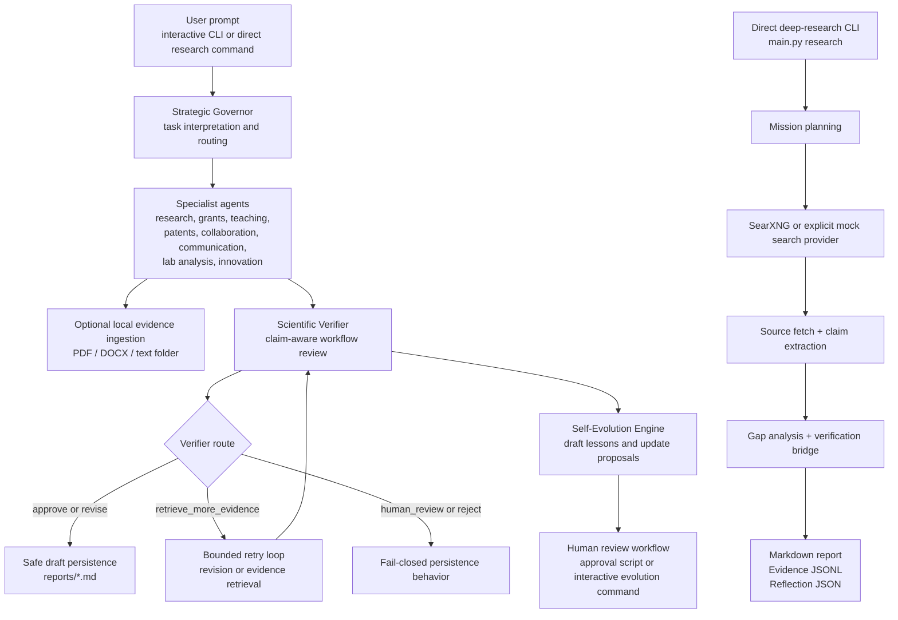
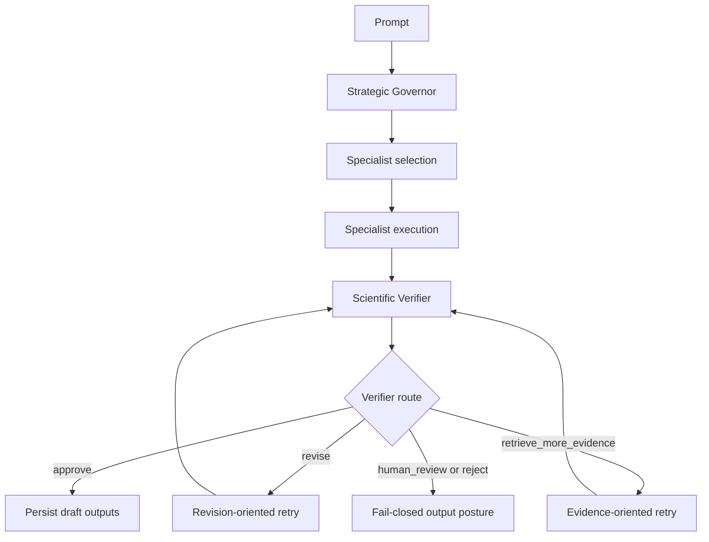
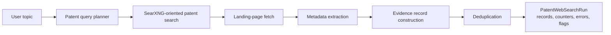

# AURA  
## Governed Multi-Agent Research Assistance, Deep Research, Local Evidence Ingestion, and Patent Reconnaissance


---

## Repository summary

**AURA** is a research-oriented Python system for governed, multi-agent scholarly assistance. It combines:

- strategic task routing across specialist agents,
- a scientific verification layer with conservative decision routes,
- optional self-evolution proposals that remain subject to human review,
- literature-oriented research support and research-profile persistence,
- direct deep-research missions with evidence logging and report generation,
- optional local document ingestion for PDF, DOCX, and text folders,
- and Stage 1 patent-web reconnaissance over publicly indexed patent pages.

The repository is suitable for a **paper or publication companion repository** when presented as a **research software prototype**. It implements substantial workflow logic, persistence, and auditability, but it does **not** claim formal validation, exhaustive patent search, or fully autonomous research decision-making.

---

## Why this repository exists

Many research-support tasks require more than a one-shot language-model response. A practical research assistant may need to:

1. interpret a research request,
2. choose a suitable specialist workflow,
3. retrieve or ingest evidence,
4. generate a structured output,
5. critique that output,
6. persist auditable artifacts,
7. and propose improvements without silently modifying its own operating profile.

AURA operationalizes that design as code. It provides a modular framework for evidence-aware research drafting, literature reconnaissance, local-document support, patent reconnaissance, and human-gated adaptation.

---

## Graphical abstract / workflow diagram



---

## Repository scope

| Area | Implemented behavior |
|---|---|
| Core orchestrated workflow | Multi-agent routing through a strategic governor, specialist execution, verifier review, bounded retry logic, draft persistence gates, and optional self-evolution proposals |
| Direct deep research | Mission planning, search-provider resolution, source fetching, evidence extraction, gap analysis, verification bridge, report generation, evidence persistence, and reflections |
| Research evolution | Profile-aware literature support, paper-source integrations, scoring, gap analysis, literature memory, reporting, and profile-evolution utilities |
| Patent reconnaissance | Stage 1 web-based discovery of public patent landing pages through SearXNG, page fetching, metadata extraction, evidence construction, and deduplication |
| Local document evidence | Folder discovery, PDF/DOCX/text extraction, chunking, session-scoped indexing, keyword-overlap retrieval, and structured ingestion reporting |
| Human governance | Approval logging, reviewer-visible self-evolution proposals, and explicit gating for consequential actions |
| Diagnostics | Live diagnostic scripts and smoke-style validation helpers for engineering inspection rather than formal scientific benchmarking |

---

## Component overview

### Top-level entry points

| File | Purpose |
|---|---|
| `main.py` | Primary CLI for interactive AURA sessions and direct deep-research subcommands |
| `config.py` | Central configuration for models, paths, search, patent-web settings, and persistence locations |
| `_demo_pipelines.py` | Demonstration helper for route or pipeline inspection |
| `_diagnose_governor.py` | Governor-focused diagnostic utility |
| `_diagnose_llm.py` | LLM connectivity diagnostic utility |
| `_e2e_test.py` | End-to-end smoke-style test utility |

### Agent layer

| File | Role |
|---|---|
| `agents/strategic_governor.py` | Selects agents, encodes routing decisions, and enforces Python-level safety triggers for selected high-risk actions |
| `agents/research_scout.py` | Supports research-scout modes including ideation, literature scan, gap analysis, grant opportunity framing, and direct deep-research integration |
| `agents/scientific_verifier.py` | Produces schema-aware verification reports, consumes structured evidence, and emits verifier routes |
| `agents/self_evolution_engine.py` | Produces governed reflection records and draft profile-update proposals; proposals are not auto-applied |
| `agents/grant_architect.py` | Generates grant-oriented proposal structures and related research-planning outputs |
| `agents/teaching_mentor.py` | Generates teaching-oriented explanations and instructional content |
| `agents/lab_data_analyst.py` | Produces analysis-oriented plans, checks, and reproducibility-oriented guidance |
| `agents/influence_public_communication.py` | Produces public-communication drafts; it does not publish content |
| `agents/collaboration_operator.py` | Produces collaboration-oriented suggestions and draft communications; it does not contact people |
| `agents/founder_innovation.py` | Produces innovation or commercialization-oriented reasoning; it is not legal, investment, or business counsel |
| `agents/patent_intelligence.py` | Performs Stage 1 patent-web reconnaissance with explicit non-exhaustiveness and non-legal-advice constraints |

### Core orchestration and governance

| File | Role |
|---|---|
| `core/orchestrator.py` | Main AURA control plane |
| `core/registry.py` | Agent registration and dispatch support |
| `core/permissions.py` | Approval and action-gating support |
| `core/evolution_review.py` | Review workflow for proposed self-evolution updates |
| `core/draft_writer.py` | Markdown draft persistence after safe verifier routes |
| `core/formatter.py` | Console rendering utilities |
| `core/llm.py` | LLM invocation wrappers |
| `core/runtime.py` | Ollama readiness support |
| `core/searxng_runtime.py` | SearXNG runtime readiness support |
| `core/memory.py` | Memory and reflection persistence helpers |
| `core/normalization.py` | Defensive data normalization |
| `core/schemas.py` | Shared typed schemas |

### Deep-research subsystem

| File | Role |
|---|---|
| `qwen_evolver/deep_research/orchestrator.py` | Runs a complete direct deep-research mission |
| `qwen_evolver/deep_research/planner.py` | Plans search branches and queries from a mission |
| `qwen_evolver/deep_research/search_providers.py` | Search-provider abstraction, including SearXNG and explicit mock fallback |
| `qwen_evolver/deep_research/source_reader.py` | Fetches and normalizes source pages |
| `qwen_evolver/deep_research/evidence_extractor.py` | Extracts evidence claims from fetched sources |
| `qwen_evolver/deep_research/evidence_store.py` | Persists evidence packs |
| `qwen_evolver/deep_research/gap_analyzer.py` | Identifies evidence gaps and follow-up queries |
| `qwen_evolver/deep_research/verifier_bridge.py` | Bridges deep-research artifacts into the verification stage |
| `qwen_evolver/deep_research/report_builder.py` | Builds structured Markdown reports |
| `qwen_evolver/deep_research/research_logger.py` | Persists research reflections |
| `qwen_evolver/deep_research/citation_manager.py` | Citation-management support within the deep-research package |
| `qwen_evolver/deep_research/schemas.py` | Deep-research data models |

### Integrations

| Package | Role |
|---|---|
| `integrations/patent_web/` | Stage 1 public patent-page reconnaissance |
| `integrations/research_evolution/` | Research profile, literature memory, paper scoring, paper-source access, gap analysis, and reports |

### Scripts

| File | Purpose |
|---|---|
| `scripts/approve_evolution.py` | Reviews pending self-evolution proposals |
| `scripts/diagnose_wave2.py` | Live diagnostic prompts for selected workflows and safety signals |
| `scripts/diagnose_wave3.py` | Additional live diagnostic prompts for collaboration, innovation, and patent-related safety signals |
| `scripts/live_validate_core.py` | Live validation utility for additional scenario prompts |
| `scripts/setup_searxng_windows.py` | Windows setup helper for the repository's SearXNG deployment scaffold |

---

## Combined workflow concept

AURA exposes two principal operating styles.

### 1. Orchestrated multi-agent workflow

The interactive CLI runs the governed specialist pipeline:

```bash
python main.py
```

A user prompt flows through:

1. strategic routing,
2. selected specialist agents,
3. optional local-document prompting and ingestion,
4. verifier review,
5. bounded retry logic when required,
6. draft persistence only when the final route permits it,
7. optional self-evolution proposal creation.

### 2. Direct deep-research workflow

The CLI also exposes direct deep-research commands:

```bash
python main.py research \
  --query "Map evidence gaps in red-NIR TADF OLED emitters" \
  --depth standard
```

and:

```bash
python main.py research-grants \
  --query "Develop a grant-facing evidence map for red-NIR OLED stability" \
  --depth extensive
```

The direct deep-research path is implemented as its own explicit workflow. It is related to the broader AURA system, but it is not merely a hidden substep of every orchestrated run.

---

## Highlights

- Governed multi-agent routing rather than unconstrained agent chaining
- Verifier-aware persistence gates
- Bounded retry loops for revision or evidence retrieval
- Human-reviewable self-evolution proposals
- Explicit mock-provider labeling in deep research and patent reconnaissance
- Local-document ingestion with provenance-bearing chunks
- Patent reconnaissance that is intentionally cautious and stage-limited
- Structured report, evidence, memory, and approval artifacts
- Engineering diagnostics that surface safety and routing behavior

---

## Code-to-README validation note

This README is grounded in the supplied repository archive and intentionally distinguishes:

- **implemented behavior** from
- **reasonable interpretation** from
- **recommended future additions**.

No claim is made that the repository provides:

- exhaustive literature review,
- rigorous factual validation,
- legal patent analysis,
- exact environment reproducibility across machines,
- or full autonomous publication, outreach, or file-modification workflows.

---

# Detailed workflows

## Workflow A — Interactive AURA session

### Command

```bash
python main.py
```

### Observed CLI behavior

The CLI:

- asks for a model name and optional API key,
- uses the model-selection priority from `config.py`,
- performs a connectivity check,
- accepts free-form user prompts,
- supports resumable local-folder prompting through the orchestration loop,
- and exposes evolution-related commands through the interactive session.

### Conceptual execution path



### Outputs

Depending on the route and workflow, the interactive path may produce:

- terminal-rendered structured results,
- Markdown draft files under `reports/`,
- approval-log entries,
- memory or reflection records under `data/`,
- self-evolution proposal records awaiting review.

---

## Workflow B — Direct deep research

### Commands

```bash
python main.py research \
  --query "Assess evidence gaps in red-NIR OLED degradation mechanisms" \
  --depth rapid
```

```bash
python main.py research \
  --query "Assess evidence gaps in red-NIR OLED degradation mechanisms" \
  --depth standard
```

```bash
python main.py research-grants \
  --query "Frame a grant-relevant evidence map for red-NIR OLED stability" \
  --depth extensive
```

### Supported depth values

| Depth | Default max rounds | Default max queries | Default max sources |
|---|---:|---:|---:|
| `rapid` | 1 | 5 | 5 |
| `standard` | 2 | 15 | 15 |
| `extensive` | 4 | 30 | 30 |

Environment overrides implemented in the deep-research orchestrator include:

```bash
AURA_RESEARCH_MAX_ROUNDS=3
AURA_RESEARCH_MAX_QUERIES=20
AURA_RESEARCH_MAX_SOURCES=25
```

### Outputs

The deep-research package persists:

| Artifact | Purpose |
|---|---|
| `reports/deep_research/` | Markdown mission reports |
| `data/deep_research/evidence/` | Evidence-pack JSONL snapshots |
| `data/deep_research/reflections/` | Reflection JSON outputs |
| `data/deep_research/sources/` | Retrieved source-text cache, where created |

### Artifact inspection commands

```bash
python main.py show-report --mission-id <MISSION_ID>
python main.py show-evidence --mission-id <MISSION_ID>
python main.py show-reflection --mission-id <MISSION_ID>
```

---

## Workflow C — Research evolution and literature support

The `integrations/research_evolution/` package implements profile- and literature-oriented support utilities. Its codebase includes:

- research profile handling,
- paper-source integrations,
- paper scoring,
- literature memory,
- gap analysis,
- profile evolution,
- and reporting helpers.

`integrations/research_evolution/paper_sources.py` directly exposes source access utilities for OpenAlex and arXiv, while configuration also provides environment variables for Crossref and Semantic Scholar integrations used elsewhere in the repository.

Outputs and persistence may involve:

- the research profile YAML file,
- literature-memory storage,
- and generated reports, depending on the calling workflow.

---

## Workflow D — Local document ingestion

The `core/local_documents/` package provides optional user-supplied evidence ingestion.

### Implemented stages

| Stage | Implementation |
|---|---|
| Discovery | Folder scanning and document discovery |
| Extraction | PDF, DOCX, and plain-text extraction utilities |
| Chunking | Chunk construction for retrieval |
| Indexing | Session-scoped index utilities |
| Retrieval | Keyword-overlap retrieval over indexed chunks |
| Preferences | Session-level local-document prompting preferences |
| Pipeline | End-to-end local-document ingestion orchestration |

### Interpretation discipline

Local documents are best described as:

- user-supplied context,
- extracted and indexed by the system,
- retrievable within the active workflow,
- and not independently validated external literature.

### OCR

The environment declares optional OCR-related dependencies:

- `pytesseract`
- `Pillow`
- `PyMuPDF`

The comments in `environment.yml` state that OCR requires a separately installed system `tesseract` binary and is enabled at runtime through:

```bash
AURA_LOCAL_PDF_OCR=1
```

---

## Workflow E — Patent web reconnaissance

Patent Intelligence is explicitly presented in code as a **Stage 1** workflow.

### Implemented stages



### Constraints encoded in the repository

The patent agent and integration code explicitly state that this workflow is:

- not comprehensive,
- not a formal prior-art search,
- not a freedom-to-operate analysis,
- and not legal advice.

Evidence records carry Stage 1 honesty flags such as:

- `web_extracted=True`
- `not_api_verified=True`

### Default allowed domains

`config.py` defaults to:

```text
patents.google.com
patentscope.wipo.int
uspto.gov
```

---

## Workflow F — Self-evolution review

AURA can generate reflection records and governed profile-update proposals. The repository does **not** silently apply such changes.

### Review command

```bash
python scripts/approve_evolution.py
```

### Common variants

```bash
python scripts/approve_evolution.py --list
python scripts/approve_evolution.py --auto-skip
```

### Relevant artifacts

| Artifact | Role |
|---|---|
| `data/reflections.jsonl` | Reflection records and proposed evolution artifacts |
| `data/approval_log.jsonl` | Approval-related decision trail |
| `profiles/research_profile.yaml` | Profile state that may be affected by approved proposals |

---

# Confidence and decision logic

## Verifier routes

The codebase uses a route vocabulary that includes:

- `approve`
- `revise`
- `retrieve_more_evidence`
- `human_review`
- `reject`

These routes influence retry behavior and whether draft outputs are persisted.

## Retry controls

The orchestration layer refers to environment-driven retry behavior, including variables such as:

```bash
AURA_AUTO_RETRIEVE_EVIDENCE=1
AURA_MAX_RETRIES=5
AURA_MAX_REVISE_ITERATIONS=4
```

These support bounded iterative recovery rather than unconstrained looping.

## Patent evidence quality

`agents/patent_intelligence.py` documents patent evidence logic in which:

- `low` quality can reflect mock mode, too few usable records, or mostly low-quality extraction,
- `moderate` quality reflects multiple real pages with several medium/high extractions,
- `strong` is intentionally not used at Stage 1.

## Mock-provider caution

The deep-research orchestrator and patent-web pathway explicitly distinguish real providers from mock fallback behavior. Mock results should be interpreted as synthetic workflow outputs, not real external evidence.

---

# Full repository layout

The following layout lists all Python source files contained in the supplied repository archive, including Python modules nested inside subfolders. Generated cache files are omitted.

```text
.
├── agents
│   ├── __init__.py
│   ├── collaboration_operator.py
│   ├── founder_innovation.py
│   ├── grant_architect.py
│   ├── influence_public_communication.py
│   ├── lab_data_analyst.py
│   ├── patent_intelligence.py
│   ├── research_scout.py
│   ├── scientific_verifier.py
│   ├── self_evolution_engine.py
│   ├── strategic_governor.py
│   └── teaching_mentor.py
├── core
│   ├── local_documents
│   │   ├── __init__.py
│   │   ├── chunking.py
│   │   ├── convert_legacy_docs.py
│   │   ├── discovery.py
│   │   ├── extract_docx.py
│   │   ├── extract_pdf.py
│   │   ├── extract_text.py
│   │   ├── indexing.py
│   │   ├── models.py
│   │   ├── pipeline.py
│   │   ├── retrieval.py
│   │   └── session_preferences.py
│   ├── __init__.py
│   ├── draft_writer.py
│   ├── evolution_review.py
│   ├── formatter.py
│   ├── llm.py
│   ├── memory.py
│   ├── normalization.py
│   ├── orchestrator.py
│   ├── permissions.py
│   ├── registry.py
│   ├── runtime.py
│   ├── schemas.py
│   └── searxng_runtime.py
├── integrations
│   ├── patent_web
│   │   ├── __init__.py
│   │   ├── dedup.py
│   │   ├── evidence_builder.py
│   │   ├── extractor.py
│   │   ├── normalizer.py
│   │   ├── page_fetcher.py
│   │   ├── pipeline.py
│   │   ├── query_planner.py
│   │   ├── schemas.py
│   │   └── search.py
│   ├── research_evolution
│   │   ├── __init__.py
│   │   ├── gap_analysis.py
│   │   ├── literature_memory.py
│   │   ├── paper_scoring.py
│   │   ├── paper_sources.py
│   │   ├── profile.py
│   │   ├── profile_evolution.py
│   │   ├── reports.py
│   │   └── schemas.py
│   └── __init__.py
├── qwen_evolver
│   └── deep_research
│       ├── __init__.py
│       ├── citation_manager.py
│       ├── evidence_extractor.py
│       ├── evidence_store.py
│       ├── gap_analyzer.py
│       ├── orchestrator.py
│       ├── planner.py
│       ├── report_builder.py
│       ├── research_logger.py
│       ├── schemas.py
│       ├── search_providers.py
│       ├── source_reader.py
│       └── verifier_bridge.py
├── scripts
│   ├── approve_evolution.py
│   ├── diagnose_wave2.py
│   ├── diagnose_wave3.py
│   ├── live_validate_core.py
│   └── setup_searxng_windows.py
├── .env.example
├── _demo_pipelines.py
├── _diagnose_governor.py
├── _diagnose_llm.py
├── _e2e_test.py
├── config.py
├── environment.yml
└── main.py
```

---

# Suggested software environment

The repository ships `environment.yml` with:

### Conda dependencies

- Python 3.11
- NumPy
- pandas
- Pydantic
- python-dotenv
- Rich
- pytest
- requests
- PyYAML

### Pip dependencies

- `ollama`
- `beautifulsoup4`
- `pypdf`
- `python-docx`
- `pytesseract`
- `Pillow`
- `pymupdf`

### Environment creation

```bash
conda env create -f environment.yml
conda activate aura
```

### Configuration bootstrap

```bash
cp .env.example .env
```

On Windows PowerShell, use an equivalent copy command such as:

```powershell
Copy-Item .env.example .env
```

---

# Runtime configuration

## Model resolution

`config.py` resolves the active model name in this priority order:

1. `LLM_MODEL`
2. `AURA_MODEL`
3. `AURA_DEFAULT_MODEL`
4. built-in fallback `deepseek-v4-flash`

Example:

```bash
AURA_MODEL=qwen3:8b
```

or:

```bash
LLM_MODEL=deepseek-v4-flash
LLM_API_KEY=...
```

## Selected core settings

```bash
AURA_TEMPERATURE=0.2
AURA_NUM_CTX=8192
AURA_KEEP_ALIVE=30m
```

## Search and patent reconnaissance

```bash
SEARXNG_ENABLED=1
SEARXNG_URL=http://localhost:8080

PATENT_WEB_SEARCH_ENABLED=1
PATENT_WEB_SEARCH_PROVIDER=auto
PATENT_WEB_ALLOWED_DOMAINS=patents.google.com,patentscope.wipo.int,uspto.gov
```

---

# Quick start commands

## Run the interactive assistant

```bash
python main.py
```

## Run deep research

```bash
python main.py research \
  --query "Identify evidence gaps in red-NIR TADF OLED emitters" \
  --depth standard
```

## Run grant-oriented deep research

```bash
python main.py research-grants \
  --query "Develop a grant-facing evidence map for red-NIR OLED stability" \
  --depth extensive
```

## Show persisted deep-research artifacts

```bash
python main.py show-report --mission-id <MISSION_ID>
python main.py show-evidence --mission-id <MISSION_ID>
python main.py show-reflection --mission-id <MISSION_ID>
```

## Review self-evolution proposals

```bash
python scripts/approve_evolution.py --list
```

---

# How to use the workflows together

A conservative publication-oriented usage pattern is:

1. Run interactive AURA for routed multi-agent assistance.
2. Use direct deep research when a source-oriented mission and persisted evidence trail are required.
3. Enable SearXNG when real web-search evidence is needed.
4. Use local-document ingestion only when user-supplied evidence should be considered as contextual input.
5. Treat patent-web results as preliminary reconnaissance, not legal conclusions.
6. Inspect verifier routes, draft reports, evidence logs, and approval records before relying on outputs.
7. Review self-evolution proposals manually before accepting any profile updates.

---

# Reproducibility notes

The repository improves inspectability through:

- explicit configuration files,
- typed schemas,
- JSONL evidence and reflection persistence,
- structured Markdown reporting,
- SQLite-backed or file-backed research state where used,
- and environment-controlled retry/search behavior.

Exact reproducibility is still limited by:

- nondeterministic language-model outputs,
- live web-search variability,
- changing source pages,
- local SearXNG configuration,
- third-party scholarly-source availability,
- and local document extraction quality.

For manuscript-facing use, record:

- repository commit or archived release,
- model identifier,
- `.env` settings,
- SearXNG configuration,
- date of execution,
- profile-file state,
- and generated reports/evidence files.

---

# Methodological contribution / interpretation

AURA is most appropriately interpreted as a **governed AI research workflow prototype**. Its methodological value lies in combining:

- specialist routing,
- evidence-aware verification,
- conservative persistence gates,
- bounded retry logic,
- provenance-conscious local-document ingestion,
- explicit mock-mode honesty,
- and review-before-application self-evolution.

This architecture is useful for studying how research assistants can become more inspectable and less likely to overstate their autonomy.

---

# Example citation block

```bibtex
@software{aura_research_workflows,
  title        = {AURA: Governed Multi-Agent Research Assistance and Evidence-Aware Workflow Prototyping},
  author       = {Repository Maintainer},
  year         = {2026},
  url          = {Repository URL},
  note         = {Research software prototype; cite the archived release or exact commit used in analysis.}
}
```

---

# Recommended additions for publication readiness

The following are recommended future additions, not confirmed current repository features:

- a `CITATION.cff` file,
- a manuscript-linked release tag,
- CI that separates deterministic tests from live LLM diagnostics,
- sanitized example outputs under an examples directory,
- a consolidated environment-variable reference table,
- reproducibility notes tied to specific paper experiments,
- and a more formal validation protocol for routed outputs and verifier behavior.

---

# Limitations

- The system relies on LLM-generated content and requires expert review.
- The Scientific Verifier is a structured critic, not a factual guarantee.
- Deep research depends on live or mock search behavior and source availability.
- Patent Intelligence is Stage 1 reconnaissance only.
- Local retrieval is not described as a semantic vector search system in the inspected code.
- OCR support is optional and requires an external system binary.
- Some Research Scout modes are explicitly marked as stubs in code and should not be presented as complete production workflows.
- Diagnostic scripts are useful engineering checks, not comprehensive benchmark suites.

---

# Acknowledgments

This repository brings together ideas from governed agent orchestration, evidence-aware research assistance, scholarly source retrieval, patent-page reconnaissance, local-document processing, and human-in-the-loop adaptation.

---

# Maintainer note

Maintain the repository as a truthfully documented scientific software artifact:

- keep the README aligned with actual code behavior,
- preserve the distinction between implemented workflows and future recommendations,
- retain the explicit caution around mock providers and patent reconnaissance,
- and version the code carefully when using it alongside a publication.
