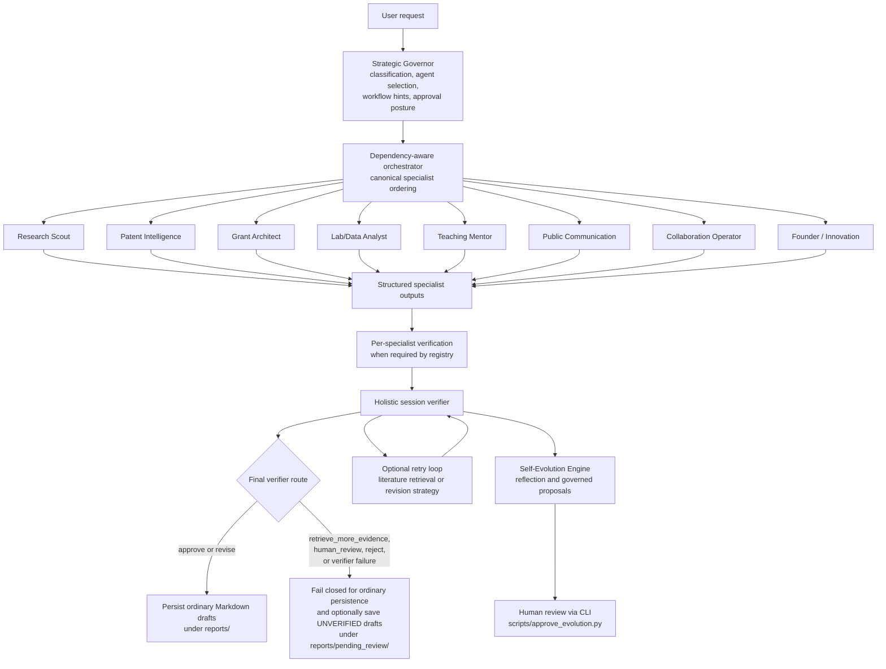

# AURA

> **A governed, multi-agent research-assistance framework for literature exploration, scientific drafting, deep-research evidence packs, local-document retrieval, preliminary patent-web reconnaissance, and reviewable workflow reflection.**

<p align="left">
  
  
  
  
  
</p>

---

## Repository summary

**AURA** is a Python research-assistance system built around an explicit control plane:

1. a **Strategic Governor** classifies the request and proposes an execution route;
2. selected **specialist agents** generate structured outputs;
3. a **Scientific Verifier** reviews specialist outputs and the full session;
4. the orchestrator gates report persistence, retry behavior, and self-evolution reflection;
5. optional **Self-Evolution** artifacts are surfaced for human review rather than silently applied.

The repository implements:

- an interactive terminal application (`main.py`);
- direct deep-research CLI commands for evidence-pack generation and report synthesis;
- specialist workflows for literature strategy, grant framing, teaching drafts, analysis planning, public communication, collaboration preparation, commercialization reflection, and preliminary patent-web reconnaissance;
- local-folder ingestion for selected workflows using PDF, DOCX, TXT, and Markdown extraction;
- SearXNG-backed real web search with explicit synthetic/mock fallback when unavailable;
- verifier-aware Markdown report persistence and visibly segregated unverified drafts;
- reviewable self-evolution proposals and an approval CLI.

AURA is best read as a **research prototype and publication-companion repository**. It prepares structured scientific and strategic drafts, but it does not autonomously submit proposals, publish content, contact collaborators, perform legal review, or replace expert scientific judgment.

---

## Why this repository exists

Many LLM research assistants mix together routing, drafting, evidence retrieval, action recommendations, and confidence language. AURA separates those concerns in code.

The repository explores how a research-support system can:

- make task routing explicit;
- order upstream evidence generation before downstream drafting;
- verify outputs before ordinary draft persistence;
- distinguish external search evidence, local user-provided context, and synthetic fallback data;
- pause for missing user input instead of inventing local-file context;
- prepare external-facing communication without executing it;
- record workflow lessons while requiring review for consequential profile changes.

---

## Graphical abstract / governed workflow



---

## Repository scope

### Implemented

| Capability | Status in code |
|---|---|
| Interactive AURA CLI | Implemented |
| Direct deep-research CLI | Implemented |
| Strategic routing and specialist registry | Implemented |
| Canonical dependency-aware specialist ordering | Implemented |
| Per-specialist and holistic verifier passes | Implemented |
| Retry logic for selected verifier routes | Implemented |
| Safe-route draft persistence | Implemented |
| Segregated unverified-draft persistence | Implemented |
| Self-evolution proposal generation and approval review | Implemented |
| Local-folder ingestion for literature/patent contexts | Implemented |
| SearXNG search provider | Implemented |
| Explicit mock search fallback | Implemented |
| Patent-web reconnaissance from public indexed pages | Implemented as Stage 1 reconnaissance |
| Diagnostic and live-validation scripts | Implemented as engineering diagnostics, not formal benchmarking |

### Not claimed

| Not claimed | Reason |
|---|---|
| Autonomous grant submission | The code drafts proposal logic; it does not submit applications. |
| Autonomous outreach, publishing, or scheduling | The system drafts text and classifies action risk; external execution is not performed. |
| Formal patentability, novelty, or freedom-to-operate analysis | Patent Intelligence is explicitly web-based, non-exhaustive Stage 1 reconnaissance. |
| Executed scientific data analysis on arbitrary local datasets | The Lab/Data Analyst produces plans and checks, not a full analytical execution engine. |
| Benchmark-validated scientific correctness | Diagnostics exist, but the archive does not provide a controlled benchmark suite. |
| Deterministic outputs across runs | Outputs depend on model selection, live search availability, provider responses, and generation behavior. |

---

## Code-to-README validation note

This README was derived from the archive contents, including:

- `main.py`
- `config.py`
- `.env.example`
- `environment.yml`
- `agents/`
- `core/`
- `qwen_evolver/deep_research/`
- `integrations/`
- `scripts/`
- deployment files under `deployment/searxng/`

The descriptions below are intentionally conservative. They distinguish:

- **implemented runtime behavior**;
- **reasonable interpretation of the implementation**;
- **publication-readiness recommendations**, which are not present guarantees.

---

## Repository architecture

### Primary entry points

| Path | Role |
|---|---|
| `main.py` | Interactive AURA terminal interface and direct deep-research subcommands |
| `scripts/approve_evolution.py` | Human review CLI for pending self-evolution proposals |
| `scripts/live_validate_core.py` | Live validation/scenario runner for selected code paths |
| `scripts/diagnose_wave2.py` | Diagnostic prompts for Wave 2 specialist behavior |
| `scripts/diagnose_wave3.py` | Diagnostic prompts for Wave 3 specialist behavior |
| `_diagnose_llm.py` | LLM connectivity / JSON-behavior diagnostics |
| `_diagnose_governor.py` | Strategic Governor diagnostic utility |
| `_demo_pipelines.py` | Demonstration-oriented routing/pipeline script |
| `_e2e_test.py` | Live end-to-end exercise script |

### Core orchestration modules

| Module | Purpose |
|---|---|
| `core/orchestrator.py` | End-to-end execution, pauses, retries, verifier aggregation, persistence gating |
| `core/registry.py` | Runtime agent registry and specialist metadata |
| `core/schemas.py` | Structured models for system outputs |
| `core/permissions.py` | Action-policy classification and approval-event logging |
| `core/draft_writer.py` | Markdown rendering and draft persistence |
| `core/evolution_review.py` | Review and application logic for evolution proposals |
| `core/llm.py` | Local/remote LLM calling wrapper |
| `core/runtime.py` | Ollama readiness/bootstrap helpers |
| `core/searxng_runtime.py` | SearXNG readiness/bootstrap helpers |
| `core/local_documents/` | Discovery, extraction, chunking, indexing, retrieval, session preferences |

### Specialist agents

| Agent | Code path | Function |
|---|---|---|
| Strategic Governor | `agents/strategic_governor.py` | Classifies requests and proposes route metadata |
| Research Scout | `agents/research_scout.py` | Ideation, literature scan, gap analysis, grant opportunity, deep-research bridge |
| Scientific Verifier | `agents/scientific_verifier.py` | Reviews claims, evidence posture, and verifier routes |
| Self-Evolution Engine | `agents/self_evolution_engine.py` | Session lessons and proposal generation |
| Grant Architect | `agents/grant_architect.py` | Reviewer-aware proposal-structure drafting |
| Teaching Mentor | `agents/teaching_mentor.py` | Teaching materials, quizzes, rubrics, explanations |
| Lab/Data Analyst | `agents/lab_data_analyst.py` | Analysis plans, checks, plot suggestions, interpretation limits |
| Public Communication | `agents/influence_public_communication.py` | Public-facing communication drafts with overclaim cautions |
| Collaboration Operator | `agents/collaboration_operator.py` | Collaboration logic, outreach drafts, agendas, questions |
| Founder / Innovation | `agents/founder_innovation.py` | Commercialization reflection and validation planning |
| Patent Intelligence | `agents/patent_intelligence.py` | Stage 1 patent-web reconnaissance and cautious interpretation |

---

## Combined workflow concept

AURA exposes **two connected but distinct execution surfaces**.

### 1. Governed multi-agent orchestration

This is the ordinary AURA pipeline:

```bash
python main.py
```

or, programmatically:

```python
from core.orchestrator import run_aura_core

result = run_aura_core(
    "Find recent literature on red-NIR OLED emitters, identify a gap, "
    "and turn it into a cautious grant concept."
)
```

The orchestrator:

1. runs the Strategic Governor;
2. resolves a dependency-aware specialist order;
3. runs selected specialists;
4. runs per-specialist verifier passes where the registry requires them;
5. runs a holistic session-wide verifier;
6. optionally retries selected failure routes;
7. combines verifier outcomes conservatively;
8. gates ordinary draft persistence;
9. executes or skips self-evolution reflection according to policy.

### 2. Direct deep-research CLI

This path bypasses the multi-agent governor and directly invokes the deep-research subsystem:

```bash
python main.py research \
  --query "red-NIR OLED emitter degradation mechanisms" \
  --depth standard
```

Grant-focused entry point:

```bash
python main.py research-grants \
  --query "grant-relevant gaps in red-NIR OLED materials" \
  --depth extensive
```

The direct deep-research path generates:

- a research mission object;
- a search plan;
- an evidence pack;
- a verification result;
- a Markdown report;
- a reflection artifact;
- a JSON result printed to the terminal.

The Research Scout can also bridge into the deep-research subsystem through its `deep_research` mode.

---

## Execution ordering and route conservatism

### Canonical specialist order

`core/orchestrator.py` canonicalizes specialists in the following order when they are selected:

```text
research_scout
patent_intelligence
grant_architect
lab_data_analyst
teaching_mentor
influence_public_communication
collaboration_operator
founder_innovation
```

This matters because upstream evidence-producing components should execute before drafting-oriented consumers.

### Evidence-heavy grant safeguard

When a grant-oriented task would otherwise send Research Scout through default `ideation`, the orchestrator can upgrade the scout mode to `literature_scan` for evidence-heavy grant contexts. The code specifically treats grant strategy/proposal workflows and downstream `grant_architect` execution as evidence-sensitive cases.

### Verifier route ordering

The orchestrator treats verifier outcomes conservatively. A worse per-specialist route is not silently overwritten by a more permissive holistic route.

The route priority encoded in `core/orchestrator.py` is:

```text
reject
human_review
retrieve_more_evidence
revise
approve
```

The final stored route is used for persistence and downstream learning gates.

---

## Detailed workflow sections

## Research Scout

**Code:** `agents/research_scout.py`

### Implemented modes

| Mode | Intended use |
|---|---|
| `ideation` | Structured exploration of a research direction |
| `literature_scan` | Query planning, paper discovery, scoring, claim extraction, gap analysis |
| `gap_analysis` | Follow-up analysis of gap candidates, optionally tied to a matching prior scan session |
| `grant_opportunity` | Funding-oriented opportunity framing |
| `deep_research` | Bridge into the direct deep-research subsystem |
| `paper_intake` | Present in dispatch, implemented as a limited/stub-like path |
| `trend_monitor` | Present in dispatch, implemented as a limited/stub-like path |
| `reviewer_attack_scan` | Present in dispatch, implemented as a limited/stub-like path |

### Literature scan inputs and sources

The Research Scout literature workflow integrates with `integrations/research_evolution/paper_sources.py`, which queries:

- OpenAlex
- arXiv
- Crossref
- Semantic Scholar
- Europe PMC

Optional configuration variables exist for:

- `OPENALEX_API_KEY`
- `CROSSREF_MAILTO`
- `SEMANTIC_SCHOLAR_API_KEY`

### Session-aware follow-up behavior

The scout stores scan-session history and attempts to reuse prior scan sessions for follow-up gap/grant workflows only when topic-keyword overlap is sufficient. This avoids attaching unrelated historical scan state indiscriminately.

### Local-folder support

Research Scout can pause and ask whether the user wants to attach a local literature folder. The prompt is returned structurally to the controller; the agent does not call `input()` directly.

---

## Direct deep research

**Code:** `qwen_evolver/deep_research/`

### CLI commands

```bash
python main.py research \
  --query "red-NIR TADF OLED photophysics" \
  --depth rapid
```

```bash
python main.py research-grants \
  --query "fundable questions in red-NIR OLED stability" \
  --depth extensive
```

Supported depths:

| Depth | Default round/query/source budgets |
|---|---|
| `rapid` | 1 round, 5 queries, 5 sources |
| `standard` | 2 rounds, 15 queries, 15 sources |
| `extensive` | 4 rounds, 30 queries, 30 sources |

The defaults may be overridden with:

```text
AURA_RESEARCH_MAX_ROUNDS
AURA_RESEARCH_MAX_QUERIES
AURA_RESEARCH_MAX_SOURCES
```

### Workflow


### Search-provider honesty

`_resolve_provider()` selects:

1. **SearXNG**, when enabled and available;
2. **MockSearchProvider**, when SearXNG is disabled or unavailable.

Mock-mode reports are visibly warned. The returned result also records:

- `mock_mode_used`
- `provider_label`
- `provider_warnings`

This prevents synthetic search runs from being represented as real web retrieval.

### Outputs

Direct deep research writes:

| Artifact | Path pattern |
|---|---|
| Markdown report | `reports/deep_research/<mission_id>_report.md` |
| Evidence pack | `data/deep_research/evidence/<mission_id>_evidence.jsonl` |
| Reflection | `data/deep_research/reflections/<mission_id>_reflection.json` |

CLI inspection commands:

```bash
python main.py show-report --mission-id <MISSION_ID>
python main.py show-evidence --mission-id <MISSION_ID>
python main.py show-reflection --mission-id <MISSION_ID>
```

---

## Grant Architect

**Code:** `agents/grant_architect.py`

### Function

Produces reviewer-aware **proposal structures** from a user request and available context.

### Draft writer fields

`core/draft_writer.py` renders sections such as:

- possible title;
- grant readiness and confidence metadata;
- summary;
- problem statement;
- central hypothesis;
- objectives;
- work packages;
- methodology overview;
- expected outcomes;
- timeline;
- indicative budget;
- team roles;
- reviewer attack points;
- evidence needed before submission;
- risk mitigation;
- collaborator needs;
- assumptions;
- references used when present.

### Boundary

This agent drafts proposal logic. It does not submit grants, commit institutional resources, or validate funder compliance.

---

## Teaching Mentor

**Code:** `agents/teaching_mentor.py`

### Function

Converts scientific content into structured teaching-oriented materials.

### Draft writer fields

- target audience;
- learner level;
- learning outcomes;
- conceptual explanation;
- Socratic questions;
- common misconceptions;
- quiz questions;
- assessment rubric;
- teaching activity;
- technical cautions.

### Boundary

The workflow produces teaching drafts; it is not a validated educational evaluation framework.

---

## Lab/Data Analyst

**Code:** `agents/lab_data_analyst.py`

### Function

Produces an **analysis plan** and scientific interpretation cautions.

### Draft writer fields

- analysis type;
- data requirements;
- required columns;
- recommended methods;
- recommended calculations;
- recommended plots;
- data-quality checks;
- reproducibility checks;
- interpretation limits;
- safe file handling;
- next analysis steps;
- assumptions;
- risks.

### Boundary

The agent is planning-oriented. The registry description and draft writer are aligned with read-only, non-destructive analytical preparation rather than arbitrary dataset modification or fully automated analysis execution.

---

## Public Communication

**Code:** `agents/influence_public_communication.py`

### Function

Prepares public-facing scientific communication drafts with caution around overclaiming.

### Draft writer fields

- audience;
- communication goal;
- core message;
- hook options;
- LinkedIn draft;
- public explanation;
- narrative angle;
- evidence cautions;
- overclaim risks;
- safer wording.

### Boundary

The rendered Markdown explicitly states that publishing requires approval. The repository drafts content; it does not publish it.

---

## Collaboration Operator

**Code:** `agents/collaboration_operator.py`

### Function

Prepares collaboration logic and outreach drafts.

### Draft writer fields

- collaboration goal;
- suggested collaboration type;
- possible collaborators;
- collaborator rationale;
- evidence for fit;
- missing information;
- draft email subject/body;
- meeting agenda;
- questions to ask;
- institutional risk notes.

### Boundary

The rendered Markdown explicitly states that contacting others requires approval. The code drafts outreach; it does not send email or schedule meetings.

---

## Founder / Innovation

**Code:** `agents/founder_innovation.py`

### Function

Produces commercialization-oriented reflection and validation planning.

### Draft writer fields

- summary;
- innovation thesis;
- product hypothesis;
- target users/customers;
- problem–customer fit;
- possible value proposition;
- technical moat;
- IP considerations;
- market assumptions;
- commercialization pathways;
- validation experiments;
- business-model options;
- key risks;
- regulatory or ethical considerations;
- next 90-day plan.

### Boundary

The draft writer supports a legal/financial disclaimer field, and policy rules separately classify high-consequence actions. This workflow should be interpreted as structured strategic analysis, not legal, investment, or IP advice.

---

## Patent Intelligence

**Code:** `agents/patent_intelligence.py`, `integrations/patent_web/`

### Function

Runs **Stage 1 patent-web reconnaissance**. It uses SearXNG-backed search to discover publicly indexed patent landing pages, fetches allowed pages, extracts metadata/evidence summaries, and produces a cautious structured analysis.

### Default allowed domains

Configured in `config.py` and `.env.example`:

```text
patents.google.com
patentscope.wipo.int
uspto.gov
```

### Configurable patent-web budget

```text
PATENT_WEB_QUERY_COUNT
PATENT_WEB_MAX_RESULTS_PER_QUERY
PATENT_WEB_MAX_PAGES_TO_FETCH
PATENT_WEB_FETCH_TIMEOUT_SECONDS
PATENT_WEB_MAX_RESPONSE_BYTES
PATENT_WEB_ALLOWED_DOMAINS
PATENT_WEB_ALLOW_MOCK_FALLBACK
```

### Evidence-level conservatism

The code classifies Stage 1 evidence conservatively:

- `low` for mock use, sparse usable records, or weak extraction;
- `moderate` only when several real records are available with better extraction;
- `strong` is not assigned by the Stage 1 classifier.

### Boundary

Patent Intelligence is explicitly:

- web-extracted;
- not API-verified;
- non-exhaustive;
- not legal advice;
- not a freedom-to-operate analysis.

---

## Local-document ingestion

**Code:** `core/local_documents/`

### Supported first-class formats

```text
.pdf
.docx
.txt
.md
```

### Recognized but unsupported legacy formats

```text
.doc
.rtf
.odt
```

These formats are surfaced in discovery summaries as legacy/unsupported rather than quietly treated as successful inputs.

### Discovery safeguards

The folder scanner:

- validates the selected path;
- defaults to recursive scanning;
- skips symlinks by default;
- rejects paths that escape the chosen folder through symlink resolution;
- applies file-count, per-file size, and total-batch size caps;
- records truncated scans and best-effort omitted counts.

Default caps in code:

| Setting | Default |
|---|---|
| `AURA_LOCAL_FOLDER_MAX_FILES` | `200` |
| `AURA_LOCAL_FOLDER_MAX_FILE_BYTES` | `20,000,000` bytes |
| `AURA_LOCAL_FOLDER_MAX_TOTAL_BYTES` | `200,000,000` bytes |

### PDF extraction

The PDF pipeline attempts:

1. `pypdf`;
2. PyMuPDF / `fitz`;
3. optional OCR, when enabled.

OCR is controlled by:

```text
AURA_LOCAL_PDF_OCR=1
```

and requires both Python packages and a separately installed system `tesseract` executable.

### Local evidence provenance

Local chunks preserve metadata such as:

- source type;
- document identifier;
- file name;
- safe reference;
- page/paragraph location hints where available;
- content fingerprints;
- extraction-quality hints.

The code explicitly warns downstream consumers not to inflate confidence merely because local documents exist.

---

## Scientific verification, retry, and persistence

### Verifier passes

The system can run:

1. **per-specialist verifier passes** for agents whose registry entry declares `requires_verification=True`;
2. a **holistic session-wide verifier** over the assembled output.

### Route-aware retry logic

When enabled by configuration, retry behavior can respond to verifier states such as:

- `retrieve_more_evidence`;
- `revise`.

Retry strategy names in the code include literature retrieval and revision-with-instructions behavior. The final combined verifier route, not merely an intermediate verdict, is used for persistence decisions.

### Safe persistence routes

Ordinary specialist drafts are persisted only when the final verifier result:

- is a dictionary;
- is not marked failed;
- has a route in:

```text
approve
revise
```

### Unverified drafts

For other non-failed verifier routes, the draft writer may save visibly segregated outputs under:

```text
reports/pending_review/
```

These files are labelled as unverified and do not relax the ordinary safe-persistence contract.

### Report families persisted by `core/draft_writer.py`

| Specialist | Markdown output |
|---|---|
| `grant_architect` | Grant Architect draft |
| `teaching_mentor` | Teaching Mentor draft |
| `lab_data_analyst` | Lab/Data Analyst plan |
| `influence_public_communication` | Public Communication draft |
| `collaboration_operator` | Collaboration Outreach draft |
| `founder_innovation` | Founder / Innovation analysis |
| `patent_intelligence` | Patent Intelligence report |

Research Scout weekly briefs are handled separately within its own workflow.

---

## Approval and action policy

**Code:** `core/permissions.py`

AURA includes an explicit action-policy map with three outcomes:

| Policy | Meaning |
|---|---|
| `auto` | May be surfaced or used without a separate approval step |
| `approval_required` | Requires explicit approval before any execution |
| `never` | Refused regardless of approval |

Examples encoded in the policy:

| Action class | Policy |
|---|---|
| `draft_text`, `draft_email`, `draft_proposal` | `auto` |
| `send_email`, `publish_content`, `submit_grant`, `share_data_externally` | `approval_required` |
| `file_patent`, `sign_agreement`, `represent_user_legally`, `execute_trade` | `never` |

Unknown action classes default to `approval_required`, which is the conservative failure mode.

Approval-relevant events are logged to:

```text
data/approval_log.jsonl
```

---

## Self-Evolution and review

### Implemented behavior

The Self-Evolution Engine can record:

- session lessons;
- what worked;
- weak or failed aspects;
- memory update proposals;
- workflow improvement proposals;
- profile update proposals;
- experiments or next-step suggestions.

### Review CLI

```bash
python scripts/approve_evolution.py --list
```

```bash
python scripts/approve_evolution.py
```

```bash
python scripts/approve_evolution.py --auto-skip
```

The same review surface can be entered from the interactive CLI with commands such as:

```text
evolve
approve evolution
pending
```

### Review boundary

The review utility logs decisions and tracks proposal content hashes. It is a controlled review path, not a silent self-modification mechanism.

---

## Suggested repository layout

The archive already uses a coherent research-software layout:

```text
.
├── main.py
├── config.py
├── .env.example
├── environment.yml
│
├── agents/
├── core/
│   └── local_documents/
├── integrations/
│   ├── patent_web/
│   └── research_evolution/
├── qwen_evolver/
│   └── deep_research/
├── deployment/
│   └── searxng/
├── profiles/
├── data/
├── reports/
├── outputs/
├── scripts/
│
├── _demo_pipelines.py
├── _diagnose_governor.py
├── _diagnose_llm.py
└── _e2e_test.py
```

For a public release, consider whether generated reports, backup profile snapshots, and live data artifacts should remain as curated examples, move into an `examples/` folder, or be excluded from the distributable repository.

---

## Suggested software environment

### Conda setup

```bash
conda env create -f environment.yml
conda activate aura
```

### Dependencies declared in `environment.yml`

Conda dependencies include:

- Python `3.11`
- `numpy`
- `pandas`
- `pydantic`
- `python-dotenv`
- `rich`
- `pytest`
- `requests`
- `pyyaml`

Pip-installed dependencies include:

- `ollama`
- `beautifulsoup4`
- `pypdf`
- `python-docx`
- `pytesseract`
- `Pillow`
- `pymupdf`

### External executables and services

| External component | Used for |
|---|---|
| Ollama | Local LLM execution for model names containing `:` |
| Docker / Docker Compose | Local SearXNG deployment |
| Tesseract binary | Optional OCR for scanned/image-only PDFs |
| SearXNG instance | Real web search for deep research and patent-web discovery |

---

## Quick start

### 1. Create the environment

```bash
conda env create -f environment.yml
conda activate aura
```

### 2. Configure environment variables

```bash
cp .env.example .env
```

Representative settings:

```dotenv
AURA_MODEL=qwen3:8b
AURA_TEMPERATURE=0.2
AURA_NUM_CTX=8192
AURA_KEEP_ALIVE=30m
```

Remote/OpenAI-compatible model usage is also supported through environment variables such as:

```dotenv
LLM_API_KEY=your_api_key_here
```

### 3. Start the interactive assistant

```bash
python main.py
```

The terminal loop supports:

```text
<any prompt>       run a research task through AURA
evolve             review pending self-evolution proposals
json               print the last raw AURA result
help               print command help
exit / quit        stop the session
```

### 4. Run direct deep research

```bash
python main.py research \
  --query "red-NIR OLED emitter degradation mechanisms" \
  --depth standard
```

### 5. Run grant-focused deep research

```bash
python main.py research-grants \
  --query "grant-relevant gaps in red-NIR OLED stability" \
  --depth extensive
```

### 6. Inspect a prior direct deep-research artifact

```bash
python main.py show-report --mission-id <MISSION_ID>
python main.py show-evidence --mission-id <MISSION_ID>
python main.py show-reflection --mission-id <MISSION_ID>
```

---

## Using SearXNG for real web search

### Configure `.env`

```dotenv
SEARXNG_ENABLED=1
SEARXNG_URL=http://localhost:8080
SEARXNG_AUTO_START=1
```

### Start the provided Docker Compose deployment

```bash
docker compose -f deployment/searxng/docker-compose.yml up -d
```

The `.env.example` notes that JSON output must be enabled in SearXNG settings for the implemented client behavior.

---

## How to use workflows together

### Example A: literature → grant framing

Interactive prompt:

```text
Find recent literature on red-NIR OLED emitters, identify a defensible gap,
and turn it into a cautious grant concept.
```

A plausible governed route is:

```text
research_scout → grant_architect → scientific verification → optional reflection
```

The exact governor route remains runtime/model dependent.

### Example B: literature → communication draft

```text
Summarize a recent OLED research direction and produce a cautious public-facing explanation without overstating certainty.
```

A plausible route is:

```text
research_scout → influence_public_communication → scientific verification
```

### Example C: patent-web reconnaissance → commercialization reflection

```text
Map the preliminary patent-web landscape around a proposed OLED emitter direction and discuss commercialization implications cautiously.
```

A plausible route is:

```text
patent_intelligence → founder_innovation → scientific verification
```

The first stage remains preliminary web reconnaissance, not legal analysis.

### Example D: local literature context

When selected workflows need local context, the interactive prompt loop can pause to ask whether to ingest a local folder. The resumed run preserves a session identifier and passes structured user responses back into the orchestration layer.

---

## Reproducibility notes

The repository includes several reproducibility-oriented design choices:

- structured schemas for LLM-facing outputs;
- timestamped and path-stable report writing conventions;
- stored deep-research evidence packs and reflections;
- explicit provider warnings and mock-mode flags;
- approval-event logging;
- session identifiers for paused/resumed local-folder workflows;
- explicit verifier routes and final persistence decisions.

Exact output reproduction still requires documenting:

- repository revision;
- selected model name;
- local vs remote LLM mode;
- temperature and context configuration;
- SearXNG availability/configuration;
- external scholarly-source availability;
- deep-research depth and budget overrides;
- contents of any user-provided local document folders.

---

## Methodological contribution / interpretation

AURA’s strongest methodological contribution is its **governed research-assistance pattern**, not any single generated draft.

The code demonstrates:

1. routing logic separated from drafting logic;
2. dependency-aware specialist ordering;
3. verifier-aware persistence gates;
4. explicit fail-closed behavior around uncertain routes;
5. action-policy classification for external or high-consequence actions;
6. local-document retrieval with provenance and quality hints;
7. mock-search disclosure rather than silent fallback;
8. self-evolution proposals that remain reviewable.

These design choices are especially relevant for research software that aims to support exploration while preserving interpretive caution.

---

## Example citation block

```bibtex
@software{aura_research_assistant,
  title        = {AURA: A Governed Multi-Agent Research Assistance Framework},
  author       = {Repository maintainers},
  year         = {2026},
  version      = {research prototype},
  url          = {repository URL},
  note         = {Cite the repository revision used in the reported workflow.}
}
```

---

## Recommended additions for publication readiness

The codebase is substantial, but a manuscript-companion release would be stronger with:

1. a top-level license file;
2. `CITATION.cff`;
3. a release tag and versioning policy;
4. a formal `tests/` tree separated from live diagnostics;
5. deterministic mocked smoke tests for routing, persistence, and approval gating;
6. curated example inputs and expected-output snapshots;
7. a concise architecture figure exported for papers/slides;
8. a reproducibility manifest template;
9. `CONTRIBUTING.md` and `SECURITY.md`;
10. a policy for generated reports, profile backups, and live data artifacts included in the repository snapshot.

---

## Limitations

- The Scientific Verifier is a software verification layer, not an external ground-truth oracle.
- Model outputs remain model-dependent and require expert review.
- Live web search can be unavailable, sparse, or noisy.
- Mock search results are synthetic and must not be interpreted as real retrieval evidence.
- Local-document extraction can be partial or poor, especially for scanned PDFs or unsupported formats.
- The Lab/Data Analyst plans analyses rather than running a complete scientific computation pipeline.
- Patent Intelligence is not legal advice and not a formal patent search.
- Diagnostic scripts should not be mistaken for a validated scientific benchmark suite.
- The archive snapshot contains generated artifacts and profile backups; public release hygiene may require curation.

---

## Acknowledgments

AURA’s implementation reflects an emphasis on:

- cautious scientific drafting;
- visible uncertainty;
- approval-aware action handling;
- provenance-rich retrieval;
- verifier-centered orchestration;
- human-reviewed workflow evolution.

---

## Maintainer note

Present AURA as a **governed research-assistance framework** rather than as an autonomous research replacement. Its publication value lies in the explicit orchestration, verification, persistence, and review mechanisms encoded in the repository—not in unsupported claims of fully automated scientific correctness.
