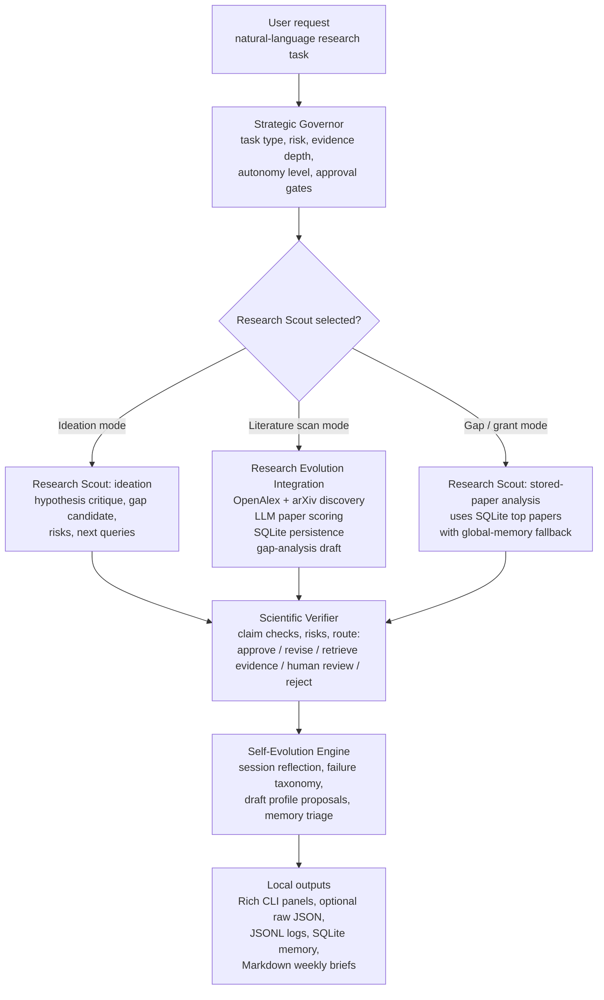
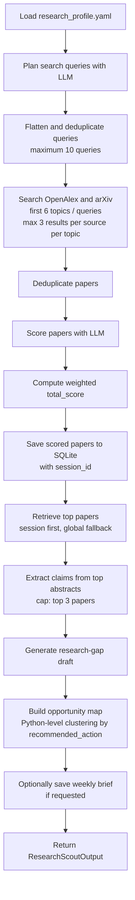
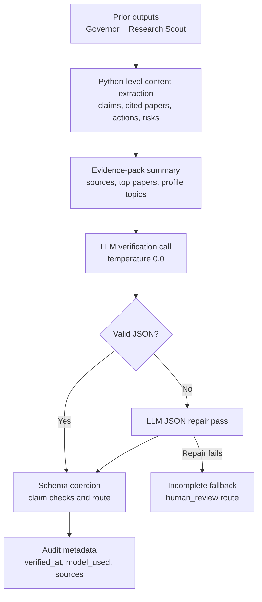

# AURA Core MVP

**Autonomous University Research Assistant Core** — a local-model, governed, multi-agent research-assistant prototype for OLED, TADF, photophysics, organic-semiconductor, red/NIR-emission, and lanthanide-complex research workflows.


> **Repository status:** core MVP. The implemented system supports governed local LLM workflows, literature search through OpenAlex/arXiv, paper scoring, gap-analysis drafts, claim-level QC, and local memory. It does **not** implement autonomous external actions such as emailing, grant submission, publishing, file deletion, or automatic research-profile modification.

---

## Table of Contents

- [Publication-Style Summary](#publication-style-summary)
- [Why This Repository Exists](#why-this-repository-exists)
- [Graphical Abstract](#graphical-abstract)
- [Repository Scope](#repository-scope)
- [Component Overview](#component-overview)
- [Combined Workflow Concept](#combined-workflow-concept)
- [Detailed Workflows](#detailed-workflows)
- [Outputs Produced](#outputs-produced)
- [Decision and Confidence Logic](#decision-and-confidence-logic)
- [Suggested Software Environment](#suggested-software-environment)
- [Quick Start](#quick-start)
- [How to Use the Workflows Together](#how-to-use-the-workflows-together)
- [Reproducibility Notes](#reproducibility-notes)
- [Methodological Contribution](#methodological-contribution)
- [Citation](#citation)
- [Recommended Additions for Publication Readiness](#recommended-additions-for-publication-readiness)
- [Limitations](#limitations)

---

## Publication-Style Summary

AURA Core MVP is a local, Ollama-powered research-assistant prototype that coordinates implemented agents for:

- research-task governance;
- research-idea analysis;
- live literature discovery through OpenAlex and arXiv;
- LLM-assisted paper scoring against a configurable research profile;
- gap-analysis and grant-opportunity drafting from stored papers;
- claim-level scientific verification of generated outputs;
- local session reflection and low-risk memory extraction.

The system follows a conservative research-support pattern:

1. classify and govern the user request;
2. route the request to implemented agents;
3. generate or retrieve research intelligence;
4. critique claims before downstream use;
5. save only low-risk reusable lessons to local memory.

The current implementation should be interpreted as a **structured research-assistance and quality-control prototype**, not as an autonomous scientist or a validated scientific decision engine.

---

## Why This Repository Exists

Research ideation and literature triage often produce useful but fragile outputs: overstated novelty claims, weak citation grounding, missing evidence, and premature grant framing. This repository implements a local, auditable architecture intended to reduce those failure modes by combining:

- **Strategic governance** before work begins;
- **mode-specific research scouting** for ideation, literature scanning, gap analysis, and grant-opportunity analysis;
- **structured paper scoring** using an OLED/TADF-focused research profile;
- **claim-level verification** after generation;
- **append-only local memory** for reflections, reusable lessons, and approval logs.

AURA Core MVP is suitable as a companion prototype for a paper, methods note, or research-software demonstration on governed local agent workflows for scientific research assistance.

---

## Graphical Abstract



---

## Repository Scope

### Implemented in the Current Code

| Area | Implemented behavior |
|---|---|
| CLI entry point | Interactive Rich-based terminal loop in `main.py`. |
| LLM backend | Ollama chat calls through `core/llm.py`. |
| Model policy | `config.py` currently permits only `qwen3:8b`. |
| Governance | Strategic routing, autonomy level, risk level, evidence depth, approval flags, and blocked-action fields. |
| Research Scout | Ideation, literature scan, gap analysis, grant-opportunity analysis, and Phase 2 stubs. |
| Literature search | OpenAlex REST API and arXiv Atom feed via `requests`. |
| Paper scoring | LLM scoring plus Python-side weighted `total_score` calculation. |
| Persistence | JSONL memory/reflection/audit logs and SQLite paper memory. |
| Verification | LLM-based claim-level scientific critique with safe incomplete fallback. |
| Self-evolution | Reflection records, failure-mode tagging, low-risk lesson saving, and draft profile proposals. |
| Tests | Pytest suite under `tests/`. |
| Diagnostics | `_diagnose_llm.py`, `_diagnose_governor.py`, and `_e2e_test.py`. |

### Not Implemented or Only Conceptual

| Area | Current status |
|---|---|
| Email sending | Explicitly not implemented; approval-required requests are logged. |
| Grant submission | Not implemented; grant-related external action is blocked / approval-gated. |
| Publishing or social posting | Not implemented; treated as a high-risk external action. |
| Automatic profile modification | Not performed by the normal orchestrated workflow. |
| `memory_retriever` agent | Mentioned in Governor vocabulary but not implemented as a separate runtime agent. |
| `grant_architect`, `lab_data_analyst`, `teaching_mentor`, etc. | Governor vocabulary only; not executed by the current orchestrator. |
| `paper_intake`, `trend_monitor`, `reviewer_attack_scan` | Present as Phase 2 stubs returning `not_implemented` metadata. |
| Formal scientific validation | The verifier is a structured QC aid, not proof of correctness. |

---

## Code-to-README Validation Note

This README was generated from the provided repository snapshot, including:

- `main.py`
- `config.py`
- `core/`
- `agents/`
- `integrations/research_evolution/`
- `tests/`
- diagnostic scripts
- the existing README draft
- profile and data artifacts included in the archive

The descriptions below distinguish between:

- functionality directly implemented in code;
- reasonable interpretation of intended workflow;
- recommended future additions.

No claim is made that generated scientific outputs are correct without expert review.

---

## Component Overview

| Path | Role |
|---|---|
| `main.py` | Interactive CLI entry point. Runs the orchestrator, prints formatted agent outputs, and supports `json` to show the last raw result. |
| `config.py` | Loads `.env`, defines paths, creates runtime directories, and enforces `AURA_MODEL=qwen3:8b`. |
| `core/llm.py` | Central Ollama wrapper. Handles JSON mode, temperature/context options, `think` control, `<think>` tag stripping, fenced JSON extraction, and JSON parsing. |
| `core/orchestrator.py` | Coordinates the implemented pipeline: Governor → Research Scout → Scientific Verifier → Self-Evolution Engine. |
| `core/permissions.py` | Defines approval-required text patterns, never-allowed action names, always-allowed action names, and approval-event logging. |
| `core/memory.py` | JSONL utilities for memories and reflections; includes simple token-overlap memory retrieval. |
| `core/schemas.py` | Pydantic schemas for agent outputs, papers, gap candidates, verification reports, reflection records, and workflow policies. |
| `core/formatter.py` | Rich terminal renderers for Governor, Research Scout, Scientific Verifier, Self-Evolution Engine, errors, and separators. |
| `agents/strategic_governor.py` | LLM-assisted task router with Python-level safety overrides and evidence-depth enforcement. |
| `agents/research_scout.py` | Research intelligence agent with ideation, literature scan, gap analysis, grant-opportunity analysis, and Phase 2 stubs. |
| `agents/scientific_verifier.py` | Claim-level verifier that extracts structured content, checks claims using the LLM, repairs malformed JSON, and fails safely. |
| `agents/self_evolution_engine.py` | Session-reflection agent that classifies failure modes, saves reflection records, and only auto-saves low-risk high-confidence lessons. |
| `integrations/research_evolution/` | Literature-search, paper-scoring, paper-memory, gap-analysis, profile, report, and profile-evolution utilities. |
| `tests/` | Pytest suite covering configuration, memory, permissions, orchestrator behavior, scout modes, verifier behavior, self-evolution, and research-evolution integrations. |

---

## Combined Workflow Concept

The implemented combined workflow is orchestrated by `core/orchestrator.py`.

```mermaid
flowchart LR
    A["run_aura_core(user_input)"] --> B["Strategic Governor<br/>agents, mode, risk, approval"]
    B --> C["Approval logging<br/>if Governor or keyword patterns require it"]
    C --> D["Resolve execution plan<br/>workflow_sequence preferred<br/>selected_agents fallback"]
    D --> E["Research Scout<br/>only if selected"]
    E --> F["Evidence pack construction<br/>top papers, sources, profile topics"]
    F --> G["Scientific Verifier<br/>only if selected"]
    G --> H["Verifier route logging<br/>human_review or reject"]
    H --> I["Self-Evolution Engine<br/>runs unless policy disables it"]
    I --> J["Result dictionary<br/>printed by main.py"]
```



Important implementation details:

- The Governor may mention more agents than currently exist, but the orchestrator only executes implemented branches for `research_scout`, `scientific_verifier`, and `self_evolution_engine`.
- `self_evolution_engine` is run according to `self_evolution_policy`; it is not a separate external service.
- Literature discovery, scoring, persistence, gap analysis, and weekly-brief generation are invoked through the Research Scout’s `literature_scan` mode.
- Gap-analysis and grant-opportunity modes operate on papers already stored in SQLite, with global-memory fallback when session-specific papers are unavailable.
- Profile updates are proposed as drafts; the normal workflow does not automatically modify `profiles/research_profile.yaml`.

---

## Highlights

- **Local model execution:** all LLM calls are routed through Ollama using `qwen3:8b`.
- **Strict model gate:** `config.py` rejects any `AURA_MODEL` other than `qwen3:8b`.
- **Governed autonomy:** risk, autonomy level, evidence requirement, and approval flags are explicit fields in the Governor output.
- **Literature triage:** OpenAlex and arXiv results are normalized, deduplicated, scored, and stored.
- **Claim-level QC:** the Scientific Verifier returns claim checks with support status, severity, confidence, evidence needs, and suggested corrections.
- **Safe failure behavior:** verifier failures return `overall_assessment="incomplete"` and route to `human_review`.
- **Local audit trail:** approval events, reflections, performance logs, and memories are saved as append-only JSONL.
- **Research profile support:** topic lists, scoring weights, watchlists, negative filters, and protected topics are loaded from YAML.
- **Draft-only learning:** profile proposals require human approval by default and are not applied during normal orchestrated sessions.

---

## Detailed Workflows

### 1. Interactive CLI Workflow

Implemented in `main.py`.

```bash
python main.py
```

The CLI:

1. displays an AURA title panel;
2. accepts natural-language tasks;
3. calls `run_aura_core(user_input)`;
4. prints Rich panels for available agent outputs;
5. stores the last result in memory;
6. prints raw JSON if the next user command is `json`;
7. exits on `exit`, `quit`, EOF, or keyboard interrupt.

Example prompts:

```text
AURA> Evaluate this research idea: red/NIR TADF-lanthanide OLEDs for photobiomodulation
AURA> Find recent papers on red-NIR TADF OLEDs and rank them
AURA> Generate a weekly research brief from recent OLED and TADF papers
AURA> Identify the strongest grant opportunity from stored red-NIR OLED papers
```

---

### 2. Strategic Governor Workflow

Implemented in `agents/strategic_governor.py`.

The Governor uses the LLM to return a structured `GovernorDecision`, then applies Python-level safeguards.

Key output fields:

| Field | Meaning |
|---|---|
| `task_type` | Request category such as `research_scan`, `idea_evaluation`, `grant_strategy`, or `unknown`. |
| `priority` | `low`, `medium`, `high`, or `urgent`. |
| `risk_level` | `low`, `medium`, `high`, or `critical`. |
| `autonomy_level` | `L0`–`L5`. |
| `evidence_requirement` | `low`, `medium`, `high`, or `ultra`. |
| `selected_agents` | Agents requested by the Governor. |
| `workflow_sequence` | Ordered workflow steps, when provided. |
| `research_scout_mode` | Scout mode such as `ideation`, `literature_scan`, `gap_analysis`, or `grant_opportunity`. |
| `requires_approval` | Whether the request should be gated by human approval. |
| `blocked_actions` | Actions the system should not perform. |
| `self_evolution_policy` | Whether the session should be used for reflection/memory extraction. |

Python-level overrides escalate risk and approval requirements for patterns such as:

- sending or replying to emails;
- submitting grants or journal material;
- publishing or posting externally;
- deleting files or folders;
- modifying or updating the research profile;
- contacting authors;
- sharing or exporting data.

If Governor parsing fails, the fallback decision selects only `scientific_verifier` and `self_evolution_engine`, sets `requires_approval=True`, and blocks consequential action.

---

### 3. Research Scout Workflow

Implemented in `agents/research_scout.py`.

The Scout resolves its mode from user keywords first, then falls back to the Governor-provided mode.

#### Implemented Modes

| Mode | Status | Description |
|---|---:|---|
| `ideation` | Implemented | LLM-based analysis of a research idea, including hypothesis, gap candidate, novelty risk, grant angle, methodology risk, kill criteria, and follow-up queries. |
| `literature_scan` | Implemented | Query planning, OpenAlex/arXiv discovery, LLM paper scoring, SQLite persistence, top-paper retrieval, claim extraction, gap draft, opportunity map, and optional weekly brief. |
| `gap_analysis` | Implemented | Uses stored top papers to identify primary and secondary research gaps. |
| `grant_opportunity` | Implemented | Uses stored top papers to produce grant framing, reviewer objections, collaboration needs, and risks. |
| `paper_intake` | Stub | Returns Phase 2 `not_implemented` metadata. |
| `trend_monitor` | Stub | Returns Phase 2 `not_implemented` metadata. |
| `reviewer_attack_scan` | Stub | Returns Phase 2 `not_implemented` metadata. |

#### Ideation Mode

Triggered by phrases such as `research idea`, `proposal concept`, `hypothesis`, `scientific strategy`, or `evaluate this idea`.

Outputs include:

- `summary`
- `findings`
- `risks`
- `novelty_risks`
- `methodology_risks`
- `grant_angles`
- `collaboration_targets`
- `kill_criteria`
- `research_gap_candidate`
- `research_gap_candidates`
- `search_queries`
- `queries_recommended_next`
- `claims_for_verification`

Ideation mode does **not** call OpenAlex or arXiv. It retrieves relevant local JSONL memories using token overlap and sends those memories to the LLM as context.

#### Literature Scan Mode

Triggered by phrases such as `find papers`, `search papers`, `recent papers`, `literature scan`, `arxiv`, `openalex`, `weekly brief`, `top papers`, `score papers`, or `literature review`.

Implemented sequence:



The literature scan is resilient to partial failures. Discovery, scoring, saving, retrieval, claim extraction, gap analysis, and report generation each append warnings rather than necessarily crashing the full pipeline.

#### Gap Analysis Mode

This mode retrieves top papers from SQLite and asks the LLM to identify a primary gap plus secondary gaps. It does not independently search external APIs.

If no stored papers are available, it returns a low-confidence partial result advising a literature scan first.

#### Grant Opportunity Mode

This mode retrieves stored top papers and prioritizes papers whose `recommended_action` is `use_for_grant`. If none are available, it uses the top stored papers as the analysis pool.

It outputs grant angles, reviewer objections, collaboration targets, methodology risks, and recommended actions. It is a drafting aid, not a grant-writing or submission system.

---

### 4. Research Evolution Integration

Implemented in `integrations/research_evolution/`.

| Module | Implemented responsibility |
|---|---|
| `paper_sources.py` | Searches OpenAlex and arXiv, reconstructs OpenAlex abstracts from inverted indexes, parses arXiv Atom XML, and deduplicates papers. |
| `paper_scoring.py` | Scores papers using the centralized LLM wrapper and computes weighted total scores. |
| `literature_memory.py` | Creates/migrates SQLite tables, saves scored papers, retrieves top papers, saves feedback, and deduplicates paper dictionaries. |
| `gap_analysis.py` | Generates a structured research-gap candidate from top papers and profile context. |
| `reports.py` | Generates and saves Markdown weekly research briefs. |
| `profile.py` | Creates, loads, saves, normalizes, and sanitizes the YAML research profile. |
| `profile_evolution.py` | Generates profile-evolution feedback and can apply sanitized updates only when called with `require_approval=False`. |
| `schemas.py` | Defines Pydantic models for papers, scores, scored papers, and research profiles. |
| `__init__.py` | Provides the public API used by `agents/research_scout.py`. |

#### Paper Scoring Dimensions

The scoring prompt requests 0–10 values for:

| Dimension | Description |
|---|---|
| `relevance` | Alignment with OLED, TADF, organic semiconductors, red/NIR emission, lanthanides, charge transport, or device physics. |
| `novelty` | Scientific novelty, with skepticism toward incremental work. |
| `grant_potential` | Fundable novelty and strategic relevance. |
| `collaboration_potential` | Author, institution, or technique value. |
| `industry_potential` | Relevance to OLED/materials industry actors. |
| `teaching_public_value` | Teaching or public-communication usefulness. |
| `feasibility` | Practical replicability or extensibility. |
| `risk` | Scientific, reliability, or reproducibility risk. |
| `oled_device_usefulness` | Device fabrication, optimization, or lifetime relevance. |
| `tadf_mechanism_relevance` | TADF/RISC/ΔEST/singlet-triplet relevance. |
| `red_nir_emission_relevance` | Red/NIR emission relevance. |
| `lanthanide_relevance` | f-block / lanthanide relevance. |
| `experimental_feasibility` | Whether the work can plausibly be extended in an academic lab. |

The weighted `total_score` is computed in Python using `scoring_weights` from the profile, plus a small feasibility/domain bonus and risk penalty. It is bounded to `0.0–10.0`.

---

### 5. Scientific Verifier Workflow

Implemented in `agents/scientific_verifier.py`.

The verifier is a structured quality-control agent. It is **not** a formal proof system and does not guarantee scientific correctness.



Claim checks include:

- `claim`
- `claim_type`
- `support_status`
- `severity`
- `confidence`
- `evidence_needed`
- `correction`

Verifier routing values:

| Route | Meaning |
|---|---|
| `approve` | Output appears acceptable for low-risk use. |
| `revise` | Output needs correction or qualification. |
| `retrieve_more_evidence` | More literature/data should be gathered. |
| `human_review` | Manual expert review required. |
| `reject` | Output should not be used without major revision. |

If parsing, repair, or coercion fails, the verifier returns `overall_assessment="incomplete"` and `route="human_review"`.

---

### 6. Self-Evolution Engine Workflow

Implemented in `agents/self_evolution_engine.py`.

The Self-Evolution Engine summarizes the session, classifies failure modes, asks the LLM for durable lessons, saves a reflection record, and writes only approved low-risk lessons to long-term JSONL memory.

Failure taxonomy:

```text
query_too_broad
query_too_narrow
overclaimed_novelty
insufficient_evidence
methodology_gap
citation_missing
scope_mismatch
verifier_reject
verifier_human_review
partial_execution
low_confidence
profile_mismatch
```

Auto-saving to `data/memories.jsonl` occurs only when a lesson satisfies all of the following:

- `save_decision == "save_now"`
- `risk_if_applied == "low"`
- `confidence >= 0.75`
- lesson text is non-trivial

Profile updates are represented as draft proposals and are not automatically applied by the orchestrated workflow.

---

## Outputs Produced

| Workflow | Main outputs | Files written |
|---|---|---|
| CLI session | Rich terminal panels and optional raw JSON. | None directly, except files written by downstream agents. |
| Governor | Routing decision, risk/evidence/autonomy fields, approval flags. | `data/approval_log.jsonl` if approval is required. |
| Ideation Scout | Gap candidate, novelty risks, grant angles, kill criteria, follow-up queries. | Usually none directly. |
| Literature Scan Scout | Top papers, scores, gap draft, opportunity map, verifier claims. | `data/research_memory.db`; optionally `reports/weekly_brief_YYYY-MM-DD.md`. |
| Gap Analysis Scout | Stored-paper gap analysis. | None directly. |
| Grant Opportunity Scout | Stored-paper grant framing and reviewer objections. | None directly. |
| Scientific Verifier | Claim checks, risks, route, corrections, audit metadata. | `data/approval_log.jsonl` if route is `human_review` or `reject`. |
| Self-Evolution Engine | Session reflection, failure modes, lessons, next experiments. | `data/reflections.jsonl`, `data/performance_log.jsonl`, and sometimes `data/memories.jsonl`. |
| Diagnostics | Console output. | Depends on script and environment. |
| Weekly brief | Markdown brief. | `reports/weekly_brief_YYYY-MM-DD.md`. |

---

## Decision and Confidence Logic

### Research Scout Evidence Quality

`_compute_evidence_quality()` uses top-paper count and OpenAlex citation counts:

| Evidence quality | Implemented condition |
|---|---|
| `strong` | At least 6 top papers and at least 3 OpenAlex papers with `cited_by_count > 5`. |
| `moderate` | At least 3 top papers. |
| `weak` | Fewer than 3 top papers or no papers. |

### Literature Scan Confidence

In literature-scan mode:

| Confidence | Implemented condition |
|---|---|
| `high` | At least 5 retrieved top papers and not using stale-cache fallback. |
| `medium` | Some retrieved top papers but fewer than 5. |
| `low` | No top papers or stale-cache fallback after failed/empty new discovery. |

### Governor Safety Logic

The Governor first produces an LLM decision, then Python code enforces additional constraints:

- high-risk keyword patterns raise autonomy level and risk;
- L5 actions require approval;
- grant/paper/proposal terms raise evidence depth to at least `high`;
- parse failures produce a conservative fallback decision.

### Verifier Logic

The verifier derives route and assessment from LLM output after schema coercion. It also derives backward-compatible flat fields such as `unsupported_claims`, `risks`, and `corrections` from structured claim checks.

---

## Suggested Repository Layout

The repository snapshot already follows this structure closely:

```text
aura/
├── README.md
├── environment.yml
├── .env.example
├── config.py
├── main.py
├── _diagnose_llm.py
├── _diagnose_governor.py
├── _e2e_test.py
├── agents/
│   ├── strategic_governor.py
│   ├── research_scout.py
│   ├── scientific_verifier.py
│   └── self_evolution_engine.py
├── core/
│   ├── llm.py
│   ├── memory.py
│   ├── orchestrator.py
│   ├── permissions.py
│   ├── schemas.py
│   └── formatter.py
├── integrations/
│   └── research_evolution/
│       ├── paper_sources.py
│       ├── paper_scoring.py
│       ├── literature_memory.py
│       ├── gap_analysis.py
│       ├── profile.py
│       ├── profile_evolution.py
│       ├── reports.py
│       └── schemas.py
├── profiles/
│   └── research_profile.yaml
├── data/
│   ├── memories.jsonl
│   ├── reflections.jsonl
│   ├── approval_log.jsonl
│   ├── performance_log.jsonl
│   └── research_memory.db
├── reports/
│   └── weekly_brief_YYYY-MM-DD.md
├── outputs/
└── tests/
```

For a clean public repository, consider committing only templates or small examples for runtime artifacts and excluding local runtime state such as `data/*.db`, large JSONL logs, and generated reports unless they are intentionally part of a reproducibility package.

---

## Suggested Software Environment

The provided `environment.yml` defines a Conda environment named `aura` with Python 3.11.

### Code-Required Python Dependencies

The implementation imports the following non-standard Python packages:

| Dependency | Used for |
|---|---|
| `ollama` | Local LLM calls. |
| `pydantic` | Agent and integration schemas. |
| `python-dotenv` | `.env` loading. |
| `rich` | Terminal UI. |
| `requests` | OpenAlex and arXiv API calls. |
| `pyyaml` | Research profile loading/saving. |
| `pytest` | Test suite. |

The environment file also includes `numpy` and `pandas`, but the inspected Python source does not currently import them.

### External Executables / Services

| Requirement | Purpose |
|---|---|
| Ollama | Runs the local model backend. |
| `qwen3:8b` | The only model accepted by `config.py`. |
| Internet access | Required for OpenAlex/arXiv literature scans. |
| Conda or compatible Python environment manager | Recommended for reproducing the included environment. |

---

## Quick Start

### 1. Create the Conda Environment

```bash
conda env create -f environment.yml
conda activate aura
```

### 2. Configure Environment Variables

Linux/macOS:

```bash
cp .env.example .env
```

Windows PowerShell:

```powershell
Copy-Item .env.example .env
```

Default `.env`:

```env
AURA_MODEL=qwen3:8b
AURA_TEMPERATURE=0.2
AURA_NUM_CTX=8192
AURA_KEEP_ALIVE=30m
OPENALEX_API_KEY=
```

`AURA_MODEL` must remain `qwen3:8b` unless `config.py` is intentionally modified. The current code rejects other model names.

`OPENALEX_API_KEY` is passed to OpenAlex only if set. Basic OpenAlex search can still run with the variable left blank, subject to external API availability and rate limits.

### 3. Pull the Required Ollama Model

```bash
ollama pull qwen3:8b
```

Ensure Ollama is running before launching AURA.

### 4. Run the Interactive CLI

```bash
python main.py
```

### 5. Inspect Raw Output After a Run

Inside the CLI:

```text
AURA> json
```

### 6. Run Unit Tests

```bash
pytest tests -q
```

The test suite imports the project dependencies. Most unit tests use mocks rather than requiring live LLM output, but the `ollama` Python package must still be installed.

### 7. Run Live Diagnostics

These scripts exercise live model behavior and may require Ollama and/or network access:

```bash
python _diagnose_llm.py
python _diagnose_governor.py
python _e2e_test.py
```

---

## How to Use the Workflows Together

### A. Idea → Literature → Gap → Verification

Start with an idea:

```text
AURA> Evaluate this idea: red/NIR TADF-lanthanide OLEDs for photobiomodulation.
```

Then run a literature scan:

```text
AURA> Find recent papers on red-NIR TADF OLEDs and identify which ones are useful for a grant proposal.
```

Then request gap analysis over stored papers:

```text
AURA> Perform a gap analysis from the stored red-NIR OLED papers.
```

The useful handoff is supported by local persistence: literature-scan mode saves scored papers to SQLite, while gap and grant modes read top papers from SQLite.

### B. Weekly Brief Workflow

```text
AURA> Generate a weekly research brief from recent OLED, TADF, lanthanide complex, and red-NIR emission papers.
```

This triggers literature-scan behavior and saves a report only when the prompt contains weekly-brief terms such as `weekly brief`, `weekly report`, `research brief`, or `weekly summary`.

### C. Grant Opportunity Workflow

```text
AURA> Identify the strongest grant opportunity from stored red-NIR OLED papers.
```

This uses stored top papers. Run a literature scan first for a more useful paper pool.

### D. Approval-Boundary Check

```text
AURA> Find a promising author from recent red-NIR OLED papers and send them a collaboration email.
```

The code is designed to flag approval requirements and log the event. It does not send the email.

---

## Data Stores

AURA uses two local memory systems with different purposes.

| Store | Path | Purpose | Format |
|---|---|---|---|
| Long-term lessons | `data/memories.jsonl` | Reusable low-risk lessons extracted from sessions. | JSONL |
| Session reflections | `data/reflections.jsonl` | Per-session reflection records. | JSONL |
| Approval log | `data/approval_log.jsonl` | Audit trail for approval-required events. | JSONL |
| Performance log | `data/performance_log.jsonl` | Runtime/self-evolution metadata. | JSONL |
| Research memory | `data/research_memory.db` | Scored paper store with ranking and deduplication. | SQLite |
| Profile | `profiles/research_profile.yaml` | Topics, weights, watchlists, filters, protected topics. | YAML |
| Reports | `reports/weekly_brief_YYYY-MM-DD.md` | Generated weekly briefs. | Markdown |

JSONL memory retrieval is simple token-overlap search, not vector search. SQLite is used for paper ranking and structured persistence.

---

## Reproducibility Notes

- The repository uses a local model backend; outputs may vary with model version, Ollama version, runtime settings, and prompt sensitivity.
- Literature scans depend on live OpenAlex and arXiv responses, so retrieved papers can change over time.
- The SQLite database accumulates prior scored papers and can influence later gap/grant analysis through global-memory fallback.
- JSONL memory retrieval uses simple token overlap, not embeddings or semantic vector search.
- `date.today()` and UTC timestamps are used in session IDs, reports, logs, and metadata.
- The included `research_profile.yaml` affects query planning, scoring, and gap analysis.
- The verifier is a structured LLM reviewer, not an independent scientific validation engine.
- To reproduce a specific session, preserve the `.env`, `profiles/research_profile.yaml`, relevant JSONL files, SQLite database, prompt text, Ollama model tag, and generated raw JSON output.

---

## Methodological Contribution

This repository contributes a practical implementation pattern for governed local research-assistant workflows:

1. **Govern before generation:** the Strategic Governor defines risk, autonomy, evidence depth, and workflow order before other agents run.
2. **Separate generation from critique:** the Scientific Verifier reviews prior agent outputs rather than sharing the same generation role.
3. **Use structured intermediate representations:** Pydantic models and schema-coerced dictionaries make agent outputs inspectable.
4. **Prefer local persistence:** JSONL and SQLite provide auditable, user-controlled state.
5. **Constrain learning:** the Self-Evolution Engine only auto-saves high-confidence, low-risk reusable lessons.
6. **Treat profile evolution as governed:** profile changes are draft-only in normal use and require explicit human approval to apply.

The correct interpretation is not “autonomous scientist.” AURA Core MVP is better described as a **local, governed research-assistance and triage prototype** for generating, ranking, critiquing, and remembering research-support artifacts.

---

## Citation

Replace the placeholder fields with the final manuscript or repository citation.

```bibtex
@software{aura_core_mvp,
  title        = {AURA Core MVP: A Local Governed Research-Assistant Prototype for OLED/TADF Literature Triage and Scientific Verification},
  author       = {Your Name},
  year         = {2026},
  url          = {https://github.com/your-org/your-repo},
  note         = {Publication companion repository}
}
```

Suggested manuscript wording:

> We used AURA Core MVP as a local, Ollama-based research-assistant prototype to explore governed agent workflows for OLED/TADF literature triage, structured paper scoring, claim-level verification, and session-memory extraction. All generated scientific claims were treated as draft outputs requiring expert review.

---

## Recommended Additions for Publication Readiness

These are recommended future additions, not features currently proven by the code.

- Add a `LICENSE` file and update the badge accordingly.
- Add a pinned `requirements.txt` or lockfile in addition to `environment.yml`.
- Add `.gitignore` rules for local runtime state such as `data/*.db`, large JSONL logs, `__pycache__/`, and generated reports.
- Add a small deterministic example dataset for tests that should not depend on live APIs.
- Add CI with mocked Ollama responses for unit tests.
- Add a reproducible example notebook or scripted demo using frozen paper fixtures.
- Add a schema-version field to JSONL and SQLite records.
- Add export utilities for anonymized session traces.
- Add documentation for expected hardware requirements for `qwen3:8b`.
- Add a formal evaluation protocol comparing AURA triage against expert-labeled literature-review decisions.

---

## Limitations

- The system depends on a local Ollama installation and the availability of `qwen3:8b`.
- `config.py` currently permits only `qwen3:8b`; other models require code changes.
- Literature results depend on live OpenAlex/arXiv availability and API behavior.
- OpenAlex and arXiv search coverage is incomplete for many publication venues and may miss relevant papers.
- Paper scoring is LLM-based and should be treated as a prioritization heuristic, not a validated bibliometric metric.
- The verifier can identify possible issues but cannot guarantee correctness.
- JSON repair is LLM-based and may still fail.
- Gap and grant modes rely on previously stored papers and can fall back to global SQLite memory.
- JSONL memory retrieval is lexical token overlap, not semantic retrieval.
- Runtime data can accumulate and influence outputs unless reset or versioned.
- Several agents named in the Governor prompt are not implemented in the current orchestrator.
- Phase 2 Scout modes are stubs.
- Profile updates are not automatically applied in the normal workflow.
- No license file is present in the inspected snapshot.

---

## Acknowledgments

This repository uses:

- Ollama for local LLM execution;
- Qwen3:8B as the configured model;
- OpenAlex and arXiv as literature-discovery sources;
- Pydantic for structured outputs;
- Rich for terminal presentation;
- SQLite and JSONL for local persistence;
- Pytest for the test suite.

---

## Maintainer Note

AURA Core MVP is intentionally conservative. It is designed to help a researcher think, search, rank, critique, and remember — not to act externally on the researcher’s behalf.

Before using outputs in a manuscript, proposal, public communication, collaboration email, or strategic decision, manually verify:

- the existence and relevance of cited papers;
- extracted metrics and abstracts;
- novelty claims;
- experimental feasibility;
- grant or biomedical framing;
- any recommendation involving external contact or public action.
