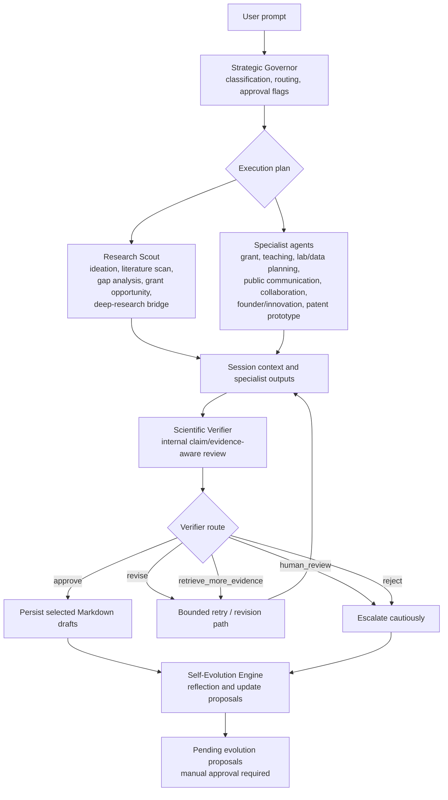

# Adaptive Understanding, Research & Action Agentic AI system (AURA)
## Governed multi-agent research workflow tooling for evidence-aware scientific drafting, literature triage, and reflective workflow improvement


---

## Repository summary

**AURA** is a Python research-workflow prototype that routes scientific requests through a governed multi-agent pipeline. The implementation combines:

- strategic task classification and agent routing,
- literature discovery and research-gap reasoning,
- specialist drafting agents for grants, teaching, lab/data planning, communication, collaboration, innovation, and patent-intelligence prototyping,
- an internal evidence-aware scientific verifier,
- bounded retry logic,
- Markdown artifact persistence,
- reflective self-evolution proposals that require manual approval before profile or memory updates are applied,
- a separate deep-research subsystem with report, evidence, and reflection persistence.

The repository is best understood as a **publication companion workflow system** for LLM-assisted scientific support. It does **not** claim autonomous scientific validation, autonomous external communication, or production-grade patent retrieval. Its strongest contribution is architectural: it demonstrates how research-oriented agents, verification logic, permissions, persistence, and reviewable self-modification can be organized in a single inspectable codebase.

---

## Why this repository exists

Scientific work often involves several linked but distinct activities:

1. deciding what kind of task a request represents,
2. identifying relevant evidence and research gaps,
3. converting an idea into a proposal, teaching material, collaboration draft, or public-facing explanation,
4. checking whether the generated output overreaches the available evidence,
5. preserving lessons from prior sessions without silently mutating scientific assumptions.

AURA operationalizes those activities as explicit software components rather than as a single monolithic prompt. The repository emphasizes:

- **routing before generation**,
- **specialist outputs with structured schemas**,
- **conservative action boundaries**,
- **review-oriented persistence**,
- **manual approval for persistent evolution proposals**.

The included research profile is domain-specific and currently centers on topics such as OLEDs, TADF, red/NIR emission, organic electronics, lanthanide complexes, charge transport, photobiomodulation-oriented OLED questions, and related research strategy themes.

---

## Graphical abstract / workflow diagram



**Interpretation:** the diagram represents the implemented orchestration pattern in `core/orchestrator.py`. It is a conceptual workflow diagram, not a claim that every possible agent combination is always executed for every prompt.

---

## Repository scope

### What the code definitely implements

| Capability | Code evidence |
|---|---|
| Interactive CLI for AURA sessions | `main.py` |
| Direct CLI commands for deep research and artifact display | `main.py` |
| Governor-driven workflow planning | `agents/strategic_governor.py`, `core/orchestrator.py` |
| Registered specialist-agent catalog | `core/registry.py` |
| Research Scout modes for ideation, literature scan, gap analysis, grant opportunity, and deep-research bridging | `agents/research_scout.py` |
| Placeholder Research Scout modes that return explicit `not_implemented` states | `agents/research_scout.py` |
| Specialist drafting agents | `agents/*.py` |
| Internal scientific verifier with route recommendations | `agents/scientific_verifier.py` |
| Retry handling for verifier routes requiring more evidence or revision | `core/orchestrator.py` |
| Markdown draft persistence | `core/draft_writer.py` |
| Self-evolution reflection generation | `agents/self_evolution_engine.py` |
| Manual review and application of approved profile/memory proposals | `core/evolution_review.py`, `scripts/approve_evolution.py` |
| Literature retrieval integrations across several scholarly sources | `integrations/research_evolution/paper_sources.py` |
| SQLite-backed research-paper memory | `integrations/research_evolution/literature_memory.py` |
| Standalone deep-research planning, evidence extraction, gap analysis, verification bridge, report persistence, and reflection logging | `qwen_evolver/deep_research/*.py` |
| Runtime support for local Ollama readiness checks and remote-model connection checks | `core/runtime.py`, `core/llm.py`, `main.py` |

### What the code does **not** establish

| Claim to avoid | Why |
|---|---|
| “Independent scientific validation” | The verifier is an internal LLM-assisted assessment layer, not an external validation system. |
| “Autonomous publication, outreach, or submission” | The code drafts materials and gates external/irreversible actions through permissions and approval logic. |
| “Production patent search” | `agents/patent_intelligence.py` uses a mock patent provider with synthetic records. |
| “Full orchestration of every conceivable research activity” | Routing is governed and conditional; several Research Scout modes are placeholders. |
| “Exact reproducibility across runs” | Outputs depend on LLM responses, APIs, stored state, environment settings, and optional retries. |
| “Live deep-research search without configuration” | Without `TAVILY_API_KEY`, the deep-research subsystem uses a mock search provider. |

---

## Code-to-README validation note

This README is derived from the repository archive contents, including all Python modules, configuration files, the environment specification, and the embedded research profile. Descriptions below are deliberately conservative:

- “verification” means **internal evidence-aware review**, not external proof;
- “patent intelligence” means a **prototype workflow using mock patent records**;
- “deep research” can use a Tavily-backed provider when configured, but otherwise defaults to **synthetic mock search results**;
- Research Scout `paper_intake`, `trend_monitor`, and `reviewer_attack_scan` return explicit **not implemented** records.

---

# Architecture at a glance

## Primary integrated AURA workflow

```text
Prompt
→ Strategic Governor
→ Research Scout and/or selected specialist agents
→ Scientific Verifier
→ Optional bounded retry path
→ Draft persistence
→ Self-Evolution reflection
→ Optional manual review of pending proposals
```

## Separate deep-research workflow

```text
Research mission
→ LLM research plan
→ Search provider selection
→ Source fetch or mock-source path
→ Evidence extraction
→ Gap analysis
→ Verification bridge
→ Report building
→ Evidence/report/reflection persistence
```

These two workflow families are connected: `Research Scout` includes a `deep_research` mode that bridges into the deep-research subsystem, while `main.py` also exposes the deep-research subsystem directly through standalone commands.

---

# Complete Python source inventory

The archive contains **56 Python files**. The inventory below lists **every `.py` file** by location and states its observed role.

## Repository-root Python files

| File | Role |
|---|---|
| `main.py` | Main command-line entry point. Supports interactive AURA sessions, direct deep-research commands, saved-artifact display commands, LLM selection, and interactive evolution review access. |
| `config.py` | Central environment-driven configuration, path definitions, model-name fallback resolution, and creation of runtime directories. |
| `_demo_pipelines.py` | Lightweight demonstration of selected routing pipelines. |
| `_e2e_test.py` | Integration-style execution checks intended to exercise end-to-end behavior. |
| `_diagnose_governor.py` | Focused diagnostic script for governor behavior. |
| `_diagnose_llm.py` | One-shot LLM connectivity / behavior diagnostic. |

## `agents/`

| File | Role |
|---|---|
| `agents/__init__.py` | Package initializer. |
| `agents/strategic_governor.py` | Decides task type, execution plan, evidence depth, agent ordering, autonomy framing, and safety-related orchestration metadata. |
| `agents/research_scout.py` | Opportunity-intelligence agent implementing ideation, literature scan, gap analysis, grant opportunity, deep-research bridge, and explicit stub records for planned modes. |
| `agents/scientific_verifier.py` | Produces structured internal assessment of claims, support, weaknesses, and next routing decision. |
| `agents/self_evolution_engine.py` | Extracts session lessons, failure modes, possible profile updates, and workflow-improvement proposals. |
| `agents/grant_architect.py` | Drafts grant-oriented proposal logic from user requests and available research context. |
| `agents/teaching_mentor.py` | Drafts educational materials, questions, misconceptions, and teaching-oriented structures. |
| `agents/lab_data_analyst.py` | Plans analysis workflows, plots, checks, and interpretation constraints without modifying raw data. |
| `agents/influence_public_communication.py` | Drafts public-facing communication content and detects publication intent requiring caution. |
| `agents/collaboration_operator.py` | Drafts collaboration strategy, contact framing, outreach text, and meeting logic without sending messages. |
| `agents/founder_innovation.py` | Produces strategic commercialization/innovation analyses, opportunity framing, and recommended next actions. |
| `agents/patent_intelligence.py` | Prototype patent-landscape reasoning pipeline using a mock patent provider and explicitly non-production patent records. |

## `core/`

| File | Role |
|---|---|
| `core/__init__.py` | Package initializer. |
| `core/orchestrator.py` | Central integrated workflow runner, execution-plan resolution, specialist dispatch, verifier handling, retry logic, and draft-persistence coordination. |
| `core/registry.py` | Registry of agent specifications, handlers, implementation flags, autonomy defaults, and verification flags. |
| `core/schemas.py` | Pydantic schemas for governance, specialists, verification reports, reflections, research-scout structures, and shared record types. |
| `core/llm.py` | Thin abstraction over local Ollama or remote OpenAI-compatible-style LLM calls; includes JSON extraction helpers. |
| `core/runtime.py` | Optional Ollama bootstrap/readiness support, local port checks, model availability checks, and model-handling utilities. |
| `core/permissions.py` | Action classification, approval requirements, never-allowed action handling, and recommended-action gating. |
| `core/evolution_review.py` | Shared logic for detecting evolution-review triggers, loading pending proposals, applying approved updates, and recording review decisions. |
| `core/draft_writer.py` | Converts specialist outputs into formatted Markdown report files under `reports/`. |
| `core/formatter.py` | Rich-console output formatting for governor decisions, specialist output, verifier status, retries, and evolution summaries. |
| `core/memory.py` | JSONL storage utilities for memory/reflection records and simple retrieval support. |

## `scripts/`

| File | Role |
|---|---|
| `scripts/approve_evolution.py` | CLI utility for reviewing and applying pending self-evolution proposals. |
| `scripts/diagnose_wave2.py` | Live diagnostic workflow for Wave 2 specialist behavior and routing summaries. |
| `scripts/diagnose_wave3.py` | Live diagnostic workflow for Wave 3 specialist behavior and routing summaries. |
| `scripts/live_validate_core.py` | Additional live validation utility for prompts not covered by the two wave diagnostics. |

## `integrations/`

| File | Role |
|---|---|
| `integrations/__init__.py` | Package initializer. |

## `integrations/research_evolution/`

| File | Role |
|---|---|
| `integrations/research_evolution/__init__.py` | Integration-level facade for paper discovery, scoring, persistence, session retrieval, and optional weekly brief generation. |
| `integrations/research_evolution/schemas.py` | Pydantic structures for papers, scoring, scored papers, and research profiles. |
| `integrations/research_evolution/profile.py` | Research-profile creation, loading, saving, weight normalization, and sanitized profile updates. |
| `integrations/research_evolution/profile_evolution.py` | Profile feedback generation and candidate profile-evolution operations. |
| `integrations/research_evolution/paper_sources.py` | Scholarly-source retrieval and deduplication across OpenAlex, arXiv, Crossref, Semantic Scholar, and Europe PMC. |
| `integrations/research_evolution/paper_scoring.py` | LLM-assisted paper scoring and aggregate score computation. |
| `integrations/research_evolution/literature_memory.py` | SQLite-backed storage, schema maintenance, paper persistence, feedback storage, and retrieval of top papers. |
| `integrations/research_evolution/gap_analysis.py` | Research-gap generation logic over available paper context. |
| `integrations/research_evolution/reports.py` | Weekly brief generation and saved-report helpers. |

## `qwen_evolver/deep_research/`

| File | Role |
|---|---|
| `qwen_evolver/deep_research/__init__.py` | Package initializer. |
| `qwen_evolver/deep_research/schemas.py` | Pydantic models for missions, plans, queries, search results, source records, evidence, gaps, verification, citations, reports, and reflections. |
| `qwen_evolver/deep_research/orchestrator.py` | Deep-research main loop: provider selection, plan execution, evidence collection, gap iterations, verification, report writing, and reflection persistence. |
| `qwen_evolver/deep_research/planner.py` | Turns a research mission into an LLM-generated research plan. |
| `qwen_evolver/deep_research/search_providers.py` | Search-provider abstraction, `MockSearchProvider`, and optional Tavily provider wiring. |
| `qwen_evolver/deep_research/source_reader.py` | Fetches and normalizes source pages for evidence extraction when using non-mock search. |
| `qwen_evolver/deep_research/evidence_extractor.py` | Extracts evidence claims from source records through the LLM layer. |
| `qwen_evolver/deep_research/evidence_store.py` | Persists and reloads evidence packs as JSONL. |
| `qwen_evolver/deep_research/gap_analyzer.py` | Generates gap/contradiction analysis and follow-up query recommendations. |
| `qwen_evolver/deep_research/verifier_bridge.py` | Connects deep-research evidence packs to the existing AURA scientific verifier logic. |
| `qwen_evolver/deep_research/report_builder.py` | Synthesizes a deep-research report object from evidence. |
| `qwen_evolver/deep_research/citation_manager.py` | Generates citation keys and inline citation formatting helpers. |
| `qwen_evolver/deep_research/research_logger.py` | Persists deep-research reflection artifacts. |

---

# repository layout

The following tree preserves the actual code organization while making the repository easier to scan on GitHub. Every Python file present in the archive is listed.

```text
.
├── README.md
├── main.py
├── config.py
├── environment.yml
├── .env.example
│
├── _demo_pipelines.py
├── _e2e_test.py
├── _diagnose_governor.py
├── _diagnose_llm.py
│
├── agents/
│   ├── __init__.py
│   ├── strategic_governor.py
│   ├── research_scout.py
│   ├── scientific_verifier.py
│   ├── self_evolution_engine.py
│   ├── grant_architect.py
│   ├── teaching_mentor.py
│   ├── lab_data_analyst.py
│   ├── influence_public_communication.py
│   ├── collaboration_operator.py
│   ├── founder_innovation.py
│   └── patent_intelligence.py
│
├── core/
│   ├── __init__.py
│   ├── orchestrator.py
│   ├── registry.py
│   ├── schemas.py
│   ├── llm.py
│   ├── runtime.py
│   ├── permissions.py
│   ├── evolution_review.py
│   ├── draft_writer.py
│   ├── formatter.py
│   └── memory.py
│
├── integrations/
│   ├── __init__.py
│   └── research_evolution/
│       ├── __init__.py
│       ├── schemas.py
│       ├── profile.py
│       ├── profile_evolution.py
│       ├── paper_sources.py
│       ├── paper_scoring.py
│       ├── literature_memory.py
│       ├── gap_analysis.py
│       └── reports.py
│
├── qwen_evolver/
│   └── deep_research/
│       ├── __init__.py
│       ├── schemas.py
│       ├── orchestrator.py
│       ├── planner.py
│       ├── search_providers.py
│       ├── source_reader.py
│       ├── evidence_extractor.py
│       ├── evidence_store.py
│       ├── gap_analyzer.py
│       ├── verifier_bridge.py
│       ├── report_builder.py
│       ├── citation_manager.py
│       └── research_logger.py
│
├── scripts/
│   ├── approve_evolution.py
│   ├── diagnose_wave2.py
│   ├── diagnose_wave3.py
│   └── live_validate_core.py
│
├── profiles/
│   └── research_profile.yaml
│
├── data/
│   └── runtime JSONL, SQLite, and deep-research artifacts
│
└── reports/
    └── generated Markdown outputs
```

---

# Core runtime model

## Agent registration model

`core/registry.py` defines the available agents using `AgentSpec`. The registry distinguishes:

- regular specialists dispatched through handlers,
- special agents invoked outside the standard specialist loop,
- pre-registered but currently non-implemented orchestration names.

### Registered implemented agents

| Registry name | Role | Verification flag |
|---|---|---|
| `research_scout` | Opportunity intelligence and literature-oriented routing | Yes |
| `grant_architect` | Proposal drafting | Yes |
| `teaching_mentor` | Teaching material drafting | Yes |
| `lab_data_analyst` | Data-analysis planning | Yes |
| `influence_public_communication` | Public-facing communication drafting | Yes |
| `collaboration_operator` | Collaboration and outreach drafting | Yes |
| `founder_innovation` | Commercialization-strategy analysis | Yes |
| `patent_intelligence` | Mock patent-intelligence prototype | Yes |

### Special orchestrator-invoked agents

| Registry name | Role |
|---|---|
| `scientific_verifier` | Runs after relevant outputs and produces route/assessment metadata. |
| `self_evolution_engine` | Runs as a session-level reflective learning/proposal step. |

### Pre-registered but not implemented as regular agents

| Registry name | Current status |
|---|---|
| `memory_retriever` | Present in registry with `implemented=False`. |
| `human_approval_governor` | Present in registry with `implemented=False`. |

---

# Detailed workflow sections

## 1. Interactive AURA CLI

Launch:

```bash
python main.py
```

The interactive path:

1. prints a formatted title,
2. asks for a model name,
3. optionally accepts an API key,
4. stores those selections in environment variables for the process,
5. bootstraps Ollama readiness when the model name contains `:`,
6. otherwise treats the model as remote and performs a connection check,
7. enters an interactive prompt loop.

### Interactive commands implemented in `main.py`

| Command | Behavior |
|---|---|
| arbitrary prompt | Runs `run_aura_core(user_input)` |
| `json` | Prints the last raw result as JSON |
| `evolve` | Starts pending self-evolution review |
| `pending` | Triggers the same review path through `is_evolution_trigger` logic |
| `help`, `?`, `/help` | Prints interactive help |
| `exit`, `quit` | Exits the session |

---

## 2. Strategic Governor

`agents/strategic_governor.py` is the front-end decision layer for the integrated workflow. It is responsible for deriving or enforcing:

- task interpretation,
- workflow order,
- evidence-depth expectations,
- safety/autonomy framing,
- selected specialist agents,
- compatibility fields used by downstream code.

The Governor does not itself replace specialist execution. It decides how the session should be routed.

---

## 3. Research Scout

`agents/research_scout.py` is the largest domain-facing agent and supports multiple modes.

### Implemented modes

| Mode | Behavior |
|---|---|
| `ideation` | Produces idea analysis, opportunity framing, and next steps. |
| `literature_scan` | Discovers papers, scores them, extracts selected claims, builds gap/opportunity summaries, and packages content for verification. |
| `gap_analysis` | Retrieves available top-paper context and asks the LLM for research-gap reasoning. |
| `grant_opportunity` | Converts top-paper context into grant-oriented opportunity analysis. |
| `deep_research` | Bridges into the separate deep-research subsystem. |

### Explicit stub modes

| Mode | Current behavior |
|---|---|
| `paper_intake` | Returns an output with a planned/not-implemented message and `failed_stage="not_implemented"`. |
| `trend_monitor` | Returns an output with a planned/not-implemented message and `failed_stage="not_implemented"`. |
| `reviewer_attack_scan` | Returns an output with a planned/not-implemented message and `failed_stage="not_implemented"`. |

### Literature scan path

The literature scan path integrates:

- profile loading,
- scholarly-source search,
- deduplication,
- paper scoring,
- memory persistence,
- optional brief/report generation,
- claim extraction over selected papers,
- opportunity and gap summarization,
- construction of verifier-facing claim packages.

The search-source implementation in `integrations/research_evolution/paper_sources.py` includes functions for:

- OpenAlex,
- arXiv,
- Crossref,
- Semantic Scholar,
- Europe PMC.

---

## 4. Specialist drafting agents

### Grant Architect

`agents/grant_architect.py` converts research context or user-described opportunities into proposal-oriented structures. Its outputs are intended as **draft logic**, not as a submission-ready grant without expert review.

### Teaching Mentor

`agents/teaching_mentor.py` builds structured pedagogical material, including teaching framing, misconceptions, questions, and assessment-oriented content.

### Lab/Data Analyst

`agents/lab_data_analyst.py` plans scientific data-analysis workflows. The registry description and implementation framing are explicit that this is **planning only** and **does not modify raw data**.

### Influence / Public Communication

`agents/influence_public_communication.py` drafts public-facing communication and detects likely publishing intent. It supports drafting, not autonomous publication.

### Collaboration Operator

`agents/collaboration_operator.py` drafts collaboration strategies, possible outreach language, and agenda structures. It does not send emails or schedule meetings.

### Founder / Innovation

`agents/founder_innovation.py` produces commercialization-oriented strategic analysis. It is framed as a decision-support draft, not as legal, investment, or transactional advice.

### Patent Intelligence

`agents/patent_intelligence.py` is a **workflow prototype**. It:

1. extracts a scope,
2. generates search queries,
3. retrieves **synthetic mock patent records**,
4. synthesizes landscape-style insights,
5. emits recommended next actions as draft-text action objects,
6. validates the output through a Pydantic model.

The module itself states that the mock provider should be replaced with real APIs for production patent search.

---

## 5. Scientific Verifier

`agents/scientific_verifier.py` performs an internal structured review of generated outputs. It extracts structured content, parses assessment records, backfills compatibility fields, and adds audit metadata.

### Verifier route values

| Route | Meaning in this repository |
|---|---|
| `approve` | The internal verifier regards the output as acceptable for the workflow stage. |
| `revise` | The output should be revised. |
| `retrieve_more_evidence` | The workflow may benefit from another evidence-oriented pass. |
| `human_review` | Human judgment should intervene. |
| `reject` | The output should not be treated as acceptable for persistence/use. |

### Rigor note

The verifier is valuable for structured caution, but it is **not** a substitute for scientific peer review, experimental validation, or expert source checking.

---

## 6. Retry logic

`core/orchestrator.py` includes retry handling for verifier routes that indicate:

- `retrieve_more_evidence`,
- `revise`.

The CLI display in `main.py` prints:

- retry count,
- route before and after each retry pass,
- strategy label,
- revision-instruction count,
- final verifier route and recommendation.

This is a bounded orchestration mechanism, not an unlimited autonomous search loop.

---

## 7. Draft persistence

`core/draft_writer.py` contains Markdown formatting paths for specialist outputs and writes generated drafts into `reports/`.

The orchestration layer stores paths in `draft_paths`, and `main.py` prints the saved files after a successful run.

The draft-writer module supports publication-quality **artifact formatting**, but the generated files remain LLM-assisted drafts that should be reviewed.

---

## 8. Self-Evolution workflow

`agents/self_evolution_engine.py` generates reflective records and possible improvement proposals. It classifies failure modes, checks verifier quality indicators, and emits proposals rather than silently altering project state.

### Manual review

Pending proposals are processed through:

```bash
python scripts/approve_evolution.py
```

or from the interactive CLI by entering:

```text
evolve
```

The review/application logic is implemented in `core/evolution_review.py`.

### What can be applied after approval

The code supports approved updates to:

- memory,
- research-profile content.

Approval decisions are logged. Profile changes are treated as reviewable state mutations rather than automatic background adaptation.

---

# Standalone deep-research subsystem

The `qwen_evolver/deep_research/` package is a separate but connectable research pipeline.

## Deep-research CLI commands

### General research mission

```bash
python main.py research \
  --query "What are recent directions in red-NIR TADF OLEDs?" \
  --depth standard
```

### Grant-focused research mission

```bash
python main.py research-grants \
  --query "Identify grant-worthy evidence gaps in red-NIR OLED photobiomodulation." \
  --depth extensive
```

### Artifact display commands

```bash
python main.py show-report --mission-id MISSION_ID
python main.py show-evidence --mission-id MISSION_ID
python main.py show-reflection --mission-id MISSION_ID
```

## Depth presets and budgets

`qwen_evolver/deep_research/orchestrator.py` defines default limits:

| Depth | Max rounds | Max queries | Max sources |
|---|---:|---:|---:|
| `rapid` | 1 | 5 | 5 |
| `standard` | 2 | 15 | 15 |
| `extensive` | 4 | 30 | 30 |

These can be overridden with:

- `AURA_RESEARCH_MAX_ROUNDS`,
- `AURA_RESEARCH_MAX_QUERIES`,
- `AURA_RESEARCH_MAX_SOURCES`.

## Search-provider behavior

`qwen_evolver/deep_research/search_providers.py` defines:

- `MockSearchProvider`,
- optional `TavilySearchProvider`.

`qwen_evolver/deep_research/orchestrator.py` chooses:

```text
TavilySearchProvider if TAVILY_API_KEY is present
otherwise MockSearchProvider
```

### Critical interpretation

When the mock provider is used, the deep-research orchestrator explicitly creates synthetic inline text such as mock content for testing. Reports generated from that path should **not** be interpreted as literature-grounded research outputs.

---

# Outputs and persistence

## Configured runtime paths

`config.py` defines these central locations:

| Path | Purpose |
|---|---|
| `data/memories.jsonl` | Memory records |
| `data/reflections.jsonl` | Session reflection records |
| `data/approval_log.jsonl` | Approval and review-related logging |
| `data/research_memory.db` | SQLite research-literature memory |
| `data/performance_log.jsonl` | Configured performance-log path |
| `profiles/research_profile.yaml` | Domain profile and scoring configuration |
| `reports/` | Generated Markdown drafts |
| `outputs/` | Directory created at config load, though not central to the documented workflows above |

## Deep-research artifacts

The standalone deep-research subsystem writes:

| Path pattern | Artifact |
|---|---|
| `reports/deep_research/<mission_id>_report.md` | Markdown report |
| `data/deep_research/evidence/<mission_id>_evidence.jsonl` | Evidence-pack persistence |
| `data/deep_research/reflections/<mission_id>_reflection.json` | Reflection record |
| source-text location managed by `source_reader.py` | Fetched/normalized source text during non-mock retrieval paths |

---

# Permission and action-boundary logic

`core/permissions.py` implements a conservative action-control layer. It includes:

- approval-required pattern matching,
- never-allowed action classes,
- explicit action-policy classification,
- best-effort legacy string-to-action-class inference,
- blocking of actions classified as `never`,
- logging support for approval-relevant events.

## Policy categories

| Policy | Meaning |
|---|---|
| `auto` | May be surfaced without approval. |
| `approval_required` | May be surfaced but requires human approval before consequential execution. |
| `never` | Should be blocked from surfaced recommendations. |

Unknown action classes default to `approval_required`, which is a conservative fail-safe.

---

# Suggested software environment

The repository ships with `environment.yml`:

```yaml
name: aura
channels:
  - conda-forge
dependencies:
  - python=3.11
  - pip
  - numpy
  - pandas
  - pydantic
  - python-dotenv
  - rich
  - pytest
  - requests
  - pyyaml
  - pip:
      - ollama
      - beautifulsoup4
```

## Non-standard Python dependencies evident in the codebase

| Dependency | Role |
|---|---|
| `pydantic` | Structured schemas and model validation |
| `python-dotenv` | `.env` loading |
| `rich` | Interactive terminal output formatting |
| `requests` | HTTP operations |
| `PyYAML` | Research-profile YAML read/write |
| `beautifulsoup4` | HTML parsing in source reading |
| `ollama` | Listed in the environment for local LLM integration |
| `numpy`, `pandas` | Included in environment; they may support broader runtime/evaluation workflows even where specific use is module-dependent |
| `pytest` | Included for testing support |

## External executable / service assumptions

| External element | Relevance |
|---|---|
| Ollama executable | Used for local-model bootstrap/readiness when the selected model name contains `:`. |
| Remote LLM provider | Used when a non-local model name is supplied with a compatible API key configuration. |
| Tavily API key | Enables non-mock deep-research search-provider behavior. |
| Scholarly APIs | Used opportunistically by the research-evolution paper-source integrations. |

---

# Quick start

## 1. Create the environment

```bash
conda env create -f environment.yml
conda activate aura
```

## 2. Configure environment variables

```bash
cp .env.example .env
```

The provided template contains:

```bash
AURA_MODEL=qwen3:8b
AURA_TEMPERATURE=0.2
AURA_NUM_CTX=8192
AURA_KEEP_ALIVE=30m
OPENALEX_API_KEY=
TAVILY_API_KEY=
CROSSREF_MAILTO=
SEMANTIC_SCHOLAR_API_KEY=
```

## 3. Run the interactive assistant

```bash
python main.py
```

## 4. Run deep research directly

```bash
python main.py research \
  --query "Map evidence gaps in red-NIR TADF OLED research." \
  --depth standard
```

## 5. Review pending self-evolution proposals

```bash
python scripts/approve_evolution.py
```

---

# How to use the workflows together

A practical integrated workflow might look like:

1. Start `python main.py`.
2. Ask for a literature scan and gap identification.
3. Let the Governor decide whether downstream grant, collaboration, teaching, or communication specialists are appropriate.
4. Inspect the verifier route and any retry summary.
5. Open the saved Markdown drafts under `reports/`.
6. Review any pending self-evolution proposals manually.
7. Use the direct deep-research CLI when a mission-oriented report/evidence/reflection bundle is preferred.

### Example integrated prompt

```text
Find recent evidence relevant to red-NIR TADF OLEDs, identify a cautious research gap,
draft a grant concept, suggest possible collaborators, and prepare a restrained public-facing summary.
```

The exact execution path is not hardcoded; it depends on the Strategic Governor and downstream agent logic.

---

# Diagnostics and validation utilities

The repository includes executable support scripts beyond the main user-facing CLI.

| Command | Purpose |
|---|---|
| `python _diagnose_governor.py` | Focused governor diagnostic |
| `python _diagnose_llm.py` | One-shot LLM diagnostic |
| `python _e2e_test.py` | End-to-end integration-style test script |
| `python scripts/diagnose_wave2.py` | Wave 2 live diagnostic prompts |
| `python scripts/diagnose_wave3.py` | Wave 3 live diagnostic prompts |
| `python scripts/live_validate_core.py` | Additional live validation of core prompt paths |

These scripts are useful for development and system inspection. They should not be confused with a complete benchmark suite or formal scientific validation framework.

---

# Reproducibility notes

AURA records many artifacts, but exact run-to-run duplication is not guaranteed.

## Factors that can alter outputs

- local vs. remote model selection,
- model version and model behavior,
- temperature/context settings,
- API availability and returned metadata,
- whether Tavily is configured,
- stored paper memory and profile state,
- pending or applied evolution proposals,
- verifier outcomes and retry-path activation.

## Practices that improve reproducibility

- preserve `environment.yml`,
- record the model name and relevant environment variables,
- archive generated report/evidence/reflection artifacts,
- version-control a clean baseline research profile,
- document whether deep research used Tavily or mock search,
- keep curated examples separate from transient runtime logs,
- avoid presenting mutable, evolved profiles as fixed experimental ground truth unless versioned.

---

# Methodological contribution and interpretation

AURA’s contribution is a software architecture for **governed LLM-assisted research workflows**, not a claim of automated scientific discovery. The repository demonstrates:

1. **task routing before specialist generation**,  
2. **schema-backed outputs**,  
3. **evidence-aware internal review**,  
4. **bounded retry logic**,  
5. **explicit action permissions**,  
6. **artifact persistence**,  
7. **manual control over persistent self-evolution**.

For a paper or methods supplement, the system can be framed as an implementation of a cautious research-assistant pattern in which generated scientific drafting is:

- routed,
- structured,
- reviewed,
- persisted,
- and kept within explicit human-approval boundaries.

---

# Example citation block

```bibtex
@software{aura_research_workflow,
  title        = {AURA: A Governed Multi-Agent Research Workflow Prototype},
  author       = {Repository Maintainers},
  year         = {2026},
  version      = {research prototype},
  note         = {GitHub repository accompanying a scientific software workflow}
}
```

Replace placeholder metadata with the finalized authorship, release tag, repository URL, DOI, and archival citation record.

---

# Recommended additions for publication readiness

The codebase is already substantial, but a paper-facing release would benefit from:

1. a formal `LICENSE`,
2. a `CHANGELOG.md` or release notes,
3. a curated `examples/` directory containing stable sample prompts and manually reviewed outputs,
4. a `.gitignore` covering caches, routine generated reports, backup profile files, and transient deep-research artifacts,
5. unit tests separated from live LLM diagnostics,
6. an explicit supported-provider matrix for literature and deep-research search,
7. a documented provenance policy for generated reports,
8. a small figure or SVG architecture diagram suitable for manuscript reuse,
9. a benchmark or qualitative case-study appendix if claims about workflow value are made,
10. replacement of the mock patent provider before making any substantive patent-search claim.

---

# Limitations

- The system is LLM-dependent and can produce incorrect or incomplete outputs.
- Internal verification is not equivalent to peer review, literature validation, or experimental confirmation.
- Deep research without `TAVILY_API_KEY` runs over synthetic mock search results.
- Patent intelligence currently uses synthetic mock patent records.
- Several Research Scout modes are placeholders rather than completed implementations.
- External scholarly APIs can fail, rate-limit, or return incomplete metadata.
- Generated drafts require human review before use in manuscripts, grants, outreach, or public-facing materials.
- Persistent profile evolution can affect future runs and should be versioned when used in reproducible research.
- The included research profile is domain-specific and should not be assumed to generalize across disciplines without revision.

---

# NOTE

AURA embodies a research-engineering approach to LLM-assisted scientific work that prioritizes inspectable orchestration, conservative claims, and explicit governance. The repository’s design is especially notable for treating approvals, persistence, retry logic, and reflective evolution as first-class software concerns rather than informal prompt conventions.

---

