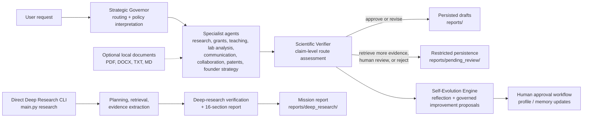

# AURA — Governed Multi-Agent Research Drafting, Evidence Triage, and Deep-Research Workflows


AURA is a research-oriented, governed multi-agent software system for scientific evidence triage, literature exploration, proposal drafting, patent reconnaissance, and structured deep-research reporting. The repository combines a central orchestration pathway with several standalone or semi-standalone research workflows, while maintaining explicit policy boundaries around external actions, verification, and persistence.

The codebase is especially oriented toward research planning in photophysics, OLED/TADF, organic electronics, grant development, patent landscape reconnaissance, and publication-support workflows. It is best understood as a **research-assistance and drafting framework**, not as an autonomous scientific authority, legal instrument, or fully automated publication pipeline.

---

## Why this repository exists

Scientific work often requires several adjacent tasks that are related but operationally distinct:

- searching and structuring literature,
- converting research opportunities into grant concepts,
- preparing reviewer-aware proposal drafts,
- generating teaching and communication materials,
- screening patent signals without overstating legal certainty,
- producing auditable deep-research reports,
- preserving lessons learned while keeping profile changes human-governed.

AURA implements these tasks as a set of specialized agents coordinated by a strategic governor and constrained by an explicit policy layer. The architecture favors:

- **bounded autonomy** rather than unrestricted execution,
- **draft generation** rather than external submission,
- **evidence-aware verification** rather than unqualified confidence,
- **human review gates** for profile changes and external-facing actions,
- **traceable outputs** stored as Markdown, JSON, JSONL, and SQLite artifacts.

---

## Graphical abstract / workflow diagram



---

## Repository scope

| Area | What is implemented | Important boundary |
|---|---|---|
| Governed multi-agent orchestration | Strategic routing, specialist execution, verifier routing, report persistence, reflection logging | Routing is software-mediated and LLM-assisted; it is not a guarantee of optimal task decomposition |
| Literature workflows | Structured research scout modes, multi-source literature retrieval, query/session lineage, report writing | Source quality and coverage depend on available APIs, search responses, and prompt formulation |
| Grant workflows | General grant architecture plus a China grant drafting mode with reviewer simulation and competitiveness scoring | These are drafting tools, not official grant submission systems |
| Deep research | Direct CLI workflow with evidence storage, mission reports, structured report sections, and fallback behavior | Mock-mode results are synthetic and must not be interpreted as real research findings |
| Patent intelligence | Web-search-based patent reconnaissance, extraction, clustering, claim-centric scoring, gap identification | Non-exhaustive, not API-verified, not freedom-to-operate analysis, and not legal advice |
| Local document ingestion | Optional folder intake for selected workflows, provenance-aware chunking, session-scoped indexing | Local files are user-supplied context, not automatically validated evidence |
| Human-governed adaptation | Reflection logging, pending evolution proposals, approval logs, profile backups | Evolution proposals are never auto-applied |
| Registry placeholders | `memory_retriever`, `human_approval_governor` are registered but not implemented as regular agents | They should not be presented as available production agents |

---

## Repository architecture

### Primary entry points

| File | Role |
|---|---|
| `main.py` | Main CLI for interactive AURA sessions, direct deep-research missions, report retrieval, evidence retrieval, and reflection retrieval |
| `config.py` | Environment loading, path construction, model settings, search settings, and output directories |
| `environment.yml` | Suggested Conda environment specification |
| `.env.example` | Example runtime configuration variables |

### Core orchestration modules

| Module | Responsibility |
|---|---|
| `core/orchestrator.py` | Runs governed specialist workflows, handles paused local-folder prompts, verification, retry logic, draft persistence, and self-evolution |
| `core/registry.py` | Central agent registry, capabilities, implementation status, and timeouts |
| `core/schemas.py` | Pydantic schemas for specialist outputs, verification reports, reflections, and structured artifacts |
| `core/llm.py` | Local Ollama and remote OpenAI-compatible model access, structured JSON parsing, and repair attempts |
| `core/runtime.py` | Local Ollama readiness checks and optional bootstrap support |
| `core/searxng_runtime.py` | SearXNG runtime health helpers |
| `core/permissions.py` | Action policy gates and approval requirements |
| `core/draft_writer.py` | Markdown draft persistence and unverified-review persistence |
| `core/evolution_review.py` | Human review workflow for self-evolution proposals |
| `core/memory.py` | Reflection and memory storage helpers |
| `core/normalization.py` | Defensive normalization of LLM-produced shapes |
| `core/aura_principles.py` | Code-level output contracts and structural assertions |
| `core/patent_rigor.py` | Claim-centric patent-profile analysis pipeline |
| `core/patent_profile_cache.py` | Content-addressed patent profile caching |

---

## Specialist agents

| Agent | Implemented role | Important caution |
|---|---|---|
| `research_scout` | Literature scans, opportunity framing, gap analysis, grant opportunity scans, deep-research delegation | Some modes are stubs; report quality depends on retrieval quality |
| `grant_architect` | General proposal architecture and grant framing | Produces drafts only |
| `china_grant_architect` | China-grant-specific drafting pathway with reviewer simulation and scoring | Draft-only workflow; not an official submission system |
| `teaching_mentor` | Teaching explanations, learning objectives, quizzes, rubric suggestions | Scientific claims may still require verification |
| `lab_data_analyst` | Analysis planning, QC ideas, reproducibility checks, interpretation limits | It does not modify raw files or execute laboratory analysis |
| `influence_public_communication` | Public-facing scientific communication drafts | Publishing remains approval-gated |
| `collaboration_operator` | Collaboration rationale, outreach drafts, agendas, screening questions | It does not send messages or schedule meetings |
| `founder_innovation` | Commercial framing, validation experiments, product hypotheses, strategic risk exploration | Not legal, financial, regulatory, or investment advice |
| `patent_intelligence` | Preliminary web-based patent landscape reconnaissance and claim-centric pattern extraction | Non-exhaustive and not legal analysis |

---

## Combined workflow concept

AURA supports two complementary operating styles.

### 1. Governed orchestration through `main.py`

The interactive or prompt-driven orchestrator can select one or more implemented specialists based on the request, run them in an internal order, send their outputs through verification, and persist drafts when the final route is sufficiently safe.

Examples of conceptually combined workflows include:

- literature scouting followed by grant structuring,
- patent reconnaissance followed by founder-oriented commercialization framing,
- research scouting followed by public communication drafting,
- specialist outputs followed by verifier assessment and reflection capture.

This coordination is implemented within the central orchestration pathway, but the exact agent mix remains dependent on the strategic governor’s routing logic and prompt content.

### 2. Standalone or semi-standalone workflows

Some capabilities are also available directly:

- `main.py research`
- `main.py research-grants`
- SearXNG diagnostics and setup scripts
- local patent folder preflight checks
- self-evolution proposal review scripts
- integrity and live diagnostic utilities

These workflows are not automatically merged into a single publication-ready pipeline unless invoked through the orchestrated pathway or manually combined by the researcher.

---

## Highlights

- Governed multi-agent orchestration with explicit action boundaries.
- Structured verifier routes: `approve`, `revise`, `retrieve_more_evidence`, `human_review`, `reject`.
- Persistence controls that prevent ordinary report writing for unsafe verifier outcomes.
- Direct deep-research CLI with mission IDs, evidence bundles, reflections, and structured reports.
- Literature search integration across OpenAlex, arXiv, Crossref, Semantic Scholar, and Europe PMC.
- Preliminary patent web reconnaissance with provenance, deduplication, and claim-centric scoring.
- Optional local-document ingestion for PDF, DOCX, TXT, and Markdown folders.
- Human-reviewed self-evolution proposals rather than silent profile mutation.
- Publication-oriented Markdown outputs suitable for inspection, archiving, and downstream editing.

---

## Code-to-README validation note

This README is derived from the repository code, configuration files, and declared runtime behavior. Capability claims intentionally exclude:

- generated artifacts already present under `data/` or `reports/`,
- unimplemented registry placeholders,
- conceptual workflows not demonstrated by the code,
- claims of formal scientific, legal, or benchmark validation.

One maintainability detail deserves attention: comments in `.env.example` and the provider resolution logic in the patent web provider factory are not perfectly aligned. The code should be treated as authoritative until configuration comments are reconciled.

---

# Detailed workflows

## 1. Main governed orchestration workflow

### Entry point

```bash
python main.py
```

The interactive CLI accepts natural-language research requests and a small set of operational commands.

### Implemented interactive commands

```text
evolve
approve evolution
pending
json
help
exit
```

### Execution outline

1. A session identifier is established.
2. The Strategic Governor analyzes the request.
3. Agent routing is resolved and canonicalized.
4. Optional local-folder prompts may pause execution.
5. One or more specialist agents execute.
6. The Scientific Verifier evaluates outputs.
7. Retry logic may revise selected steps where enabled.
8. Draft persistence is allowed only for sufficiently safe routes.
9. The Self-Evolution Engine records reflections and may propose reviewed updates.
10. The pipeline returns a complete or paused status.

### Paused local-folder behavior

If an agent requests optional local documents and the user has not yet answered, the orchestrator may return:

- `pipeline_status="awaiting_user_input"`
- `session_id`
- `pending_prompt`
- `completed_steps`

In that state, downstream verification and persistence are deferred until the workflow resumes.

---

## 2. Research Scout workflow

The Research Scout supports multiple research-oriented modes.

### Implemented modes

| Mode | Behavior |
|---|---|
| `ideation` | Structured opportunity analysis, potential directions, and kill criteria |
| `literature_scan` | Search planning, multi-source literature retrieval, scoring, claim extraction, gap analysis, and Markdown report writing |
| `gap_analysis` | Uses prior Scout context where available, otherwise falls back with warning behavior |
| `grant_opportunity` | Research-opportunity framing for proposal ideation |
| `deep_research` | Delegates to the deep-research subsystem |

### Stub or phase-limited modes

| Mode | Status |
|---|---|
| `paper_intake` | Phase 2 stub |
| `trend_monitor` | Phase 2 stub |
| `reviewer_attack_scan` | Phase 2 stub |

### Literature scan outputs

A literature scan produces a Markdown report at a timestamped path similar to:

```text
reports/literature_scans/literature_scan_<timestamp>.md
```

The scan workflow records:

- query lineage,
- source-level retrieval metadata,
- top retrieved papers,
- gap signals,
- opportunity mapping,
- source errors where retrieval fails,
- optional local-document summaries when provided.

---

## 3. Direct deep-research workflow

### Commands

```bash
python main.py research \
  --query "Map recent strategies for improving external quantum efficiency in TADF OLED emitters" \
  --depth standard
```

```bash
python main.py research-grants \
  --query "Identify grantable research directions in photocatalytic organic electronics" \
  --depth extensive
```

Supported depth values:

```text
rapid
standard
extensive
```

### What the direct deep-research pipeline does

1. Defines a research mission.
2. Builds a query plan.
3. Resolves a retrieval provider.
4. Searches and fetches candidate sources.
5. Extracts claims and evidence units.
6. Performs deep-research verification logic.
7. Builds a structured research report.
8. Writes evidence and reflection artifacts.
9. Emits a mission report path and status data.

### Retrieval provider behavior

- If SearXNG is enabled and operational, the workflow attempts live retrieval.
- If SearXNG is disabled or fails, the workflow may fall back to a mock provider.
- Mock-provider content is explicitly synthetic and must not be treated as real scientific evidence.

### Deep-research outputs

Typical artifacts include:

```text
reports/deep_research/<mission_id>_report.md
data/deep_research/evidence/<mission_id>_evidence.jsonl
data/deep_research/reflections/<mission_id>_reflection.json
```

### Report structure

The deep-research subsystem builds a structured, rigorous report contract with sixteen major sections, including:

- purpose and scope,
- question decomposition,
- evidence-quality framing,
- findings,
- competing interpretations,
- uncertainties,
- synthesis,
- recommendations,
- references and appendix material,
- final gate-style completion checks.

The code preserves the report structure even when some upstream report-generation stages degrade.

---

## 4. Patent Intelligence workflow

The patent pathway provides preliminary, web-derived patent reconnaissance.

### Core behavior

1. Optionally requests a local patent folder.
2. Extracts or infers a search topic.
3. Runs provider-based patent web retrieval.
4. Normalizes and deduplicates records.
5. Tracks search provenance and failures.
6. Excludes synthetic/mock records from substantive claim analysis.
7. Performs claim-centric patent pattern extraction and white-space reasoning.
8. Returns limitations, confidence framing, and follow-up search suggestions.

### Provider modes

The patent web integration supports provider modes including:

```text
google_web_no_key
duckduckgo_html
searxng
mock
auto
```

The exact automatic provider selection is defined by code-level factory logic rather than documentation comments alone.

### Patent outputs may include

- provider used,
- search queries,
- record counts,
- top patent records,
- cluster/theme summaries,
- overlap risks,
- white-space suggestions,
- follow-up search recommendations,
- retrieval provenance,
- rigorous claim-centric analysis object,
- local ingestion diagnostics where relevant.

### Interpretation boundary

This workflow is:

- **not exhaustive**,
- **not API-verified patent family resolution**,
- **not freedom-to-operate analysis**,
- **not legal advice**.

Its appropriate use is early-stage research reconnaissance.

---

## 5. Local-document ingestion workflow

Optional local folder ingestion is available for selected workflows, especially:

- `research_scout`
- `patent_intelligence`

### Supported file types

```text
.pdf
.docx
.txt
.md
```

### Ingestion behavior

- scans folders safely,
- skips symlinks by default,
- applies file-count and size limits,
- extracts content with provenance,
- chunks text into overlapping segments,
- indexes chunks in memory for the current session,
- surfaces diagnostics and retrieval summaries,
- never treats local files as automatically verified evidence.

### Extraction stack

| Format | Primary behavior |
|---|---|
| PDF | Native extraction using PDF parsing libraries; optional OCR fallback |
| DOCX | Paragraphs, headings, and table-aware extraction |
| TXT / MD | Text reading and chunking |

### Optional OCR

OCR can be enabled through runtime configuration. When used, it depends on external OCR tooling and may require additional system-level executables.

---

## 6. Draft persistence and verifier routing

### Verifier routes

The verifier emits one of:

```text
approve
revise
retrieve_more_evidence
human_review
reject
```

### Persistence policy

Only routes considered sufficiently safe by the code allow ordinary specialist draft persistence:

```text
approve
revise
```

Other outcomes may block normal persistence and instead write clearly marked review artifacts under:

```text
reports/pending_review/
```

These unverified drafts include warning banners and should not be confused with accepted outputs.

### Retry behavior

The orchestrator may retry selected steps when verifier feedback suggests recoverable weaknesses. The retry path may:

- revise based on verifier instructions,
- request stronger evidence,
- switch a Scout strategy in specific cases,
- preserve retry counts and histories.

---

## 7. Self-evolution and human-reviewed adaptation

The Self-Evolution Engine records lessons and candidate improvements after workflow execution.

### What it can do

- write reflections,
- classify failure patterns,
- propose profile or memory updates,
- log candidate improvements,
- preserve performance observations.

### What it does not do

- silently rewrite researcher profiles,
- automatically apply profile changes,
- bypass approval logs,
- treat every verifier output as safe for durable learning.

### Approval commands

```bash
python scripts/approve_evolution.py --list
```

```bash
python scripts/approve_evolution.py
```

Approved profile updates create backup files before modification.

---

# Outputs produced by the repository

| Output | Location |
|---|---|
| Literature scan reports | `reports/literature_scans/literature_scan_<timestamp>.md` |
| Deep-research mission reports | `reports/deep_research/<mission_id>_report.md` |
| Deep-research evidence packs | `data/deep_research/evidence/<mission_id>_evidence.jsonl` |
| Deep-research reflections | `data/deep_research/reflections/<mission_id>_reflection.json` |
| Specialist drafts | `reports/<agent>_<timestamp>.md` |
| Restricted unverified drafts | `reports/pending_review/<agent>_<timestamp>_UNVERIFIED.md` |
| Research memory database | `data/research_memory.db` |
| General memory logs | `data/memories.jsonl` |
| Reflection logs | `data/reflections.jsonl` |
| Approval logs | `data/approval_log.jsonl` |
| Performance logs | `data/performance_log.jsonl` |
| Research profile backups | `profiles/research_profile.yaml.<timestamp>.bak` |

---

# Confidence, decision logic, and trust boundaries

## Strategic routing

The Strategic Governor combines:

- LLM-assisted routing,
- structured task-type interpretation,
- deterministic Python-side keyword triggers,
- safety and evidence-policy overrides.

This makes routing more controlled than a single free-form LLM call, but it remains prompt-sensitive.

## Verification

The Scientific Verifier evaluates claims, risks, assumptions, and evidence signals. It produces a route decision rather than claiming mathematical or empirical proof.

A verifier decision should be interpreted as:

- a **software-level quality gate**,
- not a substitute for expert peer review,
- not a guarantee that retrieved scientific claims are true.

## Self-evolution filtering

Durable lesson storage is constrained by conditions such as:

- confidence thresholds,
- low-risk status,
- verifier safety,
- absence of high-severity claim problems,
- non-session-limited scope.

## Synthetic or mock data

Where a workflow uses fallback mock content:

- synthetic records must not be cited as research findings,
- mock content must not support high-confidence claims,
- patent mock records are excluded from substantive patent analysis.

---

# Suggested repository layout

```text
.
├── main.py
├── config.py
├── environment.yml
├── .env.example
│
├── agents/
│   ├── strategic_governor.py
│   ├── scientific_verifier.py
│   ├── self_evolution_engine.py
│   ├── research_scout.py
│   ├── grant_architect.py
│   ├── china_grant_architect.py
│   ├── patent_intelligence.py
│   └── ...
│
├── core/
│   ├── orchestrator.py
│   ├── registry.py
│   ├── schemas.py
│   ├── llm.py
│   ├── permissions.py
│   ├── draft_writer.py
│   ├── evolution_review.py
│   ├── patent_rigor.py
│   └── local_documents/
│
├── integrations/
│   ├── research_evolution/
│   └── patent_web/
│
├── qwen_evolver/
│   └── deep_research/
│
├── deployment/
│   └── searxng/
│
├── scripts/
│   ├── approve_evolution.py
│   ├── setup_searxng_windows.py
│   ├── verify_searxng.py
│   ├── diagnose_searxng_engines.py
│   ├── live_test_google_patent_search.py
│   ├── check_local_patent_folder.py
│   └── audit_agent_integrity.py
│
├── profiles/
├── data/
└── reports/
```

---

# Suggested software environment

## Python

The repository provides a Conda environment file targeting:

```text
Python 3.11
```

## Direct Python dependencies reflected in code or environment

| Package | Purpose |
|---|---|
| `pydantic` | Structured models and schema validation |
| `python-dotenv` | Environment-file loading |
| `requests` | HTTP retrieval |
| `rich` | CLI presentation |
| `PyYAML` | Profile/config handling |
| `beautifulsoup4` | HTML extraction |
| `pypdf` / PDF parsing fallbacks | PDF extraction |
| `python-docx` | DOCX extraction |
| `pytesseract` | Optional OCR |
| `Pillow` | OCR/image handling |
| `PyMuPDF` | PDF rendering/extraction fallback |
| `ollama` | Local-model integration support |

## External executables or services

| Tool | Why it matters |
|---|---|
| Ollama | Local LLM serving for model names such as `qwen3:8b` |
| Docker / Docker Compose | SearXNG deployment support |
| SearXNG | Live search retrieval backend |
| Tesseract OCR | Optional PDF OCR |
| Poppler | Optional PDF-to-image fallback in OCR-related paths |

---

# Quick start

## 1. Create the environment

```bash
conda env create -f environment.yml
conda activate aura
```

## 2. Configure environment variables

```bash
cp .env.example .env
```

Then edit `.env` for the model provider, keys, and search settings required by your use case.

## 3. Run interactive AURA

```bash
python main.py
```

## 4. Run a direct deep-research mission

```bash
python main.py research \
  --query "Survey recent molecular design strategies for high-efficiency TADF emitters" \
  --depth standard
```

## 5. Run a grant-oriented deep-research mission

```bash
python main.py research-grants \
  --query "Identify fundable research directions in organic photophysics and exciton management" \
  --depth extensive
```

## 6. Inspect mission outputs

```bash
python main.py show-report --mission-id <MISSION_ID>
```

```bash
python main.py show-evidence --mission-id <MISSION_ID>
```

```bash
python main.py show-reflection --mission-id <MISSION_ID>
```

---

# SearXNG setup and diagnostics

## Local deployment helper

```bash
python scripts/setup_searxng_windows.py
```

This helper checks configuration assumptions and prints startup guidance. It does not replace the need for Docker installation.

## Start the included deployment

```bash
docker compose -f deployment/searxng/docker-compose.yml up -d
```

## Verify the service

```bash
python scripts/verify_searxng.py
```

## Diagnose active engines

```bash
python scripts/diagnose_searxng_engines.py
```

---

# Operational and diagnostic scripts

| Script | Purpose | Interpretation |
|---|---|---|
| `scripts/approve_evolution.py` | Review and approve pending self-evolution proposals | Human-governed mutation path |
| `scripts/audit_agent_integrity.py` | Integrity-oriented audit of agent wiring and selected workflow assumptions | Diagnostic, not formal verification |
| `scripts/diagnose_searxng_engines.py` | Inspect search-engine availability | Operational debugging |
| `scripts/live_test_google_patent_search.py` | Exercise live no-key patent search behavior | Network-dependent exploratory test |
| `scripts/check_local_patent_folder.py` | Preflight local patent-folder extraction | Useful before patent workflows |
| `scripts/verify_searxng.py` | Health-check SearXNG and search JSON behavior | Deployment validation helper |
| `_diagnose_llm.py` | Inspect model/runtime behavior | Development diagnostic |
| `_diagnose_governor.py` | Inspect routing behavior | Development diagnostic |
| `_demo_pipelines.py` | Demonstrate selected pipelines | Demonstration utility |
| `_e2e_test.py` | End-to-end-style integration exercise | Repository-local smoke/integration script rather than a fully described CI suite |

---

# How to use the workflows together

## Example: literature scan → grant architecture

A user may ask for:

```text
Perform a literature scan on high-stability blue TADF systems and turn the strongest opportunity into a grant-ready research concept.
```

The orchestrated pathway can route to:

1. `research_scout`
2. `grant_architect`
3. `scientific_verifier`
4. persistence and reflection logic

The exact route is determined by the Strategic Governor.

## Example: patent reconnaissance → founder framing

A user may ask for:

```text
Assess preliminary patent activity around thermally activated delayed fluorescence host materials and identify commercialization implications.
```

This may activate:

1. `patent_intelligence`
2. `founder_innovation`
3. verifier routing
4. restricted persistence where required

The founder output remains strategic and exploratory, not legal or investment advice.

## Example: direct deep research → manual downstream use

A direct CLI mission created through:

```bash
python main.py research --query "..." --depth standard
```

produces mission-specific reports and evidence artifacts. A researcher may manually use those outputs when preparing a proposal, review article, or future AURA prompt. The direct deep-research CLI is not automatically merged into every specialist workflow unless it is invoked within the orchestrated system.

---

# Reproducibility notes

AURA improves traceability, but exact reproducibility is bounded by the nature of LLM and web-search systems.

## Reproducibility-supporting features

- mission IDs,
- stored reports,
- stored evidence bundles,
- reflections,
- provider warnings,
- query and source metadata,
- local document provenance,
- explicit route decisions,
- profile backups before approved mutation.

## Sources of variability

- search results change over time,
- scholarly APIs may return different rankings,
- webpages may disappear or change,
- LLM output is stochastic even at relatively controlled settings,
- local OCR may vary by system-level tooling,
- SearXNG engine configuration affects retrieval coverage,
- direct environment files are not a fully pinned lockfile.

For publication-oriented studies, retain:

- the exact commit,
- environment configuration,
- model identifiers,
- search-provider settings,
- mission outputs,
- report files,
- evidence JSONL,
- any local documents used as context where ethically shareable.

---

# Methodological contribution and interpretation

AURA’s methodological contribution is not a new scientific dataset or a validated automated discovery engine. Instead, it is a software architecture for **governed, evidence-aware research assistance**.

The repository demonstrates how to combine:

- specialized research agents,
- explicit routing,
- constrained drafting,
- claim-level verifier decisions,
- safe persistence boundaries,
- optional local corpora,
- preliminary patent recon,
- structured deep-research reporting,
- human-reviewed adaptive memory.

This architecture is suitable for researchers who want more transparent and inspectable AI-assisted workflows than a single unconstrained chat prompt, while still recognizing that scientific judgment remains external to the system.

---

# Example citation block

```bibtex
@software{aura_repository_2026,
  author       = {[Author(s)]},
  title        = {AURA: Governed Multi-Agent Research Drafting, Evidence Triage, and Deep-Research Workflows},
  year         = {2026},
  version      = {[Version or commit hash]},
  url          = {[Repository URL]},
  note         = {Research software repository accompanying scholarly or methodological work}
}
```

---

# Recommended additions for publication readiness

Before public release or manuscript submission, consider adding:

1. `LICENSE`
2. `CITATION.cff`
3. a versioned changelog
4. continuous integration tests
5. smaller deterministic unit tests for routing, persistence, and schema contracts
6. a reproducibility manifest for models and search settings
7. examples based on shareable, non-sensitive case studies
8. a benchmark or evaluation protocol for verifier routing and report quality
9. a clean generated-artifact policy for `data/` and `reports/`
10. reconciliation of patent-provider configuration comments with provider factory code
11. replacement of deployment-time secret material in templates with placeholder or generated values

---

# Limitations

- The system is LLM-assisted and can produce weak or incorrect reasoning.
- Verifier decisions are internal quality gates, not empirical proof.
- Search coverage is incomplete and provider-dependent.
- Patent outputs are preliminary reconnaissance, not legal analyses.
- Deep-research mock mode is synthetic and should not be used as real evidence.
- Local-document ingestion is context support, not formal evidence validation.
- Some registry entries are placeholders rather than implemented agents.
- Some Research Scout modes are explicitly stubbed for future work.
- The environment file is a practical setup aid, not a fully locked reproducibility specification.
- Diagnostics and integration scripts are useful but should not be overstated as comprehensive validation.

---

# Acknowledgments

This repository is designed to interoperate with open scholarly and search infrastructure, local or remote language-model backends, and modular research-support tooling. Its architecture reflects a deliberate emphasis on researcher oversight, provenance, and bounded action.

---

# Maintainer note

When extending AURA, preserve the distinction between:

- **implemented behavior**,
- **interpretive software heuristics**,
- **manual review requirements**,
- **future or conceptual workflows**.

Documentation should evolve alongside the code, especially where route logic, provider behavior, persistence policy, and output contracts change.
