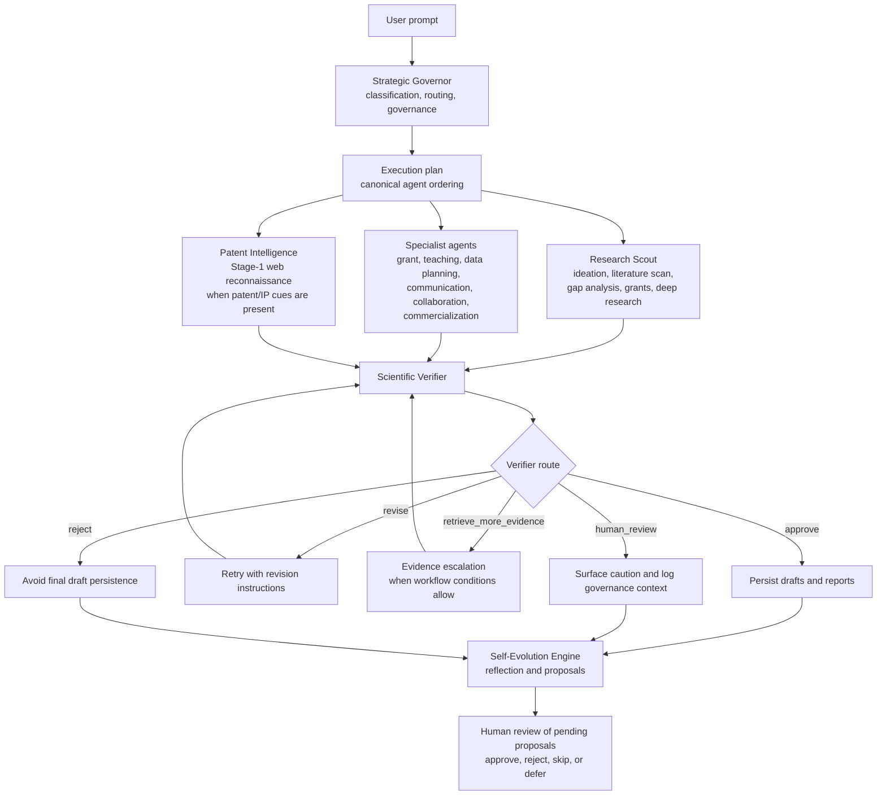
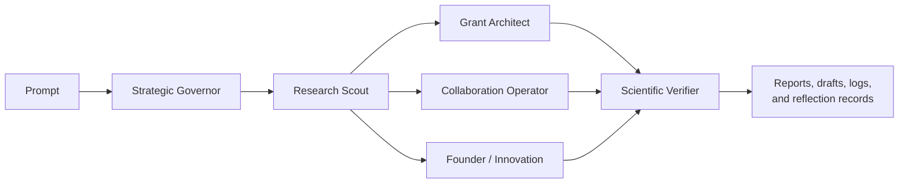
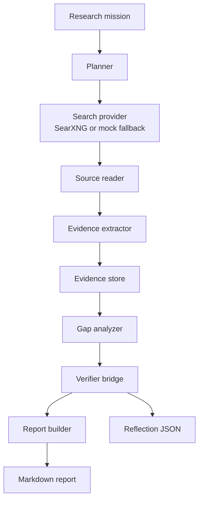
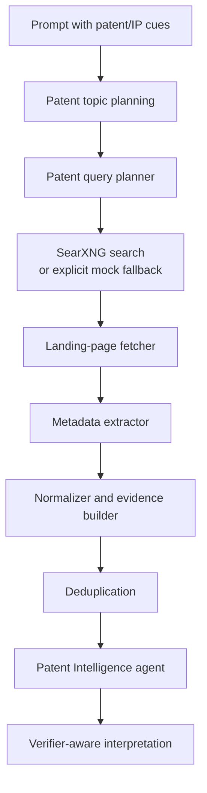

# AURA
## Governed Multi-Agent Research Assistance for Scientific Workflows

[](#suggested-software-environment)
[](#suggested-software-environment)
[](#quick-start)
[](#graphical-abstract--workflow-diagram)
[](#confidence-decision-and-governance-logic)
[](#limitations)

---

## Repository summary

**AURA** is a Python research-assistance framework for **governed, multi-agent scientific workflows**. It combines:

- an LLM-driven **Strategic Governor** for task interpretation and routing,
- a **Research Scout** with literature-scanning and deep-research pathways,
- a **Scientific Verifier** that evaluates generated outputs and can request revision or additional evidence,
- specialist agents for grants, teaching, data-analysis planning, collaboration, public communication, commercialization framing, and preliminary patent-web reconnaissance,
- persistent **draft/report/log artifacts**, and
- a **self-evolution review pathway** that records improvement proposals while preserving explicit human approval boundaries.

AURA is best understood as a **research software prototype and publication companion repository** for studying how scientific-assistance workflows can be modularized, audited, and constrained. It does **not** claim autonomous scientific judgment, legal advice, formal freedom-to-operate analysis, automatic grant submission, or unsupervised external communication.

---

## Why this repository exists

Scientific support tasks often require different reasoning modes that should not be collapsed into a single unconstrained model response. AURA separates these modes into explicit modules:

1. **Route the request** and identify whether the task is routine, evidence-sensitive, or consequential.
2. **Retrieve or synthesize research context** when a scout workflow is appropriate.
3. **Draft bounded outputs** through specialist agents.
4. **Review generated claims** through a dedicated verifier.
5. **Persist artifacts** for later inspection.
6. **Capture lessons and proposals** without silently changing the system.

This design makes the repository useful for research-engineering experiments in:

- human-in-the-loop scientific assistants,
- evidence-aware LLM workflows,
- agent routing and orchestration,
- draft-versus-action governance,
- research memory and reflection mechanisms,
- transparent treatment of search fallback behavior.

---

## Graphical abstract / workflow diagram



**Scope note:** This diagram represents the implemented orchestration concept in `core/orchestrator.py`. Some branches are conditional. For example, patent reconnaissance is inserted only when patent/IP/commercialization cues are detected, and self-evolution outputs remain proposal-oriented rather than automatically rewriting core system policy.

---

## Repository scope

### Implemented in code

AURA currently provides:

- an **interactive CLI** and direct **deep-research CLI**,
- model selection and optional Ollama bootstrap behavior,
- a registry-backed multi-agent orchestrator,
- structured Pydantic schemas for major task outputs,
- specialist-level and session-level verification,
- retry logic for revision and evidence escalation,
- literature discovery across multiple scholarly sources,
- local research-memory persistence,
- Stage-1 patent-web retrieval through SearXNG or explicit mock fallback,
- deep-research evidence/report generation,
- Markdown draft persistence,
- self-evolution reflection generation and human approval utilities,
- live/manual diagnostic scripts.

### Implemented with explicit caveats

| Area | What is implemented | Important caution |
|---|---|---|
| Deep research | Mission planning, search-provider abstraction, source reading, evidence extraction, report generation | Mock provider outputs are synthetic when real SearXNG search is unavailable or disabled |
| Patent Intelligence | Stage-1 web reconnaissance over patent-oriented public search results | Not exhaustive, not formal patent search, not legal advice |
| Self-evolution | Reflection records, proposal extraction, selective low-risk memory handling, review CLI | Profile changes and proposal approvals remain governed by explicit review |
| Verification | LLM-based critique and routing logic | Not an independent ground-truth validator |
| Diagnostics | Interactive/manual scripts that exercise intended workflows | Not a complete automated test suite |

### Present as placeholder or limited pathways

The Research Scout recognizes modes including:

- `paper_intake`,
- `trend_monitor`,
- `reviewer_attack_scan`.

These modes appear as planned or limited pathways in the code and should **not** be described as fully mature, production-grade subpipelines.

---

## Architecture at a glance

| Subsystem | Main responsibility |
|---|---|
| `main.py` | CLI entry point, interactive shell, direct deep-research commands |
| `config.py` | Environment configuration, runtime paths, search/patent settings |
| `core/` | Routing execution, schemas, LLM calls, draft writing, governance, review tooling |
| `agents/` | Strategic, verification, self-evolution, and specialist agents |
| `integrations/research_evolution/` | Literature sources, scoring, gap analysis, profile management, reports |
| `integrations/patent_web/` | Stage-1 patent-web query, retrieval, extraction, normalization, evidence packaging |
| `qwen_evolver/deep_research/` | Direct research mission pipeline and report generation |
| `scripts/` | Approval CLI, live validation, diagnostic utilities, SearXNG setup helper |
| `deployment/searxng/` | Self-hosted SearXNG deployment files |
| `profiles/` | Research-profile YAML used by research-evolution components |
| `data/` | Local memory, reflections, approval logs, caches, evidence artifacts |
| `reports/` | Generated Markdown reports and validation outputs |

---

## Description of each script / component

### Strategic coordination

| File | Role |
|---|---|
| `agents/strategic_governor.py` | Produces a structured routing decision, including task type, selected agents, scout mode, evidence needs, approval needs, and workflow order |
| `core/orchestrator.py` | Runs the end-to-end AURA session: routing, specialist execution, verification, retry logic, draft persistence, and self-evolution |
| `core/registry.py` | Defines agent registry metadata and canonical integration points |
| `core/schemas.py` | Pydantic data models for governor decisions, specialist outputs, verification, self-evolution, and patent-related structures |

### Verification and governance

| File | Role |
|---|---|
| `agents/scientific_verifier.py` | Generates structured verification reports and routes such as `approve`, `revise`, `retrieve_more_evidence`, `human_review`, and `reject` |
| `core/permissions.py` | Maps action types into `auto`, `approval_required`, and `never` policies |
| `core/evolution_review.py` | Loads pending proposals, applies reviewed profile/memory updates, and logs review decisions |
| `scripts/approve_evolution.py` | Standalone CLI for reviewing pending self-evolution proposals |

### Research and specialist agents

| File | Role |
|---|---|
| `agents/research_scout.py` | Research opportunity, literature scan, gap analysis, grant opportunity, and deep-research delegation workflows |
| `agents/grant_architect.py` | Drafts structured grant-related reasoning and proposal concepts |
| `agents/teaching_mentor.py` | Produces teaching-oriented explanations, prompts, and learning-support material |
| `agents/lab_data_analyst.py` | Plans analyses and reproducibility-oriented checks without performing destructive raw-data operations |
| `agents/influence_public_communication.py` | Drafts public-facing communication material without publishing |
| `agents/collaboration_operator.py` | Frames collaboration opportunities and outreach drafts without contacting third parties |
| `agents/founder_innovation.py` | Frames commercialization hypotheses, validation logic, and business-facing risks without replacing legal or investment advice |
| `agents/patent_intelligence.py` | Interprets preliminary patent-web evidence for early landscape reasoning |
| `agents/self_evolution_engine.py` | Generates reflection records, lessons, and improvement proposals after sessions |

### Core runtime and output helpers

| File | Role |
|---|---|
| `core/llm.py` | LLM interaction layer |
| `core/runtime.py` | Runtime helpers, including local Ollama readiness checks |
| `core/searxng_runtime.py` | SearXNG availability/runtime helpers |
| `core/formatter.py` | Rich terminal rendering for interactive outputs |
| `core/draft_writer.py` | Persists specialist drafts as Markdown files in `reports/` |
| `core/memory.py` | JSONL persistence helpers for memories, reflections, and related records |

---

## Combined workflow concept

AURA’s principal contribution is not any single specialist agent in isolation, but the **governed composition** of multiple specialized research-support stages.



This combined workflow is **implemented** through the orchestrator, but outputs vary according to:

- the governor’s selected agent list,
- external service availability,
- the selected LLM/model,
- the user’s prompt,
- verifier routing decisions,
- retry caps and runtime configuration.

---

## Highlights

- **Governed orchestration** rather than unconstrained agent chaining
- **Verifier-aware retry loop** for revision and evidence recovery
- **Canonical execution ordering** across specialists
- **Explicit approval logging** for consequential actions
- **Structured outputs** suitable for later audit
- **Persistent Markdown drafts** for specialist workflows
- **Multi-source literature search** and local research memory
- **Transparent real-versus-mock search behavior**
- **Patent Stage-1 reconnaissance** with conservative confidence handling
- **Human-reviewed self-evolution proposals**

---

## Code-to-README validation note

This README was written from direct inspection of the repository contents, including:

- all top-level Python scripts,
- `main.py`,
- `config.py`,
- `core/`,
- `agents/`,
- `integrations/`,
- `qwen_evolver/deep_research/`,
- `scripts/`,
- `environment.yml`,
- `.env.example`,
- generated artifact directories.

The wording intentionally distinguishes:

- what the code clearly implements,
- what the code supports conditionally,
- what remains a research-prototype limitation,
- what should be treated as a recommended future addition rather than a present capability.

---

# Detailed workflows

## Workflow 1 — Interactive AURA session

### Entry point

```bash
python main.py
```

### Interactive flow

1. The CLI prompts for a model name and an optional API key.
2. The configured model is stored in the runtime environment.
3. Local-model bootstrap behavior may be invoked for Ollama-style model names.
4. The user enters a natural-language research request.
5. The Strategic Governor determines workflow structure.
6. Specialist agents execute according to the resolved plan.
7. Scientific verification is applied.
8. Retry logic may revise outputs or attempt evidence escalation.
9. Drafts are written when final verifier status does not equal `reject`.
10. Self-evolution reflections are recorded or skipped according to policy.

### In-shell commands

| Command | Behavior |
|---|---|
| `help` or `?` | Show CLI help |
| `json` | Print raw JSON for the last AURA run |
| `evolve`, `approve evolution`, `pending`, and related triggers | Enter proposal-review workflow |
| `exit` or `quit` | Leave the shell |

---

## Workflow 2 — Direct deep research

### CLI commands

```bash
python main.py research \
  --query "What are recent directions in red-NIR TADF OLED research?" \
  --depth standard
```

```bash
python main.py research-grants \
  --query "Identify grant-relevant opportunities in red-NIR TADF OLED research." \
  --depth extensive
```

### Mission/report inspection

```bash
python main.py show-report --mission-id MISSION_ID
python main.py show-evidence --mission-id MISSION_ID
python main.py show-reflection --mission-id MISSION_ID
```

### Deep-research pipeline



### Search-provider interpretation

The deep-research orchestrator treats:

- **SearXNG** as the only real web-search provider currently supported by this module.
- **Mock search** as a fallback path producing synthetic placeholder results, surfaced in reports and reflection notes.

This distinction matters: mock-mode research outputs should be interpreted as workflow demonstrations, not as literature evidence.

---

## Workflow 3 — Literature scanning and research evolution

### Core files

- `agents/research_scout.py`
- `integrations/research_evolution/paper_sources.py`
- `integrations/research_evolution/paper_scoring.py`
- `integrations/research_evolution/gap_analysis.py`
- `integrations/research_evolution/literature_memory.py`
- `integrations/research_evolution/reports.py`

### Scholarly sources implemented in code

The paper-source module includes queries for:

- OpenAlex,
- arXiv,
- Crossref,
- Semantic Scholar,
- Europe PMC.

Returned paper records are deduplicated/scored downstream within the research-evolution workflow.

### Example prompt

```text
Find recent papers on red-NIR TADF OLEDs, identify promising research gaps,
and summarize the most actionable opportunity clusters.
```

### Outputs that may be produced

Depending on the route and prompt, the literature workflow may produce:

- paper collections,
- scored top-paper subsets,
- gap-analysis candidates,
- follow-up query suggestions,
- saved local literature memory,
- a weekly brief when prompt cues request one,
- verifier-ready evidence summaries.

### Weekly-brief trigger

The code can generate a weekly brief when the prompt contains trigger language such as:

- `weekly brief`,
- `weekly report`,
- `research brief`,
- `weekly summary`.

The output is written under:

```text
reports/weekly_brief_YYYY-MM-DD.md
```

---

## Workflow 4 — Patent Intelligence, Stage 1

### Purpose

Patent Intelligence provides **preliminary patent-web reconnaissance** for early-stage research or commercialization framing.

It is deliberately bounded:

- web-search based,
- landing-page oriented,
- domain-restricted,
- confidence-aware,
- not legal advice.

### Configured allowed domains

The default `.env.example` and `config.py` configure:

```text
patents.google.com
patentscope.wipo.int
uspto.gov
```

### Patent retrieval pipeline



### Evidence quality and fallback logic

The patent pipeline distinguishes:

| Condition | Interpretation |
|---|---|
| Real SearXNG provider available | Uses retrieved patent-oriented web results |
| Mock fallback enabled and real provider unavailable | Produces synthetic placeholder search output with explicit warnings |
| Mock fallback disabled and provider unavailable | Refuses to proceed through mock behavior |
| Limited usable records | Evidence should be interpreted conservatively |

### Boundary statement

The patent workflow is **not**:

- a patent-office API integration,
- a formal prior-art search,
- an exhaustive landscape analysis,
- a freedom-to-operate opinion,
- legal counsel.

---

## Workflow 5 — Self-evolution review and proposal approval

### Review CLI

```bash
python scripts/approve_evolution.py
```

### Optional flags

```bash
python scripts/approve_evolution.py --list
python scripts/approve_evolution.py --auto-skip
```

### What the review system handles

The proposal review machinery can:

- load pending profile and memory proposals from reflections,
- avoid repeatedly surfacing already decided proposals,
- present interactive review choices,
- apply approved profile updates to `profiles/research_profile.yaml`,
- append approved memory entries,
- write decision records to `data/approval_log.jsonl`.

### Governance note

Self-evolution outputs are best described as **reviewable system-improvement proposals**, not autonomous rewriting of the repository’s policy or research profile.

---

## Workflow 6 — Manual diagnostics and validation utilities

The repository includes practical scripts for debugging and demonstration.

| Script | Intended use |
|---|---|
| `_demo_pipelines.py` | Demonstrate routing and pipeline behavior |
| `_diagnose_governor.py` | Inspect Strategic Governor output behavior |
| `_diagnose_llm.py` | Check LLM connectivity path |
| `_e2e_test.py` | Manual integration-style workflow exercise |
| `scripts/diagnose_wave2.py` | Live diagnostic prompts for second-wave specialists |
| `scripts/diagnose_wave3.py` | Live diagnostic prompts for third-wave specialists |
| `scripts/live_validate_core.py` | Run live prompt checks and save validation summary |
| `scripts/setup_searxng_windows.py` | Validate/setup SearXNG-oriented runtime assumptions on Windows |

These are useful research-engineering artifacts, but they should not be presented as a comprehensive automated verification regime.

---

# Outputs produced by each workflow

| Workflow | Typical persisted outputs |
|---|---|
| Specialist drafts | `reports/<agent>_<timestamp>.md` |
| Weekly brief | `reports/weekly_brief_YYYY-MM-DD.md` |
| Deep-research report | `reports/deep_research/<mission_id>_report.md` |
| Deep-research evidence | `data/deep_research/evidence/<mission_id>_evidence.jsonl` |
| Deep-research reflection | `data/deep_research/reflections/<mission_id>_reflection.json` |
| Memory records | `data/memories.jsonl` |
| Reflection records | `data/reflections.jsonl` |
| Approval decisions | `data/approval_log.jsonl` |
| Performance logs | `data/performance_log.jsonl` |
| Literature memory | `data/research_memory.db` |
| Patent HTML/cache material | `data/patent_web/` |
| Validation output | `reports/live_validate_core_results.json` |

---

# Confidence, decision, and governance logic

## Governor-level decision structure

The Strategic Governor’s schema includes routing and governance signals such as:

- task type,
- selected agents,
- research-scout mode,
- approval requirements,
- risk level,
- evidence requirements,
- workflow sequence,
- memory policy,
- self-evolution policy,
- mission/strategic/urgency scores.

These are workflow-control outputs, not guaranteed scientific truth estimates.

---

## Verifier routes

The Scientific Verifier supports:

| Route | Meaning inside the orchestrator |
|---|---|
| `approve` | Continue with the current output |
| `revise` | Attempt a targeted revision pass when instructions exist |
| `retrieve_more_evidence` | Attempt evidence escalation when conditions permit |
| `human_review` | Surface caution and governance concerns |
| `reject` | Do not persist final specialist drafts |

The orchestrator can also compute a worst-case aggregate route across specialist verifications.

---

## Retry logic

The orchestrator includes an implemented retry loop. It can:

- escalate a non-literature scout mode into `literature_scan` after `retrieve_more_evidence`,
- rerun specialists with verifier revision instructions after `revise`,
- stop when strategies are exhausted or retry caps are reached,
- record retry history and route changes.

Configurable environment variables include:

```bash
AURA_AUTO_RETRIEVE_EVIDENCE=1
AURA_MAX_RETRIES=5
AURA_MAX_REVISE_ITERATIONS=4
```

Hard caps are enforced in code.

---

## Action-governance categories

`core/permissions.py` separates suggested actions into three policy classes:

| Policy | Interpretation |
|---|---|
| `auto` | Drafting, local reporting, and similar low-consequence internal tasks |
| `approval_required` | Actions that require explicit human authorization before execution |
| `never` | Actions the system should not autonomously perform |

Examples of restricted or non-autonomous actions include:

- sending communications,
- publishing content,
- modifying durable profiles without review,
- submitting grants,
- deleting files,
- representing legal or financial decisions,
- filing patents or signing agreements.

---

# Complete repository layout, including all `.py` files

The repository contains **68 Python files**. The layout below enumerates every `.py` file present in the provided archive.

```text
aura/
├── main.py
├── config.py
├── _demo_pipelines.py
├── _diagnose_governor.py
├── _diagnose_llm.py
├── _e2e_test.py
│
├── agents/
│   ├── __init__.py
│   ├── collaboration_operator.py
│   ├── founder_innovation.py
│   ├── grant_architect.py
│   ├── influence_public_communication.py
│   ├── lab_data_analyst.py
│   ├── patent_intelligence.py
│   ├── research_scout.py
│   ├── scientific_verifier.py
│   ├── self_evolution_engine.py
│   ├── strategic_governor.py
│   └── teaching_mentor.py
│
├── core/
│   ├── __init__.py
│   ├── draft_writer.py
│   ├── evolution_review.py
│   ├── formatter.py
│   ├── llm.py
│   ├── memory.py
│   ├── orchestrator.py
│   ├── permissions.py
│   ├── registry.py
│   ├── runtime.py
│   ├── schemas.py
│   └── searxng_runtime.py
│
├── integrations/
│   ├── __init__.py
│   ├── patent_web/
│   │   ├── __init__.py
│   │   ├── dedup.py
│   │   ├── evidence_builder.py
│   │   ├── extractor.py
│   │   ├── normalizer.py
│   │   ├── page_fetcher.py
│   │   ├── pipeline.py
│   │   ├── query_planner.py
│   │   ├── schemas.py
│   │   └── search.py
│   └── research_evolution/
│       ├── __init__.py
│       ├── gap_analysis.py
│       ├── literature_memory.py
│       ├── paper_scoring.py
│       ├── paper_sources.py
│       ├── profile.py
│       ├── profile_evolution.py
│       ├── reports.py
│       └── schemas.py
│
├── qwen_evolver/
│   └── deep_research/
│       ├── __init__.py
│       ├── citation_manager.py
│       ├── evidence_extractor.py
│       ├── evidence_store.py
│       ├── gap_analyzer.py
│       ├── orchestrator.py
│       ├── planner.py
│       ├── report_builder.py
│       ├── research_logger.py
│       ├── schemas.py
│       ├── search_providers.py
│       ├── source_reader.py
│       └── verifier_bridge.py
│
└── scripts/
    ├── approve_evolution.py
    ├── diagnose_wave2.py
    ├── diagnose_wave3.py
    ├── live_validate_core.py
    └── setup_searxng_windows.py
```

### Non-Python companion resources

The repository also includes non-Python assets that matter operationally:

```text
environment.yml
.env.example
deployment/searxng/
profiles/
data/
reports/
outputs/
```

---

# Suggested software environment

## Provided environment specification

The repository includes `environment.yml`:

```yaml
name: aura
channels:
  - conda-forge
dependencies:
  - python=3.11
  - pip
  - numpy
  - pandas
  - pydantic
  - python-dotenv
  - rich
  - pytest
  - requests
  - pyyaml
  - pip:
      - ollama
      - beautifulsoup4
```

## Dependencies directly relevant to the inspected code

Non-standard libraries imported in the repository include:

- `pydantic`,
- `python-dotenv`,
- `rich`,
- `requests`,
- `PyYAML`,
- `beautifulsoup4`,
- `ollama` through the provided environment/runtime design.

The repository’s environment file additionally includes `numpy`, `pandas`, and `pytest`.

## External executables or services

| Component | Relevance |
|---|---|
| Ollama | Local-model runtime support and bootstrap pathway |
| Docker / Docker Compose | Optional SearXNG deployment path |
| SearXNG | Real search provider for deep research and patent-web retrieval |

---

# Quick start

## 1. Create and activate the environment

```bash
conda env create -f environment.yml
conda activate aura
```

## 2. Configure environment variables

```bash
cp .env.example .env
```

Edit `.env` as needed.

A local-model preference is already illustrated in `.env.example`:

```bash
AURA_MODEL=qwen3:8b
```

## 3. Prepare a local Ollama model when using a local model string

```bash
ollama pull qwen3:8b
```

## 4. Start the interactive shell

```bash
python main.py
```

---

# Optional SearXNG setup

AURA’s deep-research and patent-web search paths can use a self-hosted SearXNG service.

## Windows-oriented helper

```bash
python scripts/setup_searxng_windows.py --gen-secret
```

## Start the provided Compose stack

```bash
docker compose -f deployment/searxng/docker-compose.yml up -d
```

## Enable SearXNG in `.env`

```bash
SEARXNG_ENABLED=1
SEARXNG_URL=http://localhost:8080
```

The repository notes that JSON output must be enabled in the SearXNG settings file for `format=json` requests to function.

---

# How to use the workflows together

## Example A — Literature scan to grant concept

```text
Find recent papers on red-NIR TADF OLEDs, identify a research gap,
and turn the strongest opportunity into a grant-oriented concept.
```

A plausible route is:

1. Research Scout literature scan,
2. Grant Architect draft,
3. Scientific Verifier review,
4. Markdown draft persistence,
5. self-evolution reflection.

---

## Example B — Research synthesis to collaboration framing

```text
Review recent OLED literature and identify collaboration angles
for experimental validation and device characterization.
```

A plausible route is:

1. Research Scout,
2. Collaboration Operator,
3. Scientific Verifier,
4. draft persistence without autonomous outreach.

---

## Example C — Research explanation for teaching

```text
Explain thermally activated delayed fluorescence to senior undergraduates
and propose a short activity with diagnostic questions.
```

A plausible route is:

1. Teaching Mentor,
2. Scientific Verifier,
3. saved teaching draft when not rejected.

---

## Example D — Early patent-aware commercialization reflection

```text
Assess whether this OLED materials direction raises patent landscape questions
for a potential commercialization pathway.
```

A plausible route is:

1. Founder / Innovation framing,
2. Patent Intelligence insertion if cues match,
3. verifier review,
4. cautious interpretation with no legal claims.

---

# Reproducibility notes

AURA supports reproducibility primarily through **traceable intermediate artifacts**, not exact deterministic replay.

## Traceability features

- JSON-compatible structured outputs,
- persisted Markdown drafts,
- approval logs,
- reflection records,
- local research-memory database,
- deep-research evidence packs,
- report and reflection artifacts,
- configurable environment variables.

## Important caveats

- LLM outputs may vary across runs.
- External literature/search sources evolve.
- SearXNG results are not fixed snapshots unless separately archived.
- Mock search outputs are synthetic.
- Generated reports demonstrate runtime behavior but should not be mistaken for validated scientific conclusions.
- Exact environment reproducibility is improved by `environment.yml`, but no fully pinned lockfile is present in the provided repository.

---

# Methodological contribution / interpretation

AURA’s strongest methodological contribution is a **governed orchestration pattern** for research-assistance systems:

1. **Explicit routing** rather than implicit task drift.
2. **Bounded specialist roles** rather than one all-purpose responder.
3. **Verifier-mediated output control** rather than unconditional acceptance.
4. **Action governance** separating drafts from consequential execution.
5. **Persistent artifacts** that allow inspection after the fact.
6. **Self-evolution as a reviewable proposal layer**, not silent self-modification.

This makes the repository suitable as a technical companion to work on:

- agentic scientific assistants,
- human approval in LLM workflows,
- research-support infrastructure,
- evidence-aware draft generation,
- responsible experimentation with self-reflective AI systems.

---

# Example citation block

```bibtex
@software{aura_research_assistant_2026,
  title        = {AURA: Governed Multi-Agent Research Assistance for Scientific Workflows},
  author       = {Repository Maintainers},
  year         = {2026},
  version      = {research prototype},
  note         = {GitHub repository and publication companion software}
}
```

Replace the author, version, repository identifier, and publication metadata with final release information.

---

# Recommended additions for publication readiness

The repository would be strengthened by adding:

1. a formal `LICENSE`,
2. `CITATION.cff`,
3. pinned lockfiles or platform-specific environment exports,
4. a minimal reproducible demo prompt set,
5. a static example gallery of representative outputs,
6. clearer separation of offline tests and live-service diagnostics,
7. continuous integration for linting and low-dependency checks,
8. a benchmark/evaluation protocol for route quality and verifier behavior,
9. security notes for any non-local SearXNG deployment,
10. a manuscript-aligned table mapping repository modules to paper sections.

These are **recommended future additions**, not capabilities currently proven by the provided code.

---

# Limitations

- AURA is a **research prototype**, not a certified scientific decision system.
- The verifier is LLM-based and does not replace expert validation.
- Draft quality depends on model choice, prompt structure, and external evidence availability.
- Literature and patent retrieval can fail or degrade when upstream services are unavailable.
- Patent web reconnaissance is preliminary and not a legal search.
- Self-evolution proposals require careful interpretation and governed review.
- Some recognized scout modes are not fully developed production workflows.
- Manual diagnostics are useful but do not constitute comprehensive software validation.
- The repository includes environment guidance, but exact bit-for-bit reproducibility is not established.

---

# Acknowledgments

This repository reflects a research-engineering effort to combine:

- multi-agent task decomposition,
- scientific-workflow routing,
- structured verification,
- retrieval-assisted research support,
- governed reflection,
- and artifact persistence.

Its design favors **transparency, caution, and inspectability** over overclaiming autonomy.

---

# Maintainer note

Preserve the repository’s most important discipline:

> **State clearly what the software drafts, what it verifies, what it suggests, and what it must not execute autonomously.**
