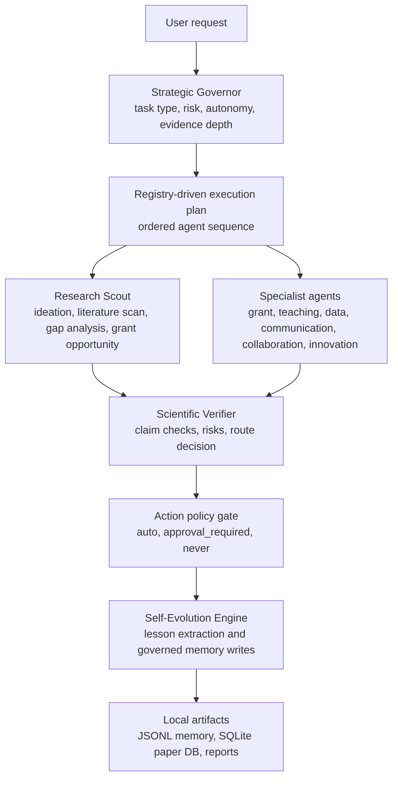
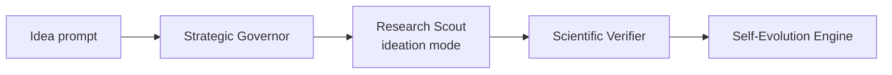
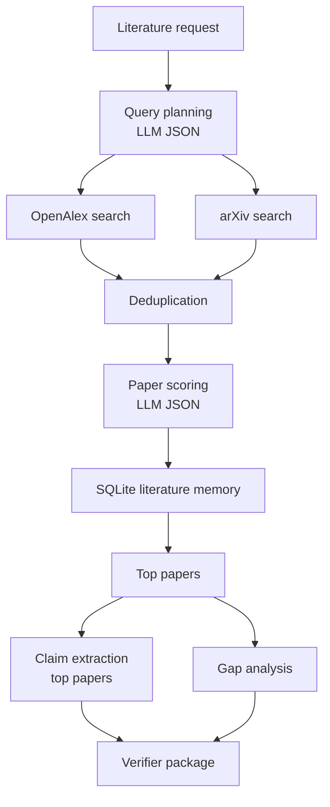

# Self Evolution Automated University Research Assistant Core (AURA)

**A local, governance-oriented multi-agent research assistant for OLED/TADF, photophysics, organic-electronics, and red/NIR emitter research.**


---

## Repository summary

Automated University Research Assistant Core (AURA) is a local Python research-assistant prototype built around a governed multi-agent workflow. It routes user requests through a **Strategic Governor**, executes one or more specialist agents, applies a **Scientific Verifier** to technical claims, and records constrained self-evolution notes for future sessions.

The system is configured for a research profile centered on:

- OLEDs and TADF emitters
- organic semiconductors
- red/NIR emission
- lanthanide complexes
- charge transport, device degradation, and quantum chemistry
- research ideation, literature scanning, grant framing, teaching, communication, collaboration, data-analysis planning, and commercialization strategy

AURA uses **Ollama with `qwen3:8b` only**. The model restriction is enforced in `config.py`; other model names are rejected at runtime.

---

## Why this repository exists

This repository provides a publication-oriented companion implementation for experimenting with **governed local research agents** in a scientific workflow. The code emphasizes:

1. **Agent routing with explicit autonomy and risk levels**
2. **Structured, schema-validated agent outputs**
3. **Claim-level scientific review before downstream use**
4. **Local memory and literature storage**
5. **Draft-only handling of external-facing actions**
6. **Conservative self-evolution through logged lessons, not automatic profile rewrites**

The repository is best understood as a research-engineering prototype for studying how local LLM agents can assist scientific ideation and literature triage while maintaining explicit approval boundaries.

---

## Graphical abstract / workflow



This diagram reflects the implemented orchestration in `core/orchestrator.py`. Some registered names are placeholders, and no script performs autonomous sending, publishing, submission, deletion, legal commitment, or financial action.

---

## Repository scope

### Implemented in the current code

| Area | Implemented behavior |
|---|---|
| Interactive entry point | `main.py` runs a Rich terminal loop around `run_aura_core()` |
| Local LLM access | All LLM calls route through `core/llm.py` and Ollama |
| Model restriction | `config.py` permits only `qwen3:8b` |
| Agent orchestration | `core/orchestrator.py` executes registry-backed workflows |
| Agent registry | `core/registry.py` defines implemented and placeholder agents |
| Structured schemas | `core/schemas.py` uses Pydantic models for outputs |
| Approval policy | `core/permissions.py` gates actions as `auto`, `approval_required`, or `never` |
| Research profile | `profiles/research_profile.yaml` defines topics, weights, watchlists, and protected topics |
| Literature search | OpenAlex and arXiv queries via `requests` |
| Literature memory | SQLite paper database at `data/research_memory.db` |
| Local logs | JSONL memory, reflection, approval, and performance logs |
| Report generation | Weekly Markdown research briefs when requested |
| Scientific verification | LLM-mediated claim review with structured fallback behavior |
| Self-evolution | Session reflection and low-risk lesson saving |

### Present but limited or planned

| Area | Current status |
|---|---|
| `paper_intake` Research Scout mode | Stub returning `not_implemented` metadata |
| `trend_monitor` Research Scout mode | Stub returning `not_implemented` metadata |
| `reviewer_attack_scan` Research Scout mode | Stub returning `not_implemented` metadata |
| `memory_retriever` registry entry | Registered but not implemented as an executable handler |
| `human_approval_governor` registry entry | Registered but not implemented as an executable handler |
| Lab/data analysis | Generates analysis plans only; it does not read, transform, or plot raw datasets |
| External communication | Draft-only; no sending, scheduling, publishing, or submission is implemented |
| Legal, financial, IP, or investment actions | Explicitly excluded from autonomous execution |

---

## Code-to-README validation note

This README was generated from the extracted repository contents, including:

- `main.py`
- `config.py`
- `environment.yml`
- `agents/*.py`
- `core/*.py`
- `integrations/research_evolution/*.py`
- `profiles/research_profile.yaml`
- included generated reports under `reports/`

The README does **not** assume tests or CI are present in the archive. The included `reports/phase1_integration_report.md` references an audit and tests, but the extracted repository package itself does not include a `tests/` directory.

---

## Repository layout

```text id="2cfps1"
.
├── main.py
├── config.py
├── environment.yml
├── agents/
│   ├── strategic_governor.py
│   ├── research_scout.py
│   ├── scientific_verifier.py
│   ├── self_evolution_engine.py
│   ├── grant_architect.py
│   ├── teaching_mentor.py
│   ├── lab_data_analyst.py
│   ├── influence_public_communication.py
│   ├── collaboration_operator.py
│   └── founder_innovation.py
├── core/
│   ├── orchestrator.py
│   ├── registry.py
│   ├── schemas.py
│   ├── permissions.py
│   ├── llm.py
│   ├── memory.py
│   └── formatter.py
├── integrations/
│   └── research_evolution/
│       ├── paper_sources.py
│       ├── paper_scoring.py
│       ├── literature_memory.py
│       ├── gap_analysis.py
│       ├── profile.py
│       ├── profile_evolution.py
│       ├── reports.py
│       └── schemas.py
├── profiles/
│   └── research_profile.yaml
├── data/
│   ├── memories.jsonl
│   ├── reflections.jsonl
│   ├── approval_log.jsonl
│   ├── performance_log.jsonl
│   └── research_memory.db
├── reports/
│   ├── phase1_integration_report.md
│   └── weekly_brief_2026-05-07.md
└── outputs/
```

Generated cache directories such as `__pycache__/` are present in the archive but should normally be ignored in a clean GitHub repository.

---

## Components

### Core system

| File | Role |
|---|---|
| `main.py` | Interactive terminal interface. Accepts user prompts, runs the orchestrator, and renders formatted output. |
| `config.py` | Loads environment variables, enforces `qwen3:8b`, and defines local data/report/profile paths. |
| `core/llm.py` | Central Ollama wrapper. Provides `ask_llm()`, `ask_json()`, and JSON extraction helpers. |
| `core/orchestrator.py` | Main execution engine. Runs the governor, specialist loop, verifier, action gating, and self-evolution. |
| `core/registry.py` | Single source of truth for available agents, handlers, verification requirements, and placeholder status. |
| `core/schemas.py` | Pydantic models for agent outputs, verifier reports, Research Scout outputs, memory records, and reflections. |
| `core/permissions.py` | Keyword-based approval detection and structured `ACTION_POLICY` gating. |
| `core/memory.py` | JSONL utility functions for memories and reflections. |
| `core/formatter.py` | Rich terminal rendering for governor, scout, verifier, specialist, and self-evolution outputs. |

### Agent modules

| Agent | File | Implemented purpose |
|---|---|---|
| Strategic Governor | `agents/strategic_governor.py` | Classifies tasks, chooses agents, sets autonomy level, evidence depth, risk, and approval requirements. |
| Research Scout | `agents/research_scout.py` | Performs research ideation, literature scanning, gap analysis, and grant-opportunity analysis. |
| Scientific Verifier | `agents/scientific_verifier.py` | Reviews claims, methodology risks, novelty risks, citation risks, grant risks, and action-governance risks. |
| Self-Evolution Engine | `agents/self_evolution_engine.py` | Extracts session lessons, logs reflections, and saves only low-risk high-confidence reusable lessons. |
| Grant Architect | `agents/grant_architect.py` | Produces reviewer-aware grant proposal structure. Draft-only; never submits. |
| Teaching Mentor | `agents/teaching_mentor.py` | Produces learner-aware teaching material, misconceptions, questions, quizzes, and rubrics. |
| Lab/Data Analyst | `agents/lab_data_analyst.py` | Produces safe analysis plans, required columns, checks, plots, and interpretation limits. Does not touch raw files. |
| Influence/Public Communication | `agents/influence_public_communication.py` | Drafts public-facing communication with overclaim controls. Never publishes. |
| Collaboration Operator | `agents/collaboration_operator.py` | Drafts collaboration plans, outreach emails, meeting agendas, and questions. Never sends or schedules. |
| Founder/Innovation | `agents/founder_innovation.py` | Produces strategic commercialization analysis. Not legal, financial, investment, or IP advice. |

### Research-evolution integrations

| File | Role |
|---|---|
| `paper_sources.py` | Searches OpenAlex and arXiv, reconstructs OpenAlex abstracts, and deduplicates records. |
| `paper_scoring.py` | Uses the local LLM to score papers across relevance, novelty, grant potential, collaboration value, industry value, teaching value, feasibility, risk, and domain-specific OLED/TADF dimensions. |
| `literature_memory.py` | Creates and updates the SQLite literature database; stores scored papers and feedback. |
| `gap_analysis.py` | Uses scored papers and profile information to propose a research gap candidate. |
| `profile.py` | Loads, creates, sanitizes, and writes the research profile. Protected topics are preserved. |
| `profile_evolution.py` | Drafts profile update suggestions; profile changes require explicit approval unless called with `require_approval=False`. |
| `reports.py` | Generates and saves Markdown weekly research briefs. |
| `schemas.py` | Pydantic schemas for papers, scores, scored papers, and research profiles. |

---

## Combined workflow concept

The primary workflow is implemented through:

```python id="ju5j0q"
from core.orchestrator import run_aura_core

result = run_aura_core("Find recent papers on red-NIR TADF OLEDs and identify grant-relevant opportunities.")
```

At a high level:

1. `Strategic Governor` classifies the user request.
2. The orchestrator resolves an ordered agent plan from the governor decision.
3. Registry-backed specialist agents execute through a common interface.
4. Recommended actions are filtered through `ACTION_POLICY`.
5. Specialists requiring review are passed to the `Scientific Verifier`.
6. The `Self-Evolution Engine` records session-level reflections and approved lessons.
7. Local artifacts are written to `data/` and `reports/` where relevant.

Individual agents expose `run()` functions and can be imported directly for development, but the repository is structured around the orchestrated `run_aura_core()` pathway rather than separate command-line tools for each agent.

---

## Decision and confidence logic

### Governor routing

The Strategic Governor produces:

- `task_type`
- `priority`
- `risk_level`
- `autonomy_level`
- `external_consequence`
- `evidence_requirement`
- `mission_alignment_score`
- `strategic_value_score`
- `selected_agents`
- `workflow_sequence`
- `memory_policy`
- `self_evolution_policy`
- `requires_approval`
- `blocked_actions`

The code also applies deterministic keyword-based overrides for high-risk operations such as sending email, submitting grants, posting publicly, deleting files, modifying profiles, contacting authors, and sharing data.

### Autonomy levels

| Level | Meaning in code comments |
|---|---|
| `L0` | Answer only |
| `L1` | Draft text in memory only |
| `L2` | Search, summarize, rank, retrieve |
| `L3` | Generate structured files or plans without external action |
| `L4` | Prepare external action drafts only |
| `L5` | Execute external action; requires explicit human approval |

The current implementation does not provide autonomous execution of external actions.

### Action policy

`core/permissions.py` defines three action classes:

| Policy | Meaning |
|---|---|
| `auto` | Safe local drafting, searching, scoring, reporting, explanation, or memory/report saving |
| `approval_required` | User approval required before execution |
| `never` | Refused regardless of approval |

Examples of `never` classes include financial decisions, legal representation, patent filing, incorporation, company registration, agreement signing, NDA signing, and trade execution.

### Scientific verification routes

The verifier can route outputs as:

- `approve`
- `revise`
- `retrieve_more_evidence`
- `human_review`
- `reject`

A verifier route of `human_review` or `reject` is logged to the approval log. The verifier is an LLM-mediated review layer, not a substitute for expert peer review or formal validation.

---

## Detailed workflows

### 1. Ideation workflow

Triggered by prompts such as:

```text id="j1mj37"
Explore a research proposal concept on red/NIR TADF-lanthanide OLEDs for photobiomodulation.
```

Expected pathway:



Primary outputs include:

- opportunity summary
- core hypothesis
- mechanism framing
- novelty risks
- minimum literature needed
- minimum experiments needed
- grant angles
- collaboration targets
- kill criteria
- verifier-ready claims

No OpenAlex or arXiv search is performed in ideation mode unless the prompt routes to a literature workflow.

---

### 2. Literature scan workflow

Triggered by prompts such as:

```text id="uoxu28"
Find recent papers on red-NIR TADF OLEDs and identify which ones are useful for a grant proposal.
```

Expected pathway:



Primary outputs include:

- planned search queries
- discovered papers
- scored papers
- top papers
- opportunity clusters
- claim-evidence maps
- gap candidate
- recommended actions
- optional report paths
- `partial_results` and `failed_stage` if a pipeline stage fails

If external APIs fail but cached papers exist, the code can fall back to global stored literature while marking the result as partial and lowering confidence.

---

### 3. Gap analysis workflow

Triggered by prompts such as:

```text id="esxwon"
Identify the research gap in the recent OLED/TADF literature.
```

This mode uses already stored session or global papers. If no papers are available, it returns a low-confidence partial result instructing the user to run a literature scan first.

Primary outputs include:

- primary gap
- secondary gaps
- supporting and overlapping papers
- what is not new
- evidence needed
- proposal angle
- paper angle
- kill criteria

---

### 4. Grant opportunity workflow

Triggered by prompts such as:

```text id="h3mcms"
Identify the strongest grant opportunity from recent red/NIR OLED papers.
```

This mode prioritizes papers marked as grant-relevant and asks the LLM to identify:

- primary grant angle
- secondary grant angles
- key claims
- supporting evidence
- gaps to fill
- reviewer objections
- collaboration needs
- industry relevance
- timeline estimate
- kill criteria

---

### 5. Grant Architect workflow

Triggered by grant/proposal keywords and routed through the registry.

The Grant Architect produces a draft-only proposal structure:

- possible title
- problem statement
- central hypothesis
- objectives
- work packages
- methodology overview
- expected outcomes
- reviewer attack points
- evidence needed before submission
- risk mitigation
- collaborator needs
- grant readiness level

The code forces `approval_level="draft_only"` for this agent. It does not submit proposals or represent the user institutionally.

---

### 6. Teaching Mentor workflow

Triggered by teaching, lecture, quiz, rubric, or student-audience keywords.

The Teaching Mentor produces:

- target audience
- learner level
- learning outcomes
- conceptual explanation
- Socratic questions
- common misconceptions
- quiz questions
- assessment rubric
- teaching activity
- technical cautions

The code validates learner level and keeps teaching outputs in draft form when technical cautions or risks are present.

---

### 7. Lab/Data Analyst workflow

Triggered by data-analysis, J-V-L, spectra, TCSPC, fitting, calibration, CSV, or raw-data keywords.

The Lab/Data Analyst produces a plan only:

- analysis type
- data requirements
- required columns
- recommended methods
- recommended calculations
- recommended plots
- data quality checks
- reproducibility checks
- interpretation limits
- safe file handling
- next analysis steps

Safety invariants are enforced in Python: outputs must include guidance not to delete raw data, not to overwrite original files, and to work on copies.

---

### 8. Influence/Public Communication workflow

Triggered by LinkedIn, public-facing, lay audience, podcast, blog, press release, or outreach-language keywords.

The agent produces:

- audience
- communication goal
- core message
- hook options
- LinkedIn draft
- public explanation
- narrative angle
- evidence cautions
- overclaim risks
- safer wording
- `approval_required_before_publishing=True`

It does not publish content. If the user asks to post or publish, the approval level is escalated.

---

### 9. Collaboration Operator workflow

Triggered by collaborator, collaboration, contact author, draft email, meeting agenda, partnership, speaker invitation, co-PI, or outreach keywords.

The agent produces:

- collaboration goal
- suggested collaboration type
- possible collaborators or collaborator archetypes
- rationale
- evidence for fit
- missing information
- draft email subject
- draft email body
- meeting agenda
- questions to ask
- institutional risk notes
- `approval_required_before_contacting=True`

It does not send email, schedule meetings, or imply institutional commitment.

---

### 10. Founder/Innovation workflow

Triggered by startup, spin-out, commercialization, product, market, customer discovery, patentability, licensing, investors, venture, or innovation keywords.

The agent produces strategic analysis only:

- innovation thesis
- product hypothesis
- target users or customers
- problem-customer fit
- value proposition
- technical moat
- IP considerations
- market assumptions
- commercialization pathways
- validation experiments
- business model options
- key risks
- regulatory or ethical considerations
- 90-day plan
- legal/financial disclaimer
- `approval_required_before_external_commitment=True`

It explicitly does not provide legal, financial, investment, or IP advice.

---
## Outputs produced

| Output path | Producer | Description |
|---|---|---|
| `data/memories.jsonl` | `core.memory`, `self_evolution_engine` | Local memory records and saved lessons |
| `data/reflections.jsonl` | `self_evolution_engine` | Session-level reflection records |
| `data/approval_log.jsonl` | `core.permissions`, `core.orchestrator` | Logged approval-required events and verifier routes |
| `data/performance_log.jsonl` | `self_evolution_engine` | Session assessment, failure modes, saved lesson count, verifier route, and scout mode |
| `data/research_memory.db` | `literature_memory.py` | SQLite store for scored papers and feedback |
| `reports/weekly_brief_<date>.md` | `reports.py` | Generated weekly research brief when requested |
| `reports/phase1_integration_report.md` | Included artifact | Existing audit-style report included in the archive |
| `outputs/` | Reserved directory | Present but not actively used by the inspected code |

The repository currently includes generated local data artifacts. For a public release, inspect these files carefully for private prompts, unpublished ideas, collaborator names, or other sensitive information.

---

## Suggested software environment

The included `environment.yml` defines a Conda environment named `aura` with Python 3.11.

Runtime dependencies used directly by the inspected source include:

- `ollama`
- `pydantic`
- `python-dotenv`
- `rich`
- `requests`
- `pyyaml`

The environment file also includes `numpy`, `pandas`, and `pytest`. These are not directly imported by the current source files inspected here, but may be useful for future analysis utilities or tests.

External executable/service requirement:

- Ollama must be installed and able to serve `qwen3:8b`.

Optional environment variable:

- `OPENALEX_API_KEY` — used if present, otherwise OpenAlex is queried without an API key.
- `AURA_MODEL` — must be `qwen3:8b` if set.
- `AURA_TEMPERATURE`
- `AURA_NUM_CTX`
- `AURA_KEEP_ALIVE`

---

## Quick start

```bash id="15smy1"
# 1. Create the Conda environment
conda env create -f environment.yml

# 2. Activate it
conda activate aura

# 3. Pull the only permitted model
ollama pull qwen3:8b

# 4. Run the interactive terminal interface
python main.py
```

If Ollama is not already running, start it according to your local Ollama installation before running AURA.

---

## Example prompts

### Research ideation

```text id="ul3tha"
Explore a research proposal concept on red/NIR TADF-lanthanide OLEDs for photobiomodulation.
```

### Literature scan

```text id="hwff8t"
Find recent papers on red-NIR TADF OLEDs and identify which ones are useful for a grant proposal.
```

### Weekly brief

```text id="9r7znx"
Generate a weekly research brief from recent OLED, TADF, lanthanide complex, and red-NIR emission papers.
```

### Data-analysis planning

```text id="1uzk0o"
Create a reproducible analysis plan for OLED J-V-L data in CSV format.
```

### Teaching material

```text id="jwslwk"
Create a graduate-level teaching module explaining TADF, RISC, PLQY, and EQE.
```

### Public communication draft

```text id="mv12xm"
Draft a responsible LinkedIn post explaining why red/NIR organic emitters are scientifically interesting.
```

### Collaboration preparation

```text id="nm3rv0"
Draft a collaboration email and meeting agenda for an OLED device-physics group.
```

### Innovation strategy

```text id="fjjtw5"
Evaluate this red/NIR OLED research direction as a possible commercialization pathway.
```

---

## Programmatic usage

```python id="v5xwas"
from core.orchestrator import run_aura_core

result = run_aura_core(
    "Find recent papers on red-NIR TADF OLEDs and identify grant-relevant gaps."
)

print(result["strategic_governor"]["task_type"])
print(result.get("research_scout", {}).get("summary"))
print(result.get("scientific_verifier", {}).get("route"))
```

For development, individual agents can also be imported directly:

```python id="mgefbb"
from agents.research_scout import run as run_research_scout

output = run_research_scout(
    user_input="Find recent papers on TADF OLEDs.",
    context={},
    mode="literature_scan",
)
```

Direct agent calls bypass parts of the orchestrator-level governance pathway. For normal use, prefer `run_aura_core()`.

---

## Reproducibility notes

Exact outputs are not guaranteed to be bitwise reproducible unless the following are fixed:

- Ollama version
- `qwen3:8b` model version or digest
- environment package versions
- research profile YAML
- local JSONL memory files
- SQLite literature database
- date-dependent session IDs
- OpenAlex and arXiv API responses
- network availability
- user prompt wording

For publication-grade reproducibility, archive:

1. `environment.yml`
2. the model name and model digest
3. the exact research profile
4. the exact prompts used
5. exported literature-search results
6. generated reports
7. relevant logs with private information removed
8. the Git commit hash

The current code includes local persistence and lightweight database migration, but it does not provide a full deterministic experiment runner.

---

## Methodological contribution

The repository implements a practical governance pattern for local scientific agents:

- **Centralized model access** through `core/llm.py`
- **Runtime model restriction** to `qwen3:8b`
- **Schema-first outputs** using Pydantic
- **Registry-based agent dispatch**
- **Verifier-after-specialist pattern**
- **Explicit action governance**
- **Draft-only external-facing workflows**
- **SQLite-backed literature memory**
- **Self-evolution constrained by confidence, risk, and scope**

This is best interpreted as a research-engineering prototype rather than a validated autonomous scientific discovery system.

---

## Limitations

- The Scientific Verifier is an LLM-mediated reviewer, not a formal validation engine.
- Literature search is limited to OpenAlex and arXiv integrations in the current code.
- The system does not parse full-text PDFs.
- Scoring depends on local LLM behavior and may vary across runs.
- The included profile is domain-specific and biased toward OLED/TADF/organic-electronics research.
- The Lab/Data Analyst plans analyses but does not execute calculations or generate plots.
- Public communication, collaboration, grant, and innovation agents produce drafts only.
- External actions are intentionally not executed.
- `paper_intake`, `trend_monitor`, and `reviewer_attack_scan` are stubs.
- Registered `memory_retriever` and `human_approval_governor` entries are placeholders.
- The archive includes generated data artifacts that may not belong in a clean public repository.
- The included audit report references tests, but no `tests/` directory is present in the extracted package.

---

## Recommended additions for publication readiness

Before using this as a manuscript companion repository, consider adding:

- `LICENSE`
- `CITATION.cff`
- `README` badge linked to CI status
- `.gitignore` excluding `__pycache__/`, local databases, and sensitive logs
- `.env.example`
- a clean sample `data/` fixture with synthetic or anonymized records
- export scripts for SQLite literature memory
- a reproducible example notebook or script
- unit tests for routing, schema validation, action policy, and fallbacks
- integration tests with mocked OpenAlex/arXiv and mocked Ollama responses
- model digest documentation for `qwen3:8b`
- privacy guidance for local memory files
- formal documentation of agent prompts and schema contracts
- a changelog describing which agents are implemented versus planned

---

## Example citation

Replace placeholders before publication.

```bibtex id="px7mah"
@software{aura_core_2026,
  title        = {AURA Core: A Local Governed Multi-Agent Research Assistant for OLED/TADF Research},
  author       = {Your Name and Contributors},
  year         = {2026},
  url          = {https://github.com/your-org/aura-core},
  version      = {0.1.0},
  note         = {Research prototype using Ollama qwen3:8b}
}
```

---

## Acknowledgments

This repository uses open-source Python tooling and local LLM infrastructure, including Ollama, Pydantic, Rich, Requests, PyYAML, SQLite, OpenAlex, and arXiv. The research profile and prompts are tailored to OLED/TADF, photophysics, organic-electronics, red/NIR emission, and related grant-oriented scientific workflows.

---

## Maintainer note

Keep claims in this README synchronized with the code. In particular:

- Do not describe placeholder modes as implemented workflows.
- Do not describe verifier output as formal validation.
- Do not claim autonomous execution of external actions.
- Do not commit private `data/*.jsonl` logs or `research_memory.db` contents without review.
- Remove generated `__pycache__/` files from the public repository.
- Update the README whenever agent routing, schemas, action policy, or supported model configuration changes.
