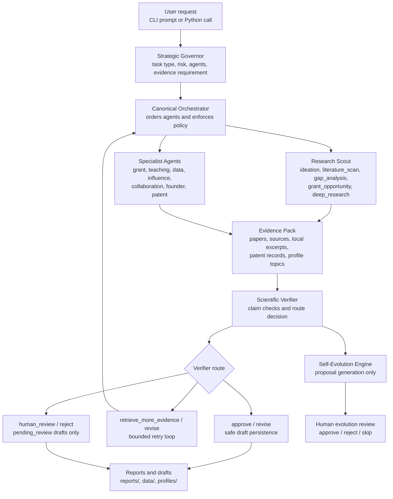
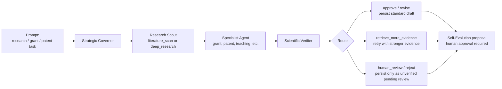
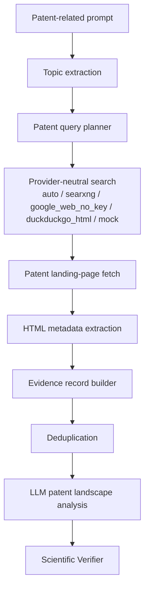
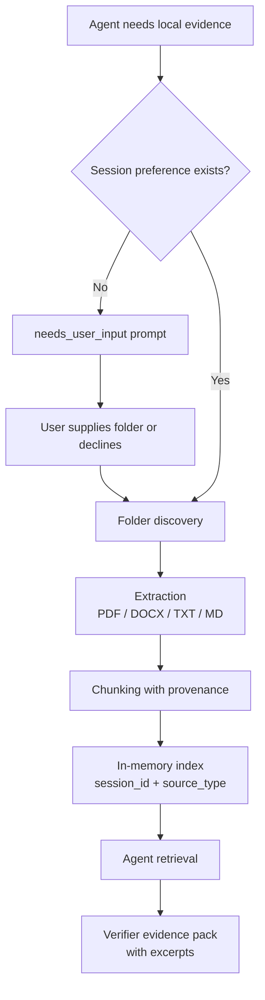

# AURA — Autonomous Unified Research Agent


**AURA** is a research-agent control plane for structured scientific ideation, literature reconnaissance, grant-draft preparation, patent-landscape reconnaissance, local-document evidence retrieval, claim-level verification, and supervised self-evolution.

The repository implements a multi-agent command-line research assistant centered on:

- a **Strategic Governor** that classifies user requests and selects agents;
- a **Research Scout** for ideation, literature scans, gap analysis, grant-opportunity analysis, and deep-research handoff;
- specialist agents for grant writing, teaching material, data-analysis planning, public communication, collaboration, commercialization, and patent reconnaissance;
- a **Scientific Verifier** that audits claims and routes outputs through `approve`, `revise`, `retrieve_more_evidence`, `human_review`, or `reject`;
- a **Self-Evolution Engine** that proposes lessons and profile/memory updates, but does **not** auto-apply them.

This repository is best understood as a **research-software prototype / companion system** for studying evidence-aware LLM research workflows. It is not a fully autonomous scientist, not a formal systematic-review engine, not a legal or patent-opinion tool, and not a grant-submission platform.

---

## Why this repository exists

Modern research assistance workflows often combine several fragile steps: task routing, paper discovery, evidence extraction, drafting, verification, and reflection. AURA makes these stages explicit and auditable.

The codebase is designed around conservative agent governance:

1. **Route before acting** — the Strategic Governor chooses an execution plan before specialists run.
2. **Separate generation from verification** — high-stakes specialist outputs are reviewed by the Scientific Verifier.
3. **Fail closed** — missing or malformed evidence lowers confidence rather than being silently treated as sufficient.
4. **Preserve provenance** — local-document excerpts, source records, patent-page provenance, and verifier routes are carried into downstream decisions.
5. **Require human approval for consequential actions** — the system may draft emails, proposals, or strategies, but it does not send, submit, publish, file, or commit externally.

---

## Graphical abstract



---

## Repository scope

AURA currently implements a **standalone Python CLI and library-style orchestration layer**. The repository contains multiple cooperating modules, but there is no separate web server, no database service beyond local SQLite/JSONL persistence, and no CI configuration included in the supplied archive.

Implemented capabilities include:

| Area | Implemented in code | Conservative interpretation |
|---|---|---|
| Interactive AURA CLI | `main.py` | Runs a prompt loop, configures LLM model/API key, dispatches to `run_aura_core()`, renders results with Rich. |
| Direct deep-research CLI | `main.py research`, `research-grants`, `show-report`, `show-evidence`, `show-reflection` | Provides a separate entry point into the deep-research subsystem. |
| Multi-agent control plane | `core/orchestrator.py`, `core/registry.py` | Executes registry-backed specialists in canonical order with soft timeouts and verifier routing. |
| LLM abstraction | `core/llm.py` | Supports local Ollama models when the model name contains `:`, otherwise uses an OpenAI-compatible remote endpoint. |
| Literature search and scoring | `agents/research_scout.py`, `integrations/research_evolution/` | Searches multiple scholarly sources where configured/available; results are scored and persisted locally. |
| Deep research | `qwen_evolver/deep_research/` | Produces one 16-section Markdown report per mission; uses SearXNG when enabled or clearly labelled mock mode otherwise. |
| Local document ingestion | `core/local_documents/` | Opt-in folder ingestion for PDF, DOCX, TXT, and Markdown, with chunking and retrieval. OCR is optional. |
| Patent reconnaissance | `agents/patent_intelligence.py`, `integrations/patent_web/` | Stage-1 web-based patent-page discovery and analysis; explicitly not API-verified and not legal advice. |
| Draft persistence | `core/draft_writer.py` | Saves verified or revisable specialist drafts to `reports/`; saves non-affirmative drafts under `reports/pending_review/`. |
| Self-evolution review | `agents/self_evolution_engine.py`, `core/evolution_review.py` | Generates proposed lessons/profile updates, but human review is required before applying changes. |

---

## Code-to-README validation note

This README was generated from inspection of the supplied repository archive. The description intentionally follows the implementation rather than aspirational design language.

In particular, this README distinguishes:

- **implemented runtime behavior**: modules, functions, CLI commands, schemas, persistence paths, and environment settings present in the code;
- **conceptual workflow**: how the implemented pieces can be used together;
- **recommended additions**: publication-readiness items not present in the supplied archive.

No claim is made that every test passes in the current environment. The archive includes a large `tests/` directory and an `_e2e_test.py` harness, but test execution depends on configured LLM/search backends and local environment state.

---

## Repository components

### Top-level entry points

| File | Purpose |
|---|---|
| `main.py` | Main command-line interface. Provides interactive AURA mode, direct deep-research commands, report/evidence/reflection display commands, Ollama bootstrap, and local-folder prompt handling. |
| `_diagnose_llm.py` | One-shot diagnostic script for basic LLM JSON calls and raw output inspection. |
| `_diagnose_governor.py` | Diagnostic script for Strategic Governor routing and schema parsing. |
| `_demo_pipelines.py` | Lightweight demo of selected routing patterns for grant, teaching, and research-plus-teaching prompts. |
| `_e2e_test.py` | End-to-end harness that exercises ideation, literature scan, weekly brief behavior, permission boundaries, failure resilience, and local artifacts. |

### Core control-plane modules

| Module | Role |
|---|---|
| `core/orchestrator.py` | Main control-plane function `run_aura_core()`. Handles session IDs, governor execution, canonical agent order, specialist execution, verifier passes, retry logic, draft persistence, and self-evolution. |
| `core/registry.py` | Registry of implemented and special agents, including verification requirements, external-action permissions, soft timeouts, and handlers. |
| `core/schemas.py` | Pydantic v2 schemas for governor decisions, specialist outputs, research-scout outputs, verifier reports, grant drafts, teaching outputs, collaboration outputs, and reflection records. |
| `core/llm.py` | LLM wrapper for Ollama and remote OpenAI-style chat completion APIs, including JSON parsing and best-effort truncated-JSON repair. |
| `core/runtime.py` | Optional Ollama readiness helper: starts/checks Ollama and verifies local model availability. |
| `core/permissions.py` | Action-policy classification and gating for actions that require approval or must be blocked. |
| `core/draft_writer.py` | Markdown rendering and persistence for specialist drafts. |
| `core/evolution_review.py` | Interactive review flow for self-evolution proposals. |
| `core/path_safety.py` | Path and mission-ID validation for file reads/writes. |
| `core/searxng_runtime.py` | Runtime helper for SearXNG availability and container startup behavior. |
| `core/memory.py` | JSONL memory helpers. |
| `core/normalization.py` | Defensive normalization helpers for malformed agent/LLM outputs. |
| `core/patent_rigor.py`, `core/patent_profile_cache.py` | Claim-centric patent-analysis support and per-patent profile caching. |
| `core/aura_principles.py` | Shared contracts and invariant definitions, including deep-research report layout and canonical agent ordering. |

### Agent modules

| Agent | File | Implemented behavior |
|---|---|---|
| Strategic Governor | `agents/strategic_governor.py` | Classifies tasks, selects agents, assigns evidence requirements, applies safety overrides, and derives backward-compatible fields. |
| Research Scout | `agents/research_scout.py` | Supports `ideation`, `literature_scan`, `gap_analysis`, `grant_opportunity`, `paper_intake`, `trend_monitor`, `reviewer_attack_scan`, and `deep_research` modes. Several modes are explicitly stub-like or phase-labelled in code. |
| Scientific Verifier | `agents/scientific_verifier.py` | Performs claim-level evidence-aware verification and produces routing decisions. Uses fail-closed defaults for malformed or missing evidence. |
| Self-Evolution Engine | `agents/self_evolution_engine.py` | Extracts session lessons and proposes updates for later human review. |
| Grant Architect | `agents/grant_architect.py` | Produces reviewer-aware grant proposal structure and includes a China-tailored `run_china()` sub-mode. |
| China Grant Architect shim | `agents/china_grant_architect.py` | Thin shim around the China specialization in `agents/grant_architect.py`. |
| Teaching Mentor | `agents/teaching_mentor.py` | Converts research material into teaching outcomes, explanations, questions, quizzes, rubrics, and activities. |
| Lab/Data Analyst | `agents/lab_data_analyst.py` | Produces data-analysis plans, required columns, methods, plotting suggestions, quality checks, and reproducibility checks. It is read-only by design. |
| Influence/Public Communication | `agents/influence_public_communication.py` | Drafts public-facing explanations, hooks, safer wording, and evidence cautions. It does not publish. |
| Collaboration Operator | `agents/collaboration_operator.py` | Suggests collaboration logic, possible collaborators, draft outreach, agendas, and questions. It does not send messages or schedule meetings. |
| Founder Innovation | `agents/founder_innovation.py` | Produces commercialization hypotheses, value propositions, validation experiments, risks, and 90-day planning. It is not legal/financial advice. |
| Patent Intelligence | `agents/patent_intelligence.py` | Runs Stage-1 web-based patent reconnaissance with conservative confidence caps and explicit provenance flags. |

### Integrations

| Directory | Purpose |
|---|---|
| `integrations/research_evolution/` | Research profile loading/saving, paper-source search wrappers, scoring, literature memory, gap analysis, and report helpers. |
| `integrations/patent_web/` | Provider-neutral patent web search, query planning, page fetching, metadata extraction, evidence-record building, deduplication, and schemas. |
| `integrations/patent_web/search_providers/` | Search-provider abstraction and implementations for SearXNG, no-key Google-web scraping, DuckDuckGo HTML, and mock mode. |
| `qwen_evolver/deep_research/` | Direct deep-research subsystem: planning, search, source reading, evidence extraction, gap analysis, verification bridge, report building, rigorous report rendering, and reflection logging. |
| `core/local_documents/` | Local folder discovery, PDF/DOCX/TXT/Markdown extraction, optional OCR, chunking, in-memory indexing, retrieval, and session preferences. |
| `deployment/searxng/` | Docker Compose and settings for a local SearXNG instance. |

---

## Combined workflow concept

AURA is not a single monolithic pipeline hardcoded for one use case. It is a **controlled orchestration framework** that can combine different specialist agents depending on the prompt.

A typical high-evidence workflow is:



The orchestration is implemented, but the exact agent combination is dynamic. The Strategic Governor may select different agents, and the orchestrator canonicalizes the order so upstream evidence producers run before downstream drafting agents.

---

## Highlights

### Evidence-aware routing

The verifier does not merely summarize. It returns structured route decisions:

| Route | Meaning in the code |
|---|---|
| `approve` | Output can be treated as sufficiently supported for the workflow’s draft-persistence gate. |
| `revise` | Output may be useful, but should be revised. Draft persistence is still allowed by the safe allowlist. |
| `retrieve_more_evidence` | Evidence is insufficient; the orchestrator may trigger a bounded retry strategy. |
| `human_review` | Human review required; standard draft persistence is blocked. |
| `reject` | Output should not be accepted; standard draft persistence is blocked. |

Only `approve` and `revise` are in the standard safe persistence allowlist. Other routes may still produce clearly labelled files under `reports/pending_review/`.

### Bounded retry loop

The orchestrator includes an automatic retry mechanism for selected verifier routes:

- `retrieve_more_evidence` can trigger a Research Scout upgrade to `literature_scan`.
- `revise` can trigger specialist re-execution with verifier revision instructions.
- Retry counts and revision loops are bounded by environment variables and hard caps.

This is implemented as a runtime retry loop, not as an external workflow manager.

### Local-document evidence path

Local folder evidence is opt-in and session-scoped. Agents can pause with `needs_user_input` when they require a folder preference. The CLI prompt loop can resume the same session after the user responds.

Supported extraction paths include:

- PDF native-text extraction;
- optional OCR pathway for scanned/image-only PDFs;
- DOCX extraction;
- TXT/Markdown extraction;
- fail-closed legacy document conversion stub for formats such as `.doc`, `.rtf`, and `.odt`.

OCR requires optional dependencies and an external Tesseract executable.

### Patent reconnaissance with conservative claims

The patent subsystem is explicitly Stage 1:

- discovers publicly indexed patent pages;
- fetches and parses landing pages;
- deduplicates records;
- marks evidence as web-extracted and not API-verified;
- caps Stage-1 evidence confidence;
- avoids presenting the result as a formal prior-art search, freedom-to-operate opinion, or legal conclusion.

### Human-reviewed self-evolution

The Self-Evolution Engine can write proposed lessons and profile/memory updates. These are not automatically applied. The review interface supports approval, rejection, skipping, and decision logging.

---

## Detailed workflows

## 1. Interactive AURA mode

Run:

```bash
python main.py
```

The interactive mode:

1. prompts for an LLM model;
2. optionally accepts an API key;
3. bootstraps Ollama if the selected model name contains `:`;
4. accepts free-form AURA prompts;
5. runs `run_aura_with_prompt_loop()`;
6. prints governor, scout, specialist, verifier, retry, draft, and self-evolution outputs.

Useful in-session commands:

```text
help
json
evolve
approve evolution
pending
exit
quit
```

### Interactive outputs

Depending on the prompt and verifier route, interactive runs can create or update:

| Path | Meaning |
|---|---|
| `reports/*.md` | Verified or revisable specialist drafts. |
| `reports/pending_review/*_UNVERIFIED.md` | Drafts from non-affirmative verifier routes. |
| `reports/deep_research/<mission_id>_report.md` | Direct deep-research report. |
| `data/memories.jsonl` | Memory records. |
| `data/reflections.jsonl` | Self-evolution proposal records. |
| `data/approval_log.jsonl` | Approval-gate and evolution-review decisions. |
| `data/research_memory.db` | Literature-memory SQLite database. |
| `profiles/research_profile.yaml` | Research-profile state. |

---

## 2. Python API control-plane workflow

The main programmatic entry point is:

```python
from core.orchestrator import run_aura_core

result = run_aura_core(
    "Find recent papers on red/NIR OLEDs and identify grant-relevant gaps."
)

print(result["pipeline_status"])
print(result["strategic_governor"])
print(result.get("research_scout"))
print(result.get("scientific_verifier"))
```

For local-folder prompts, the pipeline can pause:

```python
result = run_aura_core("Use my local papers to draft a grant rationale.")

if result.get("pipeline_status") == "awaiting_user_input":
    session_id = result["session_id"]
    target = result["pending_prompt"]["target_agent"]

    resumed = run_aura_core(
        "Use my local papers to draft a grant rationale.",
        session_id=session_id,
        user_responses={
            target: {
                "use_local_folder": True,
                "folder_path": "/path/to/local/papers"
            }
        }
    )
```

The pause/resume behavior is implemented in `core/orchestrator.py` and `core/local_documents/session_preferences.py`.

---

## 3. Direct deep-research CLI

Run a general deep-research mission:

```bash
python main.py research \
  --query "What are the strongest recent research gaps in red/NIR OLED photobiomodulation devices?" \
  --depth standard
```

Run a grant-focused deep-research mission:

```bash
python main.py research-grants \
  --query "Evaluate funding angles for red/NIR OLED photobiomodulation research." \
  --depth extensive
```

Show saved artifacts:

```bash
python main.py show-report --mission-id <MISSION_ID>
python main.py show-evidence --mission-id <MISSION_ID>
python main.py show-reflection --mission-id <MISSION_ID>
```

### Deep-research depth settings

Depth is accepted as one of:

```text
rapid
standard
extensive
```

The code maps these to default budgets for rounds, queries, and sources, with environment-variable overrides:

| Budget | Environment variable |
|---|---|
| Maximum rounds | `AURA_RESEARCH_MAX_ROUNDS` |
| Maximum queries | `AURA_RESEARCH_MAX_QUERIES` |
| Maximum sources | `AURA_RESEARCH_MAX_SOURCES` |

### Deep-research outputs

| Artifact | Path |
|---|---|
| Rigorous Markdown report | `reports/deep_research/<mission_id>_report.md` |
| Evidence JSONL | `data/deep_research/evidence/<mission_id>_evidence.jsonl` |
| Reflection JSON | `data/deep_research/reflections/<mission_id>_reflection.json` |
| Source text cache | `data/deep_research/sources/` |

The deep-research orchestrator writes exactly one report path per mission. The rigorous-report path is retained as a backward-compatible alias to the same file.

---

## 4. Research Scout workflow

The Research Scout supports multiple modes. The Governor usually selects the mode, but the orchestrator can upgrade grant-heavy workflows to `literature_scan` when needed.

| Mode | Implemented role |
|---|---|
| `ideation` | Structured analysis of a research idea, including opportunity framing and kill criteria. |
| `literature_scan` | Query planning, scholarly source search, scoring, claims, gap candidates, and report writing. |
| `gap_analysis` | Gap analysis using stored or session-linked papers. |
| `grant_opportunity` | Grant-focused opportunity analysis. |
| `deep_research` | Handoff into the deep-research subsystem. |
| `paper_intake`, `trend_monitor`, `reviewer_attack_scan` | Present as phase-labelled modes/stubs in the Scout module. They should not be described as fully developed pipelines unless extended. |

The Scout may use:

- OpenAlex;
- arXiv;
- Crossref;
- Semantic Scholar;
- Europe PMC;
- local document chunks;
- stored literature memory.

Availability depends on network access, API keys, and environment configuration.

---

## 5. Patent Intelligence workflow

The patent workflow is implemented as Stage-1 reconnaissance:



Supported provider settings include:

| Variable | Meaning |
|---|---|
| `AURA_PATENT_SEARCH_PROVIDER` | `auto`, `google_web_no_key`, `duckduckgo_html`, `searxng`, or `mock`. |
| `AURA_PATENT_SEARCH_ALLOW_FALLBACK` | Allows fallback provider chain when the primary provider fails. |
| `AURA_PATENT_SEARCH_FALLBACK_CHAIN` | Comma-separated fallback providers. |
| `AURA_PATENT_SEARCH_ALLOW_MOCK_FALLBACK` | Explicitly permits synthetic mock fallback. Default is off. |
| `AURA_PATENT_SEARCH_MAX_RESULTS` | Maximum search results per query. |
| `AURA_GOOGLE_WEB_PATENT_ENABLED` | Enables or disables the no-key Google web provider. |

### Patent workflow limitations

The code is explicit that patent outputs are:

- web-scraped;
- not official patent-office API verification;
- non-exhaustive;
- not legal advice;
- not a freedom-to-operate opinion;
- not a replacement for counsel or formal prior-art search.

---

## 6. Local-document workflow

The local-document subsystem implements opt-in ingestion and retrieval:



Supported file types are implemented in:

| File | Supported input |
|---|---|
| `extract_pdf.py` | PDF native extraction, optional OCR pathway. |
| `extract_docx.py` | DOCX. |
| `extract_text.py` | TXT and Markdown. |
| `convert_legacy_docs.py` | Controlled fail-closed stub for legacy formats. |

OCR requires optional dependencies and an external Tesseract executable.

---

## 7. Draft persistence workflow

Specialist drafts are rendered by `core/draft_writer.py`.

Standard persisted drafts are created only when the final verifier route is in:

```text
approve
revise
```

For other routes, drafts may be written under:

```text
reports/pending_review/
```

with an explicit unverified banner.

Draft-rendering support exists for:

- `grant_architect`;
- `china_grant_architect`;
- `teaching_mentor`;
- `lab_data_analyst`;
- `influence_public_communication`;
- `collaboration_operator`;
- `founder_innovation`;
- `patent_intelligence`.

Research Scout writes its own literature-scan report path rather than being handled as a standard high-stakes specialist draft.

---

## 8. Self-evolution review workflow

Self-evolution proposal generation is separate from applying changes.

Run from the interactive CLI:

```text
evolve
```

or:

```text
approve evolution
```

The review module can:

- load pending proposals from `data/reflections.jsonl`;
- avoid re-prompting for already-actioned proposals using hashes;
- apply approved profile updates to `profiles/research_profile.yaml` with backup;
- append verified memory entries;
- log decisions to `data/approval_log.jsonl`.

This is a supervised learning/update mechanism, not autonomous self-modification.

---

## Confidence and decision logic

AURA uses multiple confidence controls.

### Governor-level governance

The Strategic Governor produces fields such as:

- `task_type`;
- `selected_agents`;
- `research_scout_mode`;
- `requires_approval`;
- `risk_level`;
- `autonomy_level`;
- `external_consequence`;
- `evidence_requirement`;
- `blocked_actions`.

The orchestrator also applies Python-level overrides and approval logging rather than trusting LLM output alone.

### Specialist output contracts

Most specialist outputs follow `SpecialistBaseOutput`, which includes:

- `summary`;
- `findings`;
- `assumptions`;
- `risks`;
- `recommended_actions`;
- `claims_for_verification`;
- `evidence_level`;
- `confidence`;
- `approval_level`;
- `partial_results`;
- `failed_stage`.

### Verifier route priority

When per-specialist and holistic verifier outputs disagree, the orchestrator can preserve the worse route rather than silently allowing a holistic approval to override a specialist-level concern. Route priority is conservative:

```text
reject > human_review > retrieve_more_evidence > revise > approve
```

### Patent-specific confidence caps

The Patent Intelligence Agent deliberately avoids a `strong` Stage-1 evidence band. Mock-mode patent output forces low confidence.

### Mock-mode signalling

The deep-research and patent pathways include explicit mock-mode flags and warnings. Mock search output is synthetic and should only be used for tests, demos, or offline smoke checks.

---

## Suggested repository layout

The supplied archive already follows a modular layout. For a public companion repository, the following cleaned structure is recommended:

```text
aura/
├── main.py
├── config.py
├── environment.yml
├── .env.example
├── agents/
│   ├── strategic_governor.py
│   ├── research_scout.py
│   ├── scientific_verifier.py
│   ├── self_evolution_engine.py
│   ├── grant_architect.py
│   ├── teaching_mentor.py
│   ├── lab_data_analyst.py
│   ├── influence_public_communication.py
│   ├── collaboration_operator.py
│   ├── founder_innovation.py
│   └── patent_intelligence.py
├── core/
│   ├── orchestrator.py
│   ├── registry.py
│   ├── schemas.py
│   ├── llm.py
│   ├── permissions.py
│   ├── draft_writer.py
│   ├── evolution_review.py
│   ├── local_documents/
│   └── grant_templates/
├── integrations/
│   ├── research_evolution/
│   └── patent_web/
├── qwen_evolver/
│   └── deep_research/
├── deployment/
│   └── searxng/
├── tests/
├── data/
│   └── .gitkeep
├── profiles/
│   └── research_profile.example.yaml
├── reports/
│   └── .gitkeep
└── README.md
```

For publication readiness, runtime artifacts such as populated `data/*.jsonl`, SQLite databases, cached web pages, `.pyc` files, `.pytest_cache/`, and profile backup files should generally be excluded or moved to a separate reproducibility artifact.

---

## Suggested software environment

The supplied `environment.yml` defines the intended baseline:

```yaml
name: aura
channels:
  - conda-forge
dependencies:
  - python=3.11
  - pip
  - numpy
  - pandas
  - pydantic>=2,<3
  - python-dotenv
  - rich
  - pytest
  - requests
  - pyyaml
  - pip:
      - ollama
      - beautifulsoup4
      - pypdf
      - python-docx
      - pytesseract
      - Pillow
      - pymupdf
```

Additional notes:

- `pydantic>=2,<3` is required; the code uses Pydantic v2 APIs.
- `ollama` is required for local model workflows.
- `pytesseract`, `Pillow`, and `pymupdf` support optional OCR/PDF paths.
- The external `tesseract` binary is required if OCR is enabled.
- Docker is needed only for the optional local SearXNG deployment.
- Remote LLM usage requires `LLM_API_KEY` and an OpenAI-compatible endpoint.

---

## Configuration

Start from the example environment file:

```bash
cp .env.example .env
```

Common settings:

```bash
# Local Ollama model
AURA_MODEL=qwen3:8b

# Remote model path
LLM_MODEL=deepseek-v4-flash
LLM_API_KEY=...

# LLM behavior
AURA_TEMPERATURE=0.2
AURA_NUM_CTX=8192
AURA_KEEP_ALIVE=30m
AURA_LLM_WALL_TIMEOUT=300

# SearXNG
SEARXNG_ENABLED=0
SEARXNG_URL=http://localhost:8080

# Deep research
AURA_DEEP_RESEARCH_RIGOR=1

# Patent reconnaissance
AURA_PATENT_SEARCH_PROVIDER=auto
AURA_PATENT_SEARCH_ALLOW_FALLBACK=1
AURA_PATENT_SEARCH_ALLOW_MOCK_FALLBACK=0
```

For local Ollama models, model names containing `:` trigger the local Ollama pathway. Other model names are treated as remote and require `LLM_API_KEY`.

---

## Quick start

### 1. Create the environment

```bash
conda env create -f environment.yml
conda activate aura
```

or install manually:

```bash
python -m venv .venv
source .venv/bin/activate
pip install numpy pandas "pydantic>=2,<3" python-dotenv rich pytest requests pyyaml
pip install ollama beautifulsoup4 pypdf python-docx pytesseract Pillow pymupdf
```

### 2. Configure environment variables

```bash
cp .env.example .env
```

For a local Ollama workflow:

```bash
ollama pull qwen3:8b
export AURA_MODEL=qwen3:8b
```

For a remote model workflow:

```bash
export LLM_MODEL=deepseek-v4-flash
export LLM_API_KEY=<your_api_key>
```

### 3. Run interactive AURA

```bash
python main.py
```

### 4. Run direct deep research

```bash
python main.py research \
  --query "Find recent evidence and open questions for red/NIR OLED photobiomodulation." \
  --depth standard
```

### 5. Run diagnostics

```bash
python _diagnose_llm.py
python _diagnose_governor.py
python _demo_pipelines.py
```

### 6. Run tests

```bash
pytest
```

For LLM- or network-dependent tests, configure the relevant model/search environment first. Some tests are designed around mocked behavior; others may depend on live services.

---

## Optional SearXNG setup

The repository includes a SearXNG deployment directory:

```bash
docker compose -f deployment/searxng/docker-compose.yml up -d
```

Then configure:

```bash
export SEARXNG_ENABLED=1
export SEARXNG_URL=http://localhost:8080
```

The `.env.example` notes that JSON output must be enabled in SearXNG settings. If SearXNG is disabled or unavailable, deep research falls back to mock search with explicit synthetic-data warnings.

---

## How to use the workflows together

### Example: literature-supported grant draft

```bash
python main.py
```

Prompt:

```text
Draft a reviewer-aware grant proposal structure for red/NIR OLED photobiomodulation, using recent literature evidence.
```

Expected conceptual path:

```text
Strategic Governor
→ Research Scout in literature_scan mode
→ Grant Architect
→ Scientific Verifier
→ optional retry
→ draft persistence or pending_review
→ Self-Evolution proposal
```

### Example: patent reconnaissance

```bash
python main.py
```

Prompt:

```text
Map the patent landscape for wearable red/NIR OLED photobiomodulation devices and identify possible white-space hypotheses.
```

Expected conceptual path:

```text
Strategic Governor
→ Patent Intelligence
→ optional local patent evidence retrieval
→ Scientific Verifier
→ patent draft persistence or pending_review
```

The output should be read as preliminary reconnaissance, not as legal advice.

### Example: local-document-supported analysis

```python
from core.orchestrator import run_aura_core

prompt = "Use my local PDFs to identify the strongest grant rationale."

first = run_aura_core(prompt)

if first.get("pipeline_status") == "awaiting_user_input":
    resumed = run_aura_core(
        prompt,
        session_id=first["session_id"],
        user_responses={
            first["pending_prompt"]["target_agent"]: {
                "use_local_folder": True,
                "folder_path": "/absolute/path/to/papers"
            }
        }
    )
```

This uses the implemented pause/resume mechanism rather than assuming that local folders are always ingested automatically.

---

## Reproducibility notes

AURA has reproducibility features, but it is not fully deterministic by default.

Implemented reproducibility supports:

- structured Pydantic schemas for agent outputs;
- explicit mission IDs for deep-research artifacts;
- JSONL evidence persistence;
- local SQLite literature memory;
- saved reflections and approval logs;
- mock providers for hermetic tests;
- path-safety validation for mission-specific artifact reads;
- environment-driven depth/search budgets;
- explicit mock-mode and provider warnings.

Important caveats:

- LLM outputs are model-, version-, prompt-, and temperature-dependent.
- Web search results vary over time and by provider.
- No-key web scraping providers may be blocked, rate-limited, or inconsistent.
- SearXNG improves control over the search interface but does not freeze the web.
- Runtime files in `data/`, `reports/`, and `profiles/` are local state and should be curated before release.
- Thread-based soft timeouts return control to the orchestrator but do not forcibly terminate already-running Python threads or HTTP requests.

For publication-grade reproducibility, freeze:

```text
model name
model version or digest
environment.yml / lockfile
search provider
search date
mission IDs
input prompts
retrieved sources
generated reports
verifier routes
```

---

## Methodological contribution

The main methodological contribution of this repository is an **evidence-gated, verifier-routed multi-agent research workflow** implemented as inspectable Python modules.

AURA separates responsibilities that are often conflated in research-assistant prototypes:

| Responsibility | AURA component |
|---|---|
| Decide whether and how to act | Strategic Governor |
| Gather or structure evidence | Research Scout, deep-research subsystem, local-document retrieval, patent web pipeline |
| Draft domain-specific outputs | Specialist agents |
| Audit claims and decide routing | Scientific Verifier |
| Persist only route-appropriate drafts | Draft Writer and orchestrator persistence gate |
| Learn from sessions under supervision | Self-Evolution Engine and Evolution Review |

This architecture supports research into:

- claim-level LLM verification;
- evidence-aware retry loops;
- safe draft generation for high-stakes scientific work;
- local-document provenance injection;
- conservative patent-landscape reconnaissance;
- human-supervised agent memory/profile evolution.

---

## Example citation block

No formal citation metadata was included in the supplied archive. A suggested placeholder is:

```bibtex
@software{aura_autonomous_unified_research_agent,
  title        = {AURA: Autonomous Unified Research Agent},
  author       = {Repository maintainers},
  year         = {2026},
  url          = {https://github.com/<owner>/<repo>},
  note         = {Research-agent prototype for evidence-aware scientific workflows}
}
```

For publication, add a `CITATION.cff` file with actual authorship, version, DOI, and release date.

---

## Recommended additions for publication readiness

Before using this repository as a public manuscript companion, consider adding:

- `LICENSE`;
- `CITATION.cff`;
- `CONTRIBUTING.md`;
- `CODE_OF_CONDUCT.md`;
- `SECURITY.md`;
- pinned lockfile, such as `conda-lock.yml` or `requirements-lock.txt`;
- `.gitignore` excluding `.pyc`, `.pytest_cache/`, runtime caches, API keys, and generated reports unless intentionally archived;
- minimal reproducible example prompts;
- a small synthetic test fixture set;
- documented expected outputs for at least one offline mock-mode run;
- CI workflow for mock-mode unit tests;
- artifact manifest describing which files are generated vs. source-controlled;
- model/version manifest for reported experiments;
- benchmark table for runtime, source counts, verifier routes, and failure modes.

---

## Limitations

AURA should be interpreted cautiously.

1. **Not autonomous execution infrastructure**  
   It can draft and recommend, but consequential actions require approval and are policy-gated.

2. **Not a systematic-review engine**  
   Literature scanning is useful for reconnaissance and structured evidence gathering, but it does not guarantee systematic coverage.

3. **Not legal, financial, medical, or patent advice**  
   Patent and commercialization modules are explicitly preliminary and conservative.

4. **Not fully deterministic**  
   LLM calls and web search introduce variability.

5. **Mock mode is synthetic**  
   Mock search output is for tests and offline demos only.

6. **Soft timeouts are non-preemptive**  
   The orchestrator can regain control after a timeout, but Python threads or HTTP requests may continue running.

7. **Local-document indexing is in-memory**  
   Local evidence retrieval is session-scoped and not a full persistent vector database.

8. **Some modes are phase-labelled or stub-like**  
   Research Scout modes such as `paper_intake`, `trend_monitor`, and `reviewer_attack_scan` are present but should not be overstated as complete production workflows without further validation.

9. **Repository archive includes runtime artifacts**  
   The supplied archive contains populated `data/`, profile backups, cached pages, and bytecode. These should be cleaned or explicitly documented before publication.

---

## Acknowledgments

AURA depends on the broader Python scientific and open-source ecosystem, including Pydantic, Rich, Requests, PyYAML, Beautiful Soup, PDF/DOCX extraction libraries, Ollama-compatible local model serving, and optional SearXNG search infrastructure.

The architecture also reflects common research-software concerns: provenance, fail-closed behavior, human approval gates, and reproducible artifact persistence.

---

## Maintainer note

This repository should be maintained as a research prototype with conservative documentation. When adding features, update this README only after confirming:

- the code path is implemented;
- the behavior is covered by tests or examples;
- mock and live modes are clearly distinguished;
- outputs are labelled by evidence quality;
- externally consequential actions remain human-gated;
- generated artifacts are separated from source files.

need to add
https://github.com/connectaman/Pitchlense-mcp?tab=readme-ov-file
https://github.com/mims-harvard/ToolUniverse
https://github.com/yycyyv/M-Cube
https://github.com/jataware/open-coscientist
