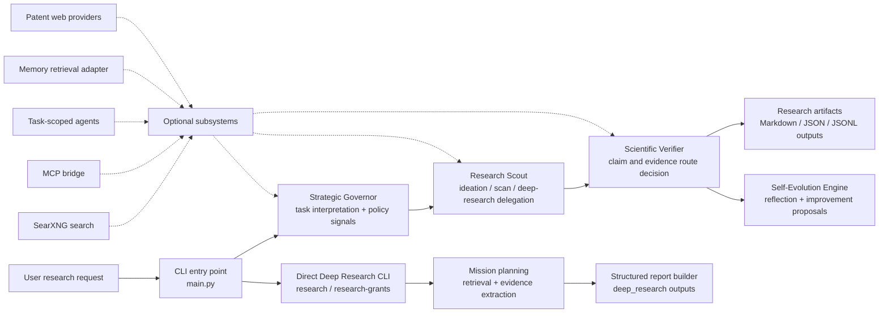
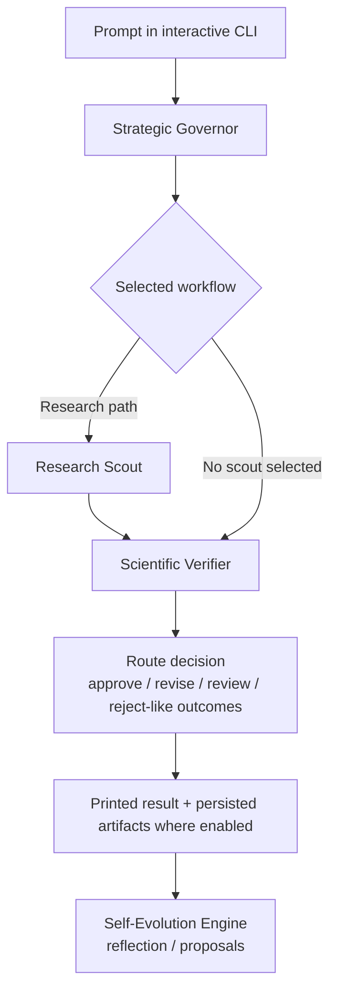
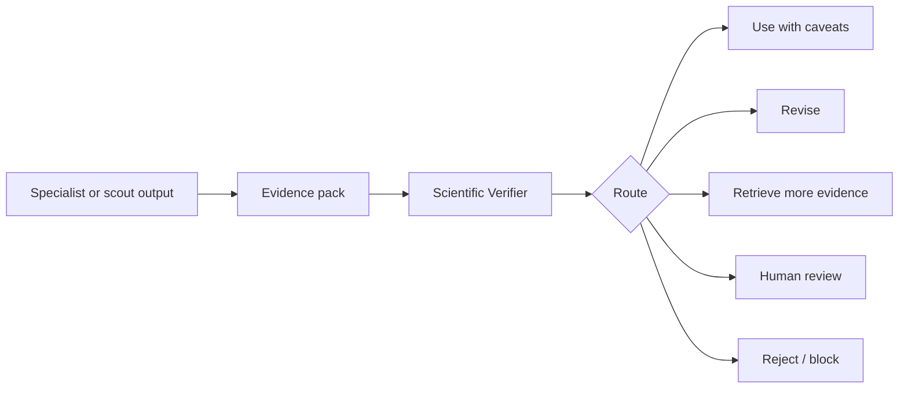

# AURA — Adaptive Understanding, Research & Action AI System


**AURA** is a governed, multi-component research-assistance system for scientific ideation, literature reconnaissance, deep-research report generation, evidence handling, optional memory retrieval, task-scoped helper agents, and supervised self-evolution.

The repository is best understood as a **research control plane**: it coordinates LLM-backed reasoning, retrieval-oriented workflows, verification gates, and persisted research artifacts. It is **not** a fully autonomous scientist, a systematic-review engine, a legal/patent opinion system, or a guaranteed truth oracle.

---

## Why this repository exists

Scientific and technical research workflows often require several adjacent activities that are related but operationally distinct:

- converting broad research questions into structured investigation plans,
- triaging literature and web-derived evidence,
- drafting exploratory research summaries,
- producing deep-research reports with explicit uncertainty,
- routing outputs through a verifier before they are treated as usable,
- retaining selected lessons or memory candidates without silently mutating user profiles,
- integrating optional local tools, MCP wrappers, SearXNG search, and external retrieval systems.

AURA implements these activities as a Python CLI and library-style orchestration layer. Its design emphasizes:

- **bounded autonomy** rather than unrestricted execution,
- **research assistance** rather than final scientific authority,
- **verification routes** rather than unconditional acceptance,
- **human-gated adaptation** rather than silent self-modification,
- **file-based artifacts** that can be inspected, archived, and cited cautiously.

---

## Graphical abstract / conceptual workflow



This diagram is conceptual. The central orchestrator and direct deep-research CLI are implemented as entry points, but not every optional subsystem is automatically invoked in every run.

---

## Repository scope

| Area | Implemented in repository | Important boundary |
|---|---|---|
| Interactive AURA CLI | `main.py` launches an interactive prompt, configures model access, runs AURA, prints structured sections, and supports evolution-review commands | Runtime quality depends on configured LLM and available retrieval backends |
| Core orchestration | `core/orchestrator.py` coordinates the strategic governor, research scout, scientific verifier, and self-evolution engine | This is governed orchestration, not an unrestricted autonomous agent |
| Direct deep research | `python main.py research --query ...` and `python main.py research-grants --query ...` call the deep-research subsystem | These are direct CLI workflows; they are not automatically merged into every interactive run |
| Research scout | `agents/research_scout.py` supports research-oriented scanning and synthesis behavior | Output is draft research assistance and still requires expert review |
| Scientific verification | `agents/scientific_verifier.py` produces route-style judgments on outputs | A verifier decision is a software-level gate, not peer review or mathematical proof |
| Self-evolution | `agents/self_evolution_engine.py` records reflections and candidate improvements | Adaptation is intended to remain human-governed |
| Memory service adapter | `core/memory_service/` provides optional LangGraph-style memory retrieval infrastructure | Its local README states Stage 1 retrieval focus; do not assume full automatic write/commit behavior |
| Task-scoped agents | `core/task_agents/` defines bounded helper agents for narrow subtasks | Disabled by default and designed not to replace core agents or bypass verification |
| MCP integration | `core/mcp/`, `aura_mcp/`, and `mcp_wrappers/` provide MCP-related integration surfaces | MCP outputs should be treated as unverified external evidence |
| Patent web reconnaissance | `integrations/patent_web/` and related config support provider-neutral patent web discovery | Preliminary reconnaissance only; not legal advice, not FTO, not exhaustive patent analysis |
| SearXNG deployment | `deployment/searxng/` and scripts support local search setup and diagnostics | Search coverage and ranking depend on local SearXNG configuration |
| Tests and diagnostics | `tests/`, `_diagnose_*.py`, `_demo_pipelines.py`, `_e2e_test.py`, and scripts provide checks and examples | Repository-local tests are not the same as formal scientific validation |

---

## Code-to-README validation note

This README is derived from the visible repository structure, entry points, configuration files, and module-level README content. It intentionally avoids claiming:

- end-to-end autonomous scientific discovery,
- exact environment reproducibility beyond the supplied `environment.yml`,
- exhaustive literature or patent coverage,
- legal, financial, medical, or patent validity analysis,
- full memory-write automation,
- automatic orchestration of every optional subsystem,
- a verified test count unless the tests are run in the target environment.

Where a capability is present as a subsystem, adapter, wrapper, diagnostic, or optional path, it is described as such.

---

## Highlights

- Governed multi-agent research workflow centered on strategic routing, research scouting, verification, and reflection.
- Direct deep-research CLI with mission-style reports and evidence/reflection artifact paths.
- Support for local Ollama-style models and remote OpenAI-compatible LLM endpoints through configuration.
- Optional SearXNG-backed search workflow with deployment and diagnostic scripts.
- Optional MCP bridge for connecting external tools while treating their outputs as unverified evidence.
- Bounded task-scoped helper agents with explicit safety invariants.
- Optional memory retrieval adapter designed to remain subordinate to governor, verifier, and human-review gates.
- File-based outputs suitable for inspection, archiving, editing, and manuscript-support workflows.

---

## Primary entry points

| Path | Role |
|---|---|
| `main.py` | Main CLI entry point for interactive AURA sessions, direct deep-research missions, report inspection, evidence inspection, and reflection inspection |
| `config.py` | Central configuration and environment-variable access |
| `environment.yml` | Conda environment specification targeting Python 3.11 |
| `agents/strategic_governor.py` | Interprets user requests and produces routing/policy signals |
| `agents/research_scout.py` | Research-scoping, ideation, and evidence-oriented scouting agent |
| `agents/scientific_verifier.py` | Verification and route-decision agent |
| `agents/self_evolution_engine.py` | Reflection and supervised improvement-proposal logic |
| `core/orchestrator.py` | Coordinates core agent execution and error/fallback behavior |
| `core/llm.py` | LLM access layer for local or remote model calls |
| `core/permissions.py` | Human-approval and policy-related checks |
| `qwen_evolver/deep_research/` | Direct deep-research subsystem used by CLI research commands |
| `core/task_agents/` | Optional task-scoped helper-agent subsystem |
| `core/mcp/` | Optional MCP integration layer |
| `core/memory_service/` | Optional memory retrieval adapter |
| `integrations/patent_web/` | Patent web-search provider subsystem |
| `deployment/searxng/` | Local SearXNG deployment support |
| `scripts/` | Operational, diagnostic, approval, and setup utilities |

---

## Combined workflow concept

AURA supports two main operating styles.

### 1. Governed interactive orchestration

The interactive CLI routes a natural-language request through the core control path:



The exact route is determined at runtime. The visible core orchestrator imports and coordinates the governor, research scout, scientific verifier, and self-evolution engine. Optional subsystems may support the workflow, but they should not be described as always active.

### 2. Direct deep-research missions

Deep research can be invoked directly:

```bash id="p2hyrm"
python main.py research \
  --query "Survey recent strategies for improving stability in TADF OLED emitters" \
  --depth standard
```

Grant-oriented deep research is also available:

```bash id="9020iq"
python main.py research-grants \
  --query "Identify fundable directions in organic photophysics and exciton management" \
  --depth extensive
```

These commands create mission-style outputs that can be manually inspected or used as downstream context. They are direct CLI workflows rather than proof that every interactive AURA request runs the deep-research subsystem.

---

## Detailed workflows

## 1. Interactive AURA CLI

### Command

```bash id="ehl8db"
python main.py
```

### What it does

The interactive CLI:

1. starts the AURA terminal interface,
2. asks for a model name,
3. optionally accepts an API key,
4. bootstraps Ollama for local model names where appropriate,
5. performs a simple LLM connectivity check,
6. accepts research prompts,
7. routes prompts through the AURA core workflow,
8. prints the governor, scout, verifier, and self-evolution sections where available,
9. supports utility commands such as JSON output and evolution review.

### Interactive commands

| Command | Purpose |
|---|---|
| `help` / `?` / `/help` | Show command help |
| `json` | Print the raw JSON for the latest result |
| `evolve` / `approve evolution` / `pending` | Review pending self-evolution proposals |
| `exit` / `quit` | Stop the interactive session |

### Interpretation boundary

The interactive CLI is a research-assistance environment. Its outputs should be read as structured drafts, critiques, and routing decisions, not as final scientific conclusions.

---

## 2. Strategic Governor workflow

### Component

```text id="ls8fr6"
agents/strategic_governor.py
```

### Role

The Strategic Governor interprets the incoming request and produces routing and policy metadata for the rest of the system. Its outputs can include task type, priority, selected agents, research-scout mode, evidence expectations, risk level, approval signals, and workflow sequencing.

### What can be trusted

The governor provides a structured software decision that helps organize the workflow.

### What requires caution

The governor remains LLM-assisted and prompt-sensitive. Its routing should not be treated as guaranteed optimal task decomposition.

---

## 3. Research Scout workflow

### Component

```text id="9mjklb"
agents/research_scout.py
```

### Role

The Research Scout is the primary research-facing agent. It supports research ideation, literature-oriented reconnaissance, gap framing, and deep-research delegation pathways.

### Typical outputs

Depending on mode and retrieval availability, the Research Scout may produce:

- a research summary,
- findings,
- risks and uncertainties,
- recommended actions,
- search queries,
- candidate papers or sources,
- gap candidates,
- report paths or structured artifacts.

### Interpretation boundary

The Research Scout performs reconnaissance and drafting. It is not a systematic review engine and does not guarantee complete literature coverage.

---

## 4. Scientific Verifier workflow

### Component

```text id="izj9ag"
agents/scientific_verifier.py
```

### Role

The Scientific Verifier evaluates claims, evidence context, and risk signals from prior outputs. It provides a route-style decision that downstream logic can use to decide whether outputs are acceptable, need revision, require more evidence, should be human-reviewed, or should be rejected.

### Conceptual route logic



### Trust boundary

The verifier is a software-level quality gate. It does not replace expert review, peer review, statistical validation, legal review, or independent source checking.

---

## 5. Direct deep-research workflow

### Commands

```bash id="nhplu0"
python main.py research \
  --query "Map recent methods for improving photostability in organic emitters" \
  --depth rapid
```

```bash id="23xq0n"
python main.py research \
  --query "Compare current approaches to retrieval-augmented scientific agents" \
  --depth standard
```

```bash id="0239iy"
python main.py research-grants \
  --query "Identify grantable research directions in organic electronics" \
  --depth extensive
```

Supported depth values:

```text id="714vyh"
rapid
standard
extensive
```

### What it does

The direct deep-research path constructs a `ResearchMission`, invokes the deep-research orchestrator, prints JSON-formatted status data, and reports the saved report path when generation succeeds.

### Typical output locations

```text id="4q5y7a"
reports/deep_research/<mission_id>_report.md
data/deep_research/evidence/<mission_id>_evidence.jsonl
data/deep_research/reflections/<mission_id>_reflection.json
```

### Inspection commands

```bash id="kpf53r"
python main.py show-report --mission-id <MISSION_ID>
python main.py show-evidence --mission-id <MISSION_ID>
python main.py show-reflection --mission-id <MISSION_ID>
```

The CLI validates mission IDs before reading mission-specific files.

---

## 6. SearXNG setup and search support

AURA includes configuration and helper scripts for using SearXNG as a local, self-hosted search backend.

### Configuration variables

```bash id="nkldq3"
SEARXNG_ENABLED=0
SEARXNG_URL=http://localhost:8080
SEARXNG_TIMEOUT_SECONDS=20
SEARXNG_AUTO_START=1
SEARXNG_CONTAINER_NAME=searxng
```

### Setup and diagnostics

```bash id="mk6jrp"
python scripts/setup_searxng_windows.py
```

```bash id="0g3uag"
docker compose -f deployment/searxng/docker-compose.yml up -d
```

```bash id="sdk52u"
python scripts/verify_searxng.py
python scripts/diagnose_searxng_engines.py
```

### Interpretation boundary

SearXNG improves transparency and local control of web search, but search results are not stable over time. Engine configuration, network conditions, and upstream index changes can affect reproducibility.

---

## 7. MCP integration workflow

### Components

```text id="7my4eq"
core/mcp/
aura_mcp/
mcp_wrappers/
```

### Role

The MCP-related modules provide integration surfaces for external tools and evidence-producing workflows. The repository treats MCP outputs as external evidence that must remain subordinate to AURA’s verification and policy gates.

### Appropriate interpretation

MCP integration can extend retrieval and tool access. It should not be interpreted as automatic trust in external tools or as permission for unreviewed consequential actions.

---

## 8. Task-scoped agents workflow

### Component

```text id="whwpnc"
core/task_agents/
```

### Role

Task-scoped agents are bounded helper agents for narrow subtasks. The local subsystem documentation emphasizes that they are not autonomous replacements for core AURA agents.

### Allowed roles documented in the subsystem

| Role | Purpose |
|---|---|
| `claim_extractor` | Extract candidate claims from text without verification |
| `evidence_table_formatter` | Format evidence records into structured tables |
| `query_variant_generator` | Generate alternative search query variants |
| `mcp_result_normalizer` | Normalize raw MCP output into evidence-style records |
| `repo_issue_classifier` | Classify GitHub issues by likely module |
| `competitor_name_extractor` | Extract competitor names from text |
| `reviewer_objection_mapper` | Map draft text to likely reviewer objections |
| `risk_register_builder` | Build a simple risk register |
| `test_case_suggester` | Suggest tests for features or modules |
| `local_document_excerpt_summarizer` | Produce deterministic extractive summaries |

### Safety constraints

The task-agent subsystem is designed with constraints such as:

- disabled by default,
- no memory modification,
- no profile modification,
- no draft persistence,
- no shell execution,
- no GitHub write access,
- verifier-required output handling,
- output marked as unverified until reviewed.

### Configuration

```bash id="pvav3m"
AURA_TASK_AGENTS_ENABLED=0
AURA_TASK_AGENTS_MAX_PER_SESSION=3
AURA_TASK_AGENTS_MAX_STEPS=5
AURA_TASK_AGENTS_REQUIRE_VERIFIER=1
```

---

## 9. Optional memory service workflow

### Component

```text id="a2se1q"
core/memory_service/
```

### Role

The memory-service adapter provides optional retrieval of relevant memories from an external LangGraph-style memory service.

The subsystem README describes the current stage as retrieval-focused. Therefore this README does not claim full automatic memory writing, automatic profile editing, or unsupervised durable learning.

### Configuration

```bash id="7ciqsn"
AURA_MEMORY_SERVICE_ENABLED=0
AURA_MEMORY_SERVICE_URL=http://localhost:2024
AURA_MEMORY_WRITE_MODE=propose_only
AURA_MEMORY_MAX_RETRIEVED=8
AURA_MEMORY_TIMEOUT_SECONDS=30
AURA_MEMORY_FAIL_CLOSED=0
```

### Memory trust boundary

Memory can provide context. It cannot override:

- the Strategic Governor,
- policy gates,
- the Scientific Verifier,
- human review requirements,
- evidence quality requirements.

---

## 10. Patent web reconnaissance workflow

### Component

```text id="2zpnh8"
integrations/patent_web/
```

### Role

The patent web subsystem supports Stage-1 web-based patent discovery and reconnaissance over publicly indexed patent pages and provider adapters.

### Configuration themes

The environment example documents provider-neutral patent search support and distinguishes live web providers from mock behavior. Depending on configuration, workflows may use local search, no-key web providers, or mock providers.

### What this workflow is useful for

- early-stage patent landscape familiarization,
- identifying candidate patent documents,
- collecting provisional search leads,
- generating follow-up search directions.

### What it is not

- not a patentability opinion,
- not freedom-to-operate analysis,
- not legal advice,
- not exhaustive patent-family search,
- not a substitute for professional patent databases or counsel.

---

## Outputs produced by the repository

| Output | Typical location |
|---|---|
| Deep-research Markdown reports | `reports/deep_research/<mission_id>_report.md` |
| Deep-research evidence packs | `data/deep_research/evidence/<mission_id>_evidence.jsonl` |
| Deep-research reflections | `data/deep_research/reflections/<mission_id>_reflection.json` |
| Memory-service audit log | `data/memory_service.jsonl` |
| Memory candidates / pending records | `data/memory_candidates.jsonl` |
| General reports | `reports/` |
| Pending or review-oriented artifacts | `reports/pending_review/` where used |
| Evolution and approval logs | `data/` paths, depending on runtime workflow |
| SearXNG deployment assets | `deployment/searxng/` |
| Diagnostic outputs | Terminal output from `_diagnose_*.py`, `_demo_pipelines.py`, `_e2e_test.py`, and `scripts/` |

Exact output creation depends on the command used, configuration, model availability, and whether optional services are enabled.

---

## Confidence, decision logic, and trust boundaries

## Strategic routing

The Strategic Governor helps determine which workflow should run. This decision is useful for orchestration, but it remains software-mediated and LLM-sensitive.

## Verification

The Scientific Verifier provides a structured assessment of claims and evidence quality. Treat verifier routes as quality-control signals, not as proof that a claim is scientifically correct.

## Mock and degraded modes

Some retrieval or research paths may support mock or degraded behavior. Mock output is useful for testing and demonstrations but must not be cited as real evidence.

## External tools

MCP tools, search engines, patent pages, and remote APIs are external information sources. Their outputs need provenance tracking, verification, and human interpretation.

## Human review

AURA is designed around human oversight. Consequential scientific, legal, funding, publication, or collaboration decisions should be reviewed by qualified humans.

---

## Suggested repository layout

```text id="wnfo2f"
.
├── main.py
├── config.py
├── environment.yml
├── env.example
├── readme.md
│
├── agents/
│   ├── research_scout.py
│   ├── scientific_verifier.py
│   ├── self_evolution_engine.py
│   └── strategic_governor.py
│
├── core/
│   ├── formatter.py
│   ├── llm.py
│   ├── memory.py
│   ├── orchestrator.py
│   ├── permissions.py
│   ├── schemas.py
│   ├── mcp/
│   ├── memory_service/
│   ├── planning/
│   └── task_agents/
│
├── integrations/
│   ├── patent_web/
│   └── research_evolution/
│
├── qwen_evolver/
│   └── deep_research/
│
├── aura_mcp/
├── mcp_wrappers/
├── deployment/
│   └── searxng/
│
├── profiles/
├── data/
├── reports/
├── scripts/
└── tests/
```

---

## Suggested software environment

The repository provides a Conda environment file targeting **Python 3.11**.

### Create the environment

```bash id="8bjw5n"
conda env create -f environment.yml
conda activate aura
```

### Core dependencies declared in `environment.yml`

| Dependency | Purpose |
|---|---|
| `python=3.11` | Runtime |
| `pip` | Python package installation |
| `numpy` | Numerical utilities used by supporting workflows |
| `pandas` | Tabular data handling |
| `pydantic` | Structured models and schema validation |
| `python-dotenv` | Environment-variable loading |
| `rich` | CLI display and formatted terminal output |
| `pytest` | Repository tests |
| `requests` | HTTP requests |
| `pyyaml` | YAML configuration/profile handling |
| `ollama` | Local model integration support |

### External services and executables

| Tool or service | Required? | Purpose |
|---|---:|---|
| Ollama | Optional | Local LLM serving for model names such as `qwen3:8b` |
| Remote OpenAI-compatible LLM endpoint | Optional | Remote model access when configured through API key/model variables |
| Docker / Docker Compose | Optional | Running the included SearXNG deployment |
| SearXNG | Optional | Local search backend for retrieval workflows |
| LangGraph-style memory service | Optional | Memory retrieval adapter target |

---

## Configuration

Create a local `.env` from the example:

```bash id="hrz2xr"
cp env.example .env
```

Then edit `.env` for your model and retrieval setup.

### Minimal local-model configuration

```bash id="sll1kj"
AURA_MODEL=qwen3:8b
AURA_TEMPERATURE=0.2
AURA_NUM_CTX=8192
AURA_KEEP_ALIVE=30m
```

### Optional scholarly and search configuration

```bash id="jbtxeg"
OPENALEX_API_KEY=
CROSSREF_MAILTO=
SEMANTIC_SCHOLAR_API_KEY=

SEARXNG_ENABLED=1
SEARXNG_URL=http://localhost:8080
SEARXNG_TIMEOUT_SECONDS=20
```

### Optional memory configuration

```bash id="uq3d8o"
AURA_MEMORY_SERVICE_ENABLED=0
AURA_MEMORY_SERVICE_URL=http://localhost:2024
AURA_MEMORY_WRITE_MODE=propose_only
```

### Optional task-agent configuration

```bash id="z2hil2"
AURA_TASK_AGENTS_ENABLED=0
AURA_TASK_AGENTS_MAX_PER_SESSION=3
AURA_TASK_AGENTS_MAX_STEPS=5
AURA_TASK_AGENTS_REQUIRE_VERIFIER=1
```

---

## Quick start

### 1. Clone the repository

```bash id="to30p7"
git clone https://github.com/ph7klw76/AURA-AI-System.git
cd AURA-AI-System
```

### 2. Create the Conda environment

```bash id="g1ge8e"
conda env create -f environment.yml
conda activate aura
```

### 3. Configure environment variables

```bash id="1p5m86"
cp env.example .env
```

Edit `.env` to select a model and any optional services.

### 4. Run the interactive CLI

```bash id="c9olde"
python main.py
```

### 5. Run a direct deep-research mission

```bash id="ahh1hp"
python main.py research \
  --query "Survey recent strategies for improving external quantum efficiency in TADF emitters" \
  --depth standard
```

### 6. Run a grant-oriented research mission

```bash id="wpjsx3"
python main.py research-grants \
  --query "Identify fundable research directions in organic photophysics" \
  --depth extensive
```

### 7. Inspect saved mission artifacts

```bash id="yayn52"
python main.py show-report --mission-id <MISSION_ID>
python main.py show-evidence --mission-id <MISSION_ID>
python main.py show-reflection --mission-id <MISSION_ID>
```

---

## Python API usage

AURA can also be used programmatically through the core orchestrator.

```python id="imczqr"
from core.orchestrator import run_aura_core

result = run_aura_core(
    "Map recent research opportunities in high-stability blue OLED emitters."
)

print(result.keys())
print(result.get("strategic_governor"))
print(result.get("research_scout"))
print(result.get("scientific_verifier"))
```

The visible orchestrator entry point should be treated as the source of truth for the current callable signature. Inspect `core/orchestrator.py` before relying on advanced programmatic parameters.

---

## Operational and diagnostic scripts

| Script | Purpose | Interpretation |
|---|---|---|
| `_diagnose_llm.py` | Inspect model/runtime behavior | Development diagnostic |
| `_diagnose_governor.py` | Inspect routing behavior | Development diagnostic |
| `_demo_pipelines.py` | Demonstrate selected workflows | Demonstration utility |
| `_e2e_test.py` | End-to-end-style local exercise | Smoke/integration script, not formal validation |
| `scripts/setup_searxng_windows.py` | Help prepare local SearXNG setup | Setup helper |
| `scripts/verify_searxng.py` | Check SearXNG JSON/search behavior | Deployment diagnostic |
| `scripts/diagnose_searxng_engines.py` | Inspect active SearXNG engines | Operational diagnostic |
| `scripts/live_test_google_patent_search.py` | Exercise live patent-search behavior | Network-dependent exploratory test |
| `scripts/check_local_patent_folder.py` | Preflight local patent folder behavior | Utility script |
| `scripts/audit_agent_integrity.py` | Audit selected assumptions and agent wiring | Diagnostic, not formal proof |
| `scripts/approve_evolution.py` | Review pending self-evolution proposals | Human-governed approval utility |

---

## How to use the workflows together

## Example 1 — Literature reconnaissance to research concept

A researcher can start with:

```text id="cna06o"
Survey recent progress in stable blue TADF emitters and identify the most promising research gap for a grant concept.
```

AURA may route the request through:

```text id="co36g6"
Strategic Governor → Research Scout → Scientific Verifier → Self-Evolution
```

The output can then be manually refined into a proposal outline.

## Example 2 — Direct deep research to manuscript support

Run:

```bash id="15zdde"
python main.py research \
  --query "Compare recent molecular design strategies for triplet management in organic emitters" \
  --depth extensive
```

Then inspect:

```bash id="vn5ozb"
python main.py show-report --mission-id <MISSION_ID>
python main.py show-evidence --mission-id <MISSION_ID>
```

The generated report and evidence bundle can support literature review planning, but sources and claims should be checked before citation.

## Example 3 — Patent reconnaissance to follow-up search

Use the patent web subsystem or related scripts to gather preliminary patent leads, then treat the results as search leads only. Legal conclusions require professional review and more rigorous patent databases.

---

## Reproducibility notes

AURA improves traceability through saved reports, evidence files, reflections, route decisions, configuration variables, and diagnostic scripts. However, exact reproducibility is limited by:

- changing search results,
- changing web pages,
- availability and ranking differences across SearXNG engines,
- stochastic LLM behavior,
- remote API behavior,
- local model versions,
- optional service availability,
- mock or degraded-mode fallbacks,
- environment differences outside the Conda file.

For publication-oriented work, archive:

- repository commit hash,
- `.env` settings with secrets removed,
- model identifiers,
- search backend configuration,
- SearXNG settings where used,
- mission IDs,
- generated reports,
- evidence JSONL files,
- reflections,
- local documents used as context where sharing is permitted.

---

## Methodological contribution and interpretation

AURA’s contribution is a **software architecture for governed research assistance**, not a validated autonomous discovery system.

It demonstrates how to combine:

- strategic LLM-based routing,
- research-scout style ideation,
- structured deep-research report generation,
- verifier-style route decisions,
- optional memory retrieval,
- optional task-scoped helper agents,
- MCP and search adapters,
- file-based persistence,
- human-gated self-evolution.

The system is most appropriate for exploratory research planning, draft generation, evidence triage, and workflow experimentation.

---

## Testing

Run repository tests with:

```bash id="fqp7xi"
python -m pytest tests/ -q
```

Targeted examples:

```bash id="foiji9"
python -m pytest tests/test_memory_service_*.py -q
python -m pytest tests/test_planning_*.py -q
python -m pytest tests/test_task_agents_*.py -q
```

Run local diagnostics:

```bash id="chfogl"
python _diagnose_llm.py
python _diagnose_governor.py
python _demo_pipelines.py
python _e2e_test.py
```

Tests should be run in the target environment before making claims about current pass counts or release readiness.

---

## Example citation block

```bibtex id="fagxq0"
@software{aura_ai_system,
  title        = {AURA: Adaptive Understanding, Research & Action AI System},
  author       = {AURA-AI-System contributors},
  year         = {2026},
  url          = {https://github.com/ph7klw76/AURA-AI-System},
  note         = {Research prototype for governed multi-agent scientific research assistance}
}
```

For manuscripts, cite the exact commit used:

```text id="8ldway"
AURA-AI-System contributors. AURA: Adaptive Understanding, Research & Action AI System.
GitHub repository, commit <COMMIT_HASH>, accessed <ACCESS_DATE>.
```

---

## Recommended additions for publication readiness

Before using this repository as a manuscript companion, consider adding:

- `LICENSE` file if not already present,
- `CITATION.cff`,
- pinned dependency lockfile,
- release tags matching manuscript experiments,
- example input prompts and expected output artifacts,
- anonymized sample reports,
- CI workflow for tests,
- documented benchmark or evaluation protocol,
- data provenance template,
- model/version reporting template,
- security notes for API keys and local files,
- clearer separation of generated artifacts from source code,
- formal limitations section in any associated manuscript.

---

## Limitations

- AURA is not a systematic-review engine.
- AURA is not a substitute for expert scientific judgment.
- AURA is not legal, patent, financial, medical, or regulatory advice.
- Web and scholarly retrieval coverage depends on configured providers.
- LLM outputs can be incomplete, wrong, or overconfident.
- Scientific Verifier outputs are software-level route decisions, not peer review.
- Mock-mode or degraded-mode results must not be treated as real evidence.
- Optional memory service behavior should be verified from `core/memory_service/` before relying on write or commit semantics.
- Task-scoped agents are bounded helpers and remain unverified until routed through review.
- MCP outputs are external evidence and should not be treated as ground truth.
- Exact reproducibility is limited by LLM stochasticity and changing search backends.

---

## Acknowledgments

AURA builds on the Python scientific and agent-tooling ecosystem, including Pydantic, Rich, Requests, PyYAML, Conda, Ollama, pytest, and optional SearXNG-based search infrastructure.

The repository also includes MCP-related wrappers and integration surfaces intended to connect AURA with external tool ecosystems while preserving verification and human-review boundaries.

---

## Maintainer note

When extending AURA, document whether a capability is:

1. implemented and tested,
2. implemented but optional,
3. diagnostic or experimental,
4. a mock/degraded fallback,
5. a proposed future addition.

New features should preserve the core safety posture: external evidence is untrusted until verified, memory does not override the verifier, task agents do not replace core agents, and consequential outputs remain subject to human review.
